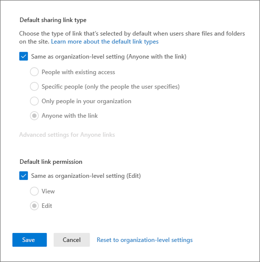

# Change the sharing settings for a site

You must be a Global Administrator or SharePoint Administrator in Microsoft 365 to change the sharing settings for a site. Site owners aren't allowed to change these settings.

The steps in this article apply to team sites, communication sites, and classic sites. To learn how to change the external sharing setting for a user's OneDrive, see [Change the external sharing setting for a user's OneDrive](user-external-sharing-settings.md). For info about changing your organization-level settings, see [Manage sharing settings](turn-external-sharing-on-or-off.md).

For detailed information about how to set up guest access for a site, see [Collaborate with guests in a site](/Office365/Enterprise/collaborate-in-a-site).

> [!IMPORTANT]
> [Azure Active Directory external collaboration settings](/azure/active-directory/external-identities/external-collaboration-settings-configure) determine who can invite guests in your organization for site sharing (always) and file and folder sharing (if Azure B2B collaboration is enabled). Be sure to review Azure AD guest access settings as part of your SharePoint and OneDrive sharing setup.

To change the external sharing setting:
  
1. Go to <a href="https://go.microsoft.com/fwlink/?linkid=2185220" target="_blank">**Active sites** in the new SharePoint admin center</a>, and sign in with an account that has [admin permissions](./sharepoint-admin-role.md) for your organization. 
1. In the left column, select a site. (For a channel site, select the link in the **Channel sites** column and then select the site.)
1. On the **Settings** tab, select **More sharing settings**.
1. Select an external sharing option (see the table in the next section).

    

1. If you want to limit the sharing of this site by domain, select the **Limit sharing by domain** check box by expanding **Advanced settings for external sharing**, and add the domains that you want to allow or block.

    > [!IMPORTANT]
    > [Allowed or blocked domains in Azure AD](/azure/active-directory/external-identities/allow-deny-list) also affect SharePoint and OneDrive site sharing (always) and file and folder sharing (if Azure B2B collaboration is enabled). Be sure to review Azure AD collaboration restrictions as part of your SharePoint and OneDrive sharing setup.

1. If you want to change the guest access expiration setting for this site, clear the **Same as organization-level setting** check boxes and set the values that you want to use for this site.

1. If you want to change the default sharing link type or permissions for this site, clear the **Same as organization-level setting** check boxes and set the values that you want to use for this site. For more info, see [Change the default sharing link for a site](change-default-sharing-link.md).

    

1. Select **Save**.

### Which option to select...

| Select this option: | If you want to: |
|:-----|:-----|
|Anyone  | Allow site owners and others with full control permission to share the site with people who authenticate. Allow site users to decide when sharing files and folders to require authentication or allow unauthenticated people to access the item. Anyone links to files and folders can be freely forwarded. |
|New and existing guests  | Allow site owners and others with full control permission to share the site with people outside the organization. These people will need to sign in and will be added to the directory. Allow site users to share files and folders with people who aren't in the organization's directory. |
|Existing guests  |Allow sharing with only people already in your directory. These users may exist in your directory because they previously accepted sharing invitations or because they were [manually added](/azure/active-directory/b2b/b2b-quickstart-add-guest-users-portal). (These users have **#EXT#** in their user principal name.)  |
|Only people in your organization  |Prevent all site users from sharing any site content externally.  |

The settings available are dependent on your organization-level setting. If you enable external sharing for a site and it's later turned off for your organization, external sharing will become unavailable at the site level and any shared links will stop working. If it's turned back on for the organization, the site sharing setting will return to what it was before and the shared links will resume working.

> [!NOTE]
> You might have site content shared with a Microsoft 365 group that has guest members, and the group settings prevent guest members from accessing group resources. In this case, even if you turn on external sharing for the site, guests of the group may not be able to access site content. To enable or disable Microsoft 365 Group guest member access, see [Manage guest access in Microsoft 365 Groups](/microsoft-365/admin/create-groups/manage-guest-access-in-groups).

### Default site sharing settings

The table below shows the default sharing setting for each site type.

| Site type | Default sharing setting |
|:-----|:-----|
|Classic|**Only people in your organization**|
|OneDrive|**Anyone**|
|Group-connected sites (including Teams)|**New and existing guests** if the Microsoft 365 Groups setting **Let group owners add people outside the organization to groups** is **On**; otherwise **Existing guests only**|
|Communication|**Only people in your organization**|
|Modern sites with no group (#STS3 TeamSite)|**Only people in your organization**|

> [!NOTE]
> The root communication site (tenant-name.sharepoint.com) has a default sharing setting of **Anyone**.
  
## Related topics

[Best practices for sharing files and folders with unauthenticated users](/microsoft-365/solutions/best-practices-anonymous-sharing)

[Create a more secure guest sharing environment](/microsoft-365/solutions/create-secure-guest-sharing-environment)

[File collaboration in SharePoint with Microsoft 365](deploy-file-collaboration.md)

[Stop sharing files or folders or change permissions](https://support.office.com/article/0a36470f-d7fe-40a0-bd74-0ac6c1e13323)

