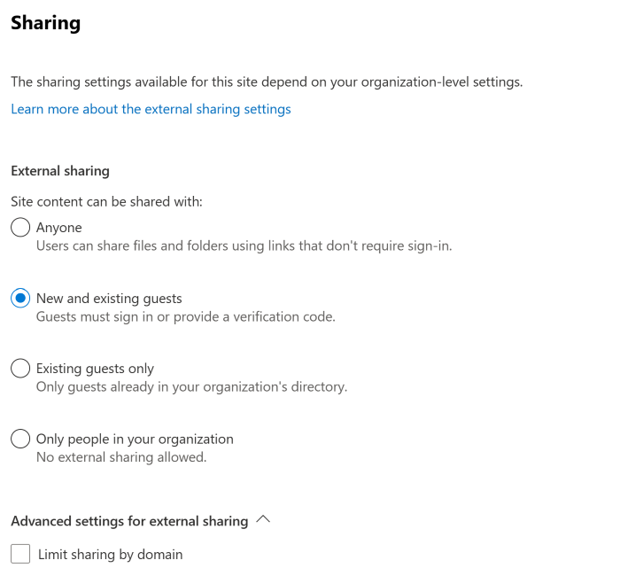

# Turn external sharing on or off for a site

You must be a global or SharePoint admin in Office 365 to change the external sharing setting for a site (previously called a "site collection"). Site owners are not allowed to change this setting.
  
Note that this procedure applies to classic sites, communication sites, and new team sites. To learn how to change the external sharing setting for a user's OneDrive, see [Change the external sharing setting for a user's OneDrive](/onedrive/user-external-sharing-settings). For info about changing your organization-level settings, see [Turn external sharing on or off for SharePoint](turn-external-sharing-on-or-off.md).

For detailed information about how to set up guest access for a site, see [Collaborate with guests in a site](https://docs.microsoft.com/Office365/Enterprise/collaborate-in-a-site).

To configure external sharing for a site
  
1. Go to the [Active sites page of the new SharePoint admin center](https://admin.microsoft.com/sharepoint?page=siteManagement&modern=true) and sign in with an account that has admin permissions for your organization.

    > [!NOTE]
    > If you have Office 365 Germany, [sign in to the Microsoft 365 admin center](https://go.microsoft.com/fwlink/p/?linkid=848041), then browse to the SharePoint admin center and open the Active sites page.  If you have Office 365 operated by 21Vianet (China), [sign in to the Microsoft 365 admin center](https://go.microsoft.com/fwlink/p/?linkid=850627), then browse to the SharePoint admin center and open the Active sites page.
    
2. In the left column, click to select a site.

3. Select **Sharing**.
     
4. Select an external sharing option (see the following table).

    

5. If you want to limit the sharing of this site by domain, select the **Limit sharing by domain** check box and add the domains that you want to allow or block.

6. If you want to change the default sharing link type, permissions, or expiration setting for this site, clear the **Same as organization-level setting** check box and set the value that you want to use for this site. For more info, see [Change the default sharing link for a site](change-default-sharing-link.md).

7. Click **Save**.
   
### Which option to select...

|**Select this option:**|**If you want to:**|
|:-----|:-----|
|Anyone    | Allow site owners and others with full control permission to share the site with people who authenticate. Allow site users to decide when sharing files and folders to require authentication or allow unauthenticated people to access the item. Anyone links to files and folders can be freely forwarded.   |
|New and existing guests    | Allow site owners and others with full control permission to share the site with people outside the organization. These people will need to sign in and will be added to the directory. Allow site users to share files and folders with people who aren't in the organization's directory.   |
|Existing guests    |Allow sharing with only people already in your directory. These users may exist in your directory because they previously accepted sharing invitations or because they were [manually added](/azure/active-directory/b2b/b2b-quickstart-add-guest-users-portal). (You can tell an external user because they have **#EXT#** in their user name.)    |
|Only people in your organization    |Prevent all site users from sharing any site content externally. (This is the default setting for new classic sites.)    |

The settings available are dependent on your organization-level setting. If you enable external sharing for a site and it is later turned off for your organization, external sharing will become unavailable at the site level and any shared links will stop working. If it is turned back on for the organization, the site sharing setting will return to what it was before and the shared links will resume working.

> [!NOTE]
> You might have site content shared with an Office 365 group that has guest members, and the group settings prevent guest members from accessing group resources. In this case, even if you turn on external sharing for the site, guests of the group may not be able to access site content. To enable or disable Office 365 Group guest member access, see [Manage guest access in Office 365 Groups](/office365/admin/create-groups/manage-guest-access-in-groups).
  
## See also

[Best practices for sharing files and folders with unauthenticated users](https://docs.microsoft.com/Office365/Enterprise/best-practices-anonymous-sharing)

[Create a secure guest sharing environment](https://docs.microsoft.com/Office365/Enterprise/create-a-secure-guest-sharing-environment)

[File collaboration in SharePoint with Microsoft 365](deploy-file-collaboration.md)

[Stop sharing files or folders or change permissions](https://support.office.com/article/0a36470f-d7fe-40a0-bd74-0ac6c1e13323)
