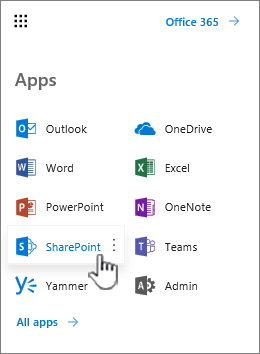
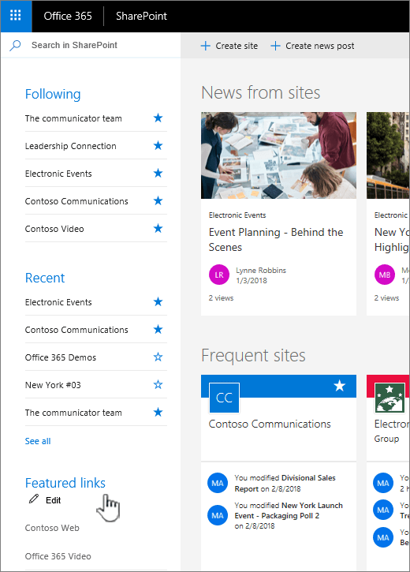
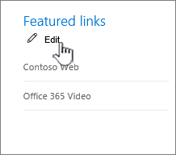
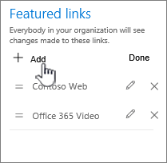
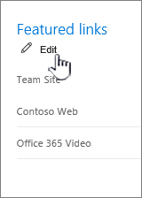
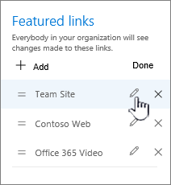
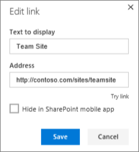
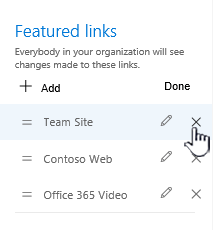

# Add featured links to the SharePoint start page

 As a global or SharePoint admin in Office 365, you can feature the sites and content you want on the SharePoint start page by changing the **Featured links** list in the left pane. To add links to a SharePoint Server page, see [Video: Add a link to a page](https://support.office.com/article/F9B329F9-67BB-4258-A686-9CD98415E7CA).
  
> [!NOTE]
> To learn more about the SharePoint start page, see [Find news, sites, and portals in Office 365](https://support.office.com/article/6b85097a-87e0-4611-a29a-dfd49b1a1220). 
  
To view the SharePoint start page:
  
1. Sign in with your work or school account. For help, see [Where do I sign in?](https://support.office.com/article/17e859dc-88be-45a0-97be-a8837efb2c24.aspx#BKMK_WhereSignIn).
    
2. Select SharePoint from the list of apps. 
    
    
  
    If you don't see the list of apps, select the app launcher icon  in the top left corner of the page, and then select **SharePoint**.
    
    
  
Can't find the app you're looking for? From the app launcher, select **All apps** to see an alphabetical list of the Office 365 apps available to you. From there, you can search for a specific app. 
  
You'll see the **Featured links** list on the left side of the page. 
  

  
## Add a link

1. Click **Edit** at the top of the list. 
    
    
  
    > [!NOTE]
    > If you do not see **Edit**, you don't have permissions to change the Featured links list. Contact your administrator. 
  
2. To add a link, choose **+ Add**.
    
    
  
3. Fill in the **Text to display** and **Address** in the **New link** dialog box. 
    
    
  
4. Click **Try link** to check the link. 
    
5. Click **Save**.
    
    The new link will appear at the top of the list. To change where the link appears, you can drag and drop it within the list.
    
6. To leave edit mode, click **Done** when you're finished. 
    
## Edit a link

1. Click **Edit** at the top of the list. 
    
    
  
    > [!NOTE]
    > If you do not see **Edit**, you don't have permissions to change the Featured links list. Contact your administrator. 
  
2. Click the link you want to change.
    
    
  
3. Fill in the **Text to display** and **Address** in the **Edit link** dialog box. 
    
    
  
4. Click **Try link** to check the link. 
    
5. Click **Save**.
    
6. To leave edit mode, click **Done** when you're finished. 
    
    To change where the link appears, you can drag and drop it within the list.
    
## Change the order of links

1. Click **Edit** at the top of the list. 
    
    
  
    > [!NOTE]
    > If you do not see **Edit**, you don't have permissions to change the Featured links list. Contact your administrator. 
  
2. Drag each link to the place you want within the list.
    
3. To leave edit mode, click **Done** when you're finished. 
    
## Delete a link

1. Click **Edit** at the top of the list. 
    
    
  
    > [!NOTE]
    > If you do not see **Edit**, you don't have permissions to change the Featured links list. Contact your administrator. 
  
2. Click **X**. 
    
    
  
3. Click **Delete** in the confirmation dialog box. 
    
4. To leave edit mode, click **Done** when you're finished. 
    
> [!NOTE]
> If you had custom promoted sites in classic view of the SharePoint Sites page, the Featured links section of the SharePoint start page is pre-populated with those sites. The pre-population of promoted sites in the Featured links list happens only once when the first user visits the new SharePoint start page. If you go back to classic view and change the promoted sites, the changes will not be reflected in the Featured links list on the SharePoint start page. 
  

