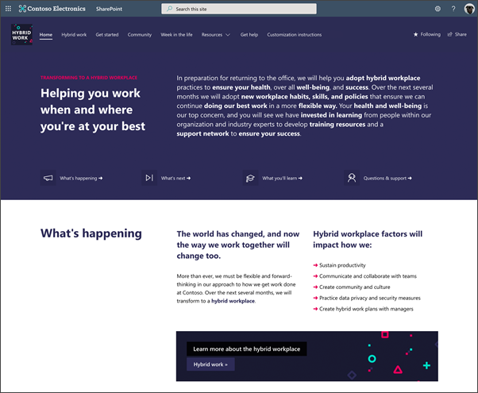
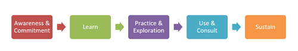

# Overview of the Workplace transformation site 

Help your organization drive and manage change by using the Workplace transformation site template in SharePoint. The Workplace transformation site template is designed to communicate and pro-actively manage to change universally using a SharePoint communication site in combination with the power of Microsoft Lists. The workplace transformation site design is based on change management research that is proven to help organizations successfully adopt and sustain change. 

   

### The Workplace transformation site features:

-	A landing place for people in your organization to get more information, news, and support
-	Specialized support channels for many audiences like managers, teams, and champions 
-	Pre-populated content and web parts that can be customized to fit the needs of your organization and specific change management project
-	Opportunity to use the Microsoft 365 Learning pathways solution to display Microsoft-curated and maintained training playlists
-	Integration with Microsoft 365 lists that let you customize and manage the change management journey 
-	Examples of micro-learning content that can be adapted to your change project

## Site design is based on a proven change management model

   

**1. Awareness and commitment –** Start communicating details about upcoming changes with users and provide various support channels and opportunities to engage through events and [Yammer community chats](https://support.microsoft.com/office/join-and-create-a-community-in-yammer-56aaf591-1fbc-4160-ba26-0c4723c23fd6).
 

**2. Learn –** Build training content right into the site itself by using [Microsoft 365 Learning pathways](https://docs.microsoft.com/office365/customlearning/).
 

**3. Practice and exploration –** Use your organization’s [champion community](https://view.officeapps.live.com/op/view.aspx?src=https://fto365dev.blob.core.windows.net:443/media/Default/DocResources/Adoption/Build_Champions_Program_Guide.pptx) in leading hand-on events and demonstrations in addition to 1:1 help.
 

**4. Use and consult –** Use [Microsoft Lists](https://support.microsoft.com/office/get-started-with-microsoft-lists-10b12560-fb20-471e-9258-773aec6a4a2f?ui=en-US&rs=en-US&ad=US) to help your organization manage tasks and knowledge checks associated with training and change management objectives.
 

**5. Sustain –** Help users practice and sustain new skillsets and habits by using micro-learning content like quick tips and [publishing regular news posts](https://support.microsoft.com/office/create-and-share-news-on-your-sharepoint-sites-495f8f1a-3bef-4045-b33a-55e5abe7aed7) sharing change management success stories. 

## How to use the Workplace transformation site template
The Workplace transformation site can be used to drive any topic or scope of organizational change. The site template helps organizations to successfully manage the people side of their organization change management to ensure all impacted employees are informed, have support, and know where they can learn more about upcoming changes.

**Examples of the types of change projects that could benefit from the workplace transformation template:**
 

- **New process –** Communicate and manage changes to data security policies, new contract management workflows, or project intake processes.

- **Merger and acquisition –** Onboard new employees and help current employees understand what to expect and how to work together.

- **New systems –** Roll out a new employee benefits program, or help employees adopt new tools and apps.

### Pre-populated content focuses on the hybrid workplace
The workplace transformation site features pre-populated content that revolves around helping organizations transition to a hybrid workplace. The hybrid workplace is one that is flexible when and where people do their work. Many organizations plan to allow employees to work from home up to 50% of the time, which means the organization will need to adopt new ways of working to ensure wellbeing and productivity.
 

Learn more about the [future of work](https://www.microsoft.com/research/theme/future-of-work/) and [what we have learned about remote work so far](https://www.microsoft.com/microsoft-365/blog/2020/07/08/future-work-good-challenging-unknown/).

## Overview of the site contents
The workplace transformation site is full of pre-populated content, web parts, news templates and a [Microsoft List](https://support.microsoft.com/office/get-started-with-microsoft-lists-10b12560-fb20-471e-9258-773aec6a4a2f?ui=en-US&rs=en-US&ad=US). Carefully review and customize pre-populated content before sharing broadly with end users.

   
 
- **Home page –** Provide a landing place for employees to learn more right away about why the change is happening and how it will impact their day-to-day work.
 

- **Hybrid work –** Explain in more detail what is changing and what success will look like when change is adopted and sustained.
 

- **Get started –** Give employees a jumping-off place to dive into messages form leadership, view the change management checklist, and RSVP to an upcoming event.
 

- **Community –** Help recognize and celebrate success within the organization and give employees and opportunity to connect in a change management Yammer community.
 

- **Training –** Embed curated training playlist that can be easily viewed and bookmarked on any device.
 

- **Quick tips –** Create micro-learning opportunities to help employees adopt and sustain new skills.
 

- **A message from our CEO –** Unit the organization around a central change by sharing a recording or written message form leadership endorsing the change project.
 

- **Champions program –** Recruit subject matter experts into your champions program.
 

- **Managers only –** Provide special resources and support that managers may need around the change project that can be audience targeted to a specific security group.
  

- **Get help –** Make sure employees know where to go for support and have more than one option for getting 1:1 help or learning from others. 

### Considerations for M365 Learning Pathways
[Microsoft 365 learning pathways](https://docs.microsoft.com/office365/customlearning/) is a customizable, on-demand learning solution that displays playlists using the M365 Learning pathways web part right onto SharePoint pages. Consider using the M365 Learning pathways solution in combination with the workplace transformation site to embed training playlists on SharePoint pages. 

Learn more about [how to provision the M365 Learning pathways solution for the first time](https://docs.microsoft.com/office365/customlearning/custom_provision), how to [find Microsoft-maintained content packs](https://docs.microsoft.com/office365/customlearning/custom_plancontent), and [how to custom learning pathways and playlists](https://docs.microsoft.com/office365/customlearning/custom_overview). 

## Step 1: Provision the Workplace transformation site template

> [!NOTE]
> -	Tenant administrators’ credentials (or higher) are required to provision a template from the lookbook
> -	The workplace transformation site will take about 15 minutes to provision 

1.	Start by navigating to the [SharePoint look book](https://lookbook.microsoft.com/) and selecting the work transformation template. Select **Add to your tenant**.
2.	Then, select a site name, URL, and email address where an email confirmation will be sent when the site is successfully created.
3.	Select **Provision**, and in less than 15 minutes you will receive an email confirmation with a link to your new site.
  
Learn more about [provisioning site templates from the lookbook](https://docs.microsoft.com/sharepoint/add-sample-site). 

### Share the site with site owners and members to customize
Once the site has been provisioned and you are ready to customize. If other people from your organization will be making site customizations, make sure you [share the site](https://support.microsoft.com/office/share-a-site-958771a8-d041-4eb8-b51c-afea2eae3658?ui=en-us&rs=en-us&ad=us#:~:text=Share%20a%20Site%20in%20SharePoint%201%20Communication%20sites.,external%20users%22%20to%20share%20the%20...%20See%20More.) add them as site owners and site members to ensure they have access and the right permissions to make edits to site content, theme, navigation, [settings](https://support.microsoft.com/office/change-a-site-s-title-description-logo-and-site-information-settings-8376034d-d0c7-446e-9178-6ab51c58df42), and permissions. 

## Step 2: Customize the Workplace transformation site
Customize the workplace transformation site to fit the needs of your organization’s change management project. Customize the theme, logo, navigation, web parts, and pre-populated content.

> [!NOTE]
> You need site member (or higher) permissions to the Workplace transformation site template in order to make customizations. 

### Sign in 

1.	Open your web browser and navigate to [office.com](https://www.office.com/) or your organization’s sign in location.
2.	**Sign in** with your username and password.
3.	Navigate to the location of the site using the URL supplied by your tenant admin, or select SharePoint from the Microsoft 365 home page, and then select the **Workplace transformation site**.

### Review pre-populated content
The workplace transformation site is full of pre-populated content, web parts, news templates and a Microsoft list. Carefully review and customize pre-populated content before sharing broadly with end users. 

   

The workplace transformation site features pre-populated content that helps organizations transition to a hybrid workplace. However, the workplace transformation site can be customized for any change management project. [Learn more about the workplace transformation site features and contents](https://review.docs.microsoft.com/SharePoint/change-management-template?branch=change-management#pre-populated-content-focuses-on-the-hybrid-workplace). 

### Customize web parts and content
Learn more about how to customize web parts and content that will appear on certain pages or throughout the site.

   

**Text, labels, and buttons -** Edit the labels and links in the [Text web parts](https://support.microsoft.com/office/add-text-and-tables-to-your-page-with-the-text-web-part-729c0aa1-bc0d-41e3-9cde-c60533f2c801#:~:text=%20To%20use%20the%20Text%20web%20part:%20,5%20Use%20s%EF%BB%BF%EF%BB%BFtrikethrough%206%20I%EF%BB%BFndent%20text%20More) and [Call to Action web parts](https://support.microsoft.com/office/use-the-call-to-action-web-part-e9917310-7543-4fc4-8f3f-d78e46074c00) throughout the site.
  

   

**Events-** Add, edit, and delete events in the [Events web parts](https://support.microsoft.com/en-us/office/use-the-events-web-part-5fe4da93-5fa9-4695-b1ee-b0ae4c981909#:~:text=Add%20the%20Events%20web%20part%201%20If%20you're,options%20for%20the%20web%20part.%20More%20items...) on the **Home** and **Get help pages**.
  

   

**News and news post templates -** Use pre-populated news templates to create news posts in the [News web part](https://support.microsoft.com/office/use-the-news-web-part-on-a-sharepoint-page-c2dcee50-f5d7-434b-8cb9-a7feefd9f165#:~:text=%20Use%20the%20News%20web%20part%20on%20a,but%20there%20may%20be%20one%20or...%20More) on the **Community page**. Find the templates by navigating to **Setting > Site Content > Site pages > Templates**.
  

   

**Yammer -** Connect the [Yammer conversations web part](https://support.microsoft.com/office/use-a-yammer-web-part-in-sharepoint-online-a53cfa0c-3d09-42c8-a286-1038a81c59da#conversations) on the **Community** page with an existing Yammer community.
 

   

**People -** Edit [People web parts](https://support.microsoft.com/office/show-people-profiles-on-your-page-with-the-people-web-part-7e52c5f6-2d72-48fa-a9d3-d2750765fa05) in news post templates and on the **Get help** page.
 

#### Use M365 Learning pathways to embed training content on a page
If your tenant admin has set up [M365 Learning pathways](https://docs.microsoft.com/office365/customlearning/custom_plancontent), you can [add pages to the site](https://support.microsoft.com/office/create-and-use-modern-pages-on-a-sharepoint-site-b3d46deb-27a6-4b1e-87b8-df851e503dec) and use the [Learning pathways web part](https://docs.microsoft.com/office365/customlearning/custom_addwebpart) to display custom training playlists.
 

#### Use tools to help target content to specific audiences or protect content from specific audiences
Consider using [audience targeting](https://support.microsoft.com/office/target-content-to-a-specific-audience-on-a-sharepoint-site-68113d1b-be99-4d4c-a61c-73b087f48a81) to surface important content to specific groups or use [information barriers](https://support.microsoft.com/office/associate-information-segments-with-sharepoint-sites-2b03db07-6d3f-4297-a388-b943317a26a7#:~:text=%20Associate%20segments%20with%20a%20SharePoint%20site%20,10%20segments,%20and%20then%20select%20Save.%20More) to protect sensitive information that may appear in the **Managers** section under **Resources**. 

#### Update the site theme and branding
Edit the look of your site to align with your organization's brand. Customize the site display name, logo, theme, header layout, navigation style, and more in the [Change the look panel](https://support.microsoft.com/office/customize-your-sharepoint-site-320b43e5-b047-4fda-8381-f61e8ac7f59b?ui=en-US&rs=en-US&ad=US).

#### Customize site navigation
Site navigation is important because it helps users immediately understand what can be accomplished on a given site. The most effective SharePoint sites help viewers find what they need quickly so that they can use the information to make decisions, learn about what is going on, access the tools they need, or engage with colleagues to help solve a problem. [Learn how to edit site navigation](https://support.microsoft.com/office/customize-the-navigation-on-your-sharepoint-site-3cd61ae7-a9ed-4e1e-bf6d-4655f0bf25ca?ui=en-US&rs=en-US&ad=US).

#### Edit the change management checklist
The Workplace transformation site contains a [Microsoft List](https://support.microsoft.com/office/get-started-with-microsoft-lists-10b12560-fb20-471e-9258-773aec6a4a2f?ui=en-US&rs=en-US&ad=US) in **Site contents** that is displayed in a [List web part](https://support.microsoft.com/office/use-the-list-web-part-ef0a1b80-f8b3-443d-b04a-1e76c70b5537) on the **Get started page**. This list is intended to give end users a high-level view of what to expect through the change management journey. Edit the list to meet the need of your change management project. 

   

1.	Start by navigating to **Setting > Site contents**, and then select **Hybrid workplace checklist**.
2.	Then you can edit list items, [change columns and labels](https://support.microsoft.com/office/create-a-column-in-a-list-or-library-2b0361ae-1bd3-41a3-8329-269e5f81cfa2), the theme and more. Or, you can [create a new list based on an existing Excel spreadsheet](https://support.microsoft.com/office/create-a-list-based-on-a-spreadsheet-380cfeb5-6e14-438e-988a-c2b9bea574fa) or [use a list template](https://support.microsoft.com/office/create-a-list-from-a-template-70b008a2-7a3d-4223-83d8-345e0313974d).
3.	Finally, [edit the view of your list](https://support.microsoft.com/office/edit-a-view-of-a-list-15916903-e79a-423f-b4e2-02d37e1ff372) to make sure users see the most important information in the [List web part](https://support.microsoft.com/office/use-the-list-web-part-ef0a1b80-f8b3-443d-b04a-1e76c70b5537) on the **Get started page**. 

[Learn more about M365 lists](https://support.microsoft.com/office/get-started-with-microsoft-lists-10b12560-fb20-471e-9258-773aec6a4a2f?ui=en-US&rs=en-US&ad=US).

## Step 3: Share the Workplace transformation site with end users

Once the site has been customized and republished, it is ready to share with end users.

1.	Select **Share site** from the right-hand corner.
2.	In the **Share site** pane, enter the names of people or groups to add them to the site, or enter "Everyone except external users" to share the site with everyone in your organization.
3.	Change the permission level (Read, Edit, or Full control) as needed.
4.	Enter an optional message to send to the person or clear the **Send email box** if you don't want to send an email.
5.	Select **Share**.

