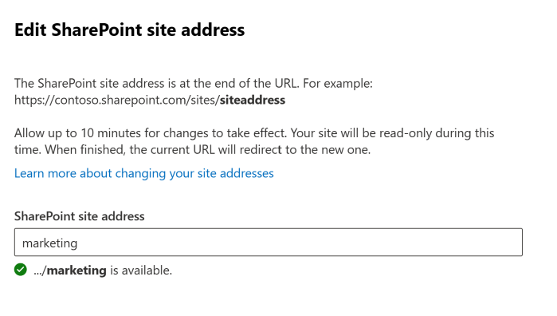

# Change a site address

> [!NOTE]
>  This feature is not available for Microsoft 365 Government GCC High customers.

As a global or SharePoint admin in your organization, you can change the URL for the following types of sites (previously called "site collections"):

- Microsoft 365 group-connected team sites
- Modern team sites that don't belong to a Microsoft 365 group
- Communication sites
- Classic team sites

You can change only the address of the site within the URL, for example:

https://<i></i>contoso.sharepoint.<i></i>com/sites/*projectx*  
to
https://<i></i>contoso.sharepoint.<i></i>com/sites/*projecty* 

You can't change the domain ("contoso" in the previous example) or any other part of the path. For example, you can't move the site from "/sites" to "/teams."

It can take about 10 minutes to change the site address (depending on the size of the site), and the site will be read-only during this time. We recommend changing addresses during times when site usage is low. 

You can change the address of up to 100 sites at a time. To change an additional site address, wait for another change to finish. 

## Communicate the address change to users

Before you change the address of a site, it's important to communicate the change to site users (generally anyone with the ability to edit or view the site). This can help reduce user confusion and calls to your help desk. [Review the effects](#effects-of-changing-a-site-address) of changing a site address and let users know the following information:

- When the change will happen  
- What the new URL will be  
- Users should close their files and not make edits during the address change
- Users should check the site recycle bin to make sure it contains no files they want to keep 
- File permissions and sharing won't change  

## Change a site address in the new SharePoint admin center

1. Go to the [Active sites page of the new SharePoint admin center](https://admin.microsoft.com/sharepoint?page=siteManagement&modern=true), and sign in with an account that has [admin permissions](/sharepoint/sharepoint-admin-role) for your organization.

>[!NOTE]
>If you have Office 365 Germany, [sign in to the Microsoft 365 admin center](https://go.microsoft.com/fwlink/p/?linkid=848041), then browse to the SharePoint admin center and open the Active sites page. <br>If you have Office 365 operated by 21Vianet (China), [sign in to the Microsoft 365 admin center](https://go.microsoft.com/fwlink/p/?linkid=850627), then browse to the SharePoint admin center and open the Active sites page.

2. To open the details pane, select the site name.

3. On the **General** tab, under URL, select **Edit**.

    

4. Enter the new site address, and then select **Save**.

> [!NOTE]
> You can't change the address of hub sites, sites that are locked or on hold, or of sites that have BCS connections. <br>When you change a site address, we create a redirect at the previous address. If you want to reuse the previous address, you need to delete the redirect. [Learn how](manage-site-redirects.md) 

## Change site addresses by using Microsoft PowerShell

1. [Download the latest SharePoint Online Management Shell](https://go.microsoft.com/fwlink/p/?LinkId=255251).

    > [!NOTE]
    > If you installed a previous version of the SharePoint Online Management Shell, go to Add or remove programs and uninstall "SharePoint Online Management Shell." <br>On the Download Center page, select your language and then click the Download button. You'll be asked to choose between downloading a x64 and x86 .msi file. Download the x64 file if you're running the 64-bit version of Windows or the x86 file if you're running the 32-bit version. If you don't know, see https://support.microsoft.com/help/13443/windows-which-operating-system. After the file downloads, run it and follow the steps in the Setup Wizard. 
    
2. Connect to SharePoint Online as a [global admin or SharePoint admin](/sharepoint/sharepoint-admin-role) in Microsoft 365. To learn how, see [Getting started with SharePoint Online Management Shell](/powershell/sharepoint/sharepoint-online/connect-sharepoint-online).

3. Run the following command to verify that the site address can be changed:

    ```PowerShell
    Start-SPOSiteRename -Identity <SiteURL> -NewSiteUrl <NewSiteURl> -ValidationOnly
    ```

4. Run the following command to change the site address:

    ```PowerShell
    Start-SPOSiteRename -Identity <SiteURL> -NewSiteUrl <NewSiteURl>
    ```

For more info about this cmdlet, see [Start-SPOSiteRename](/powershell/module/sharepoint-online/start-spositerename?view=sharepoint-ps)

## Effects of changing a site address

While the change is in progress, the site is set to read-only, and a redirect is created. After the change is complete, users are redirected to the new URL if they've saved the site as a favorite or if they click a link to the site.
 
**Permissions**<br>
People who have permission to access the site can access the site during and after the site address change.  

**Sharing links**<br>
After the site address is changed, sharing links will automatically redirect to the new URL. 

**Synced locations**<br>
The OneDrive sync app will automatically detect and seamlessly transfer syncing to the new site URL after the site address has been changed. Users don't need to sign in again or take any other action. (Version 17.3.6943.0625 or later of the sync app required.) 
If a user updates a file while the site address is being changed, they'll see a message that file uploads are pending during the change. 

**Recycle bin**
Any files in the recycle bin will be lost when the site address is changed. 

**Recent lists in Office apps**<br>
The Word, Excel, and PowerPoint desktop apps and apps for the web will show the new URL after the change.  

**OneNote**<br>
If users have a notebook open during the site address change, they'll see a notebook sync error. After the address is changed, the following OneNote apps will automatically detect and seamlessly sync notebooks to the new site URL:

- OneNote desktop app – Version 16.0.8326.2096 and later 
- OneNote for Windows 10 – Version 16.0.8431.1006 and later 
- OneNote mobile app – Version 16.0.8431.1011 and later 

Users don't need to sign in again or take any other action.

**Teams (for Microsoft 365 group-connected sites)**<br>
After the site address is changed, users won't be able to view the team's files within the Teams app, but they can access them from Teams by selecting **Open in SharePoint**. This issue is actively being worked on and will be addressed soon. 

**SharePoint mobile apps for Android and iOS**<br>
The SharePoint mobile apps will detect the site's new URL. Make sure that users have updated their apps to the latest version.  

**Apps**<br>
If apps in your organization refer to the site's URL, you might need to republish the apps when you change the site's address.  

**Power Automate**<br>
Flows will need to be recreated after the site address change.  

**Power Apps**<br>
You need to reconnect the app or apps to your data source. 
Start by deleting the existing SharePoint connections to any lists you may have before you reconnect to your data. Once you've done that, reconnect your app to the SharePoint lists you were using. Most fields should update automatically. Certain types seem to have trouble updating and can be fixed by simply deleting the field and then undoing the delete.

**Hub sites**<br>
If the site is associated with a hub, it will need to be reassociated after the site address is changed. 

**InfoPath forms**<br>
InfoPath forms that refer to URLs might not work after the site address is changed. 

**SharePoint workflow 2013**<br>
SharePoint workflow 2013 will need to be re-published after the site address is changed. 
  
**Site customizations and embedded code**<br>
Site customizations and embedded code that refer to URLs might need to be fixed after the site address change. Changing the site address will preserve data stored in SharePoint but won't change URL dependencies in custom solutions.

**List View web part**<br>
If a List View web part is added to a page and scoped to a specific folder in that list, the web part might display an error after the site URL is changed. To fix this issue, either edit the web part and reset the folder path or remove the web part from the page and then add it again.
