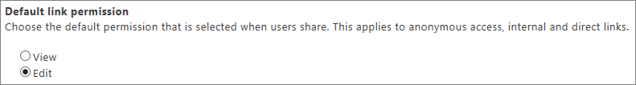

# Change the default link type when users get links for sharing

When a user wants to share a document or folder, they can get a link to it to send to others.
  
SharePoint Online supports three types of links: Anonymous access links (accessible by anyone), internal links (accessible only by users within your organization) and direct links (accessible only by users who you specify when you create the link). As a SharePoint admin, you may want to enable users to send anonymous access links (as these provide the smoothest experience) but you may not want it to be the default link when the user opens the **Get a link** dialog box. You can set the default type of link to something more restrictive, while still allowing users to select other types of links as needed. 
  
## Change the default link type

1. [Sign in to Office 365](e9eb7d51-5430-4929-91ab-6157c5a050b4.md) as a global admin or SharePoint admin. 
    
2. Select the app launcher icon  in the upper-left and choose **Admin** to open the Office 365 admin center. (If you don't see the Admin tile, you don't have Office 365 administrator permissions in your organization.) 
    
3. In the left pane, choose **Admin centers** > **SharePoint**.
    
4. In the left pane, choose **sharing**.
    
5. Under **Default link type** choose the option you want to show by default when a user gets a link. 
    
    
  
6. Under **Default link permission** choose whether you want the default permission to be view or edit. 
    
    
  
> [!NOTE]
> This setting does not affect Outlook Web App, Outlook 2016, or Office clients prior to Office 2016. 
  

