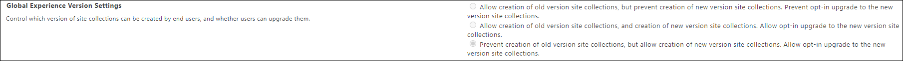
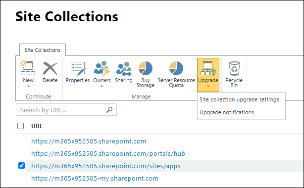

# Change site collection version and upgrade settings

The **Global Experience Version Settings** on the settings page of the classic SharePoint admin center are no longer in use.

The **Upgrade** settings on the site collections page of the classic SharePoint admin center are no longer in use.

