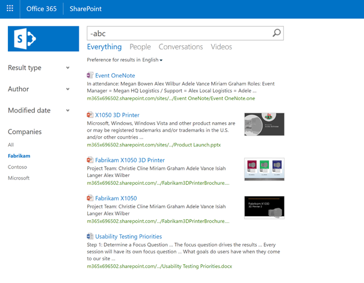
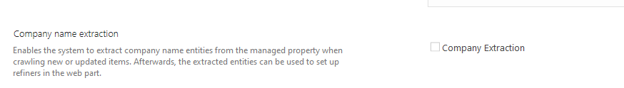

# Changes to company name extraction in SharePoint Online

As we continue to deliver rich new search experiences with Microsoft search, we'll be making changes to some of the classic search experiences in Office 365. Beginning on November 15th, 2019, we'll be removing Company Name Extraction from SharePoint Online. Company Name Extraction in SharePoint allows the search system to extract company names from content under a specific set of conditions using a pre-populated dictionary or through using the Company Inclusions or Company Exclusions lists. While company name extraction has become a relied-upon solution to derive one or more company names from content in SharePoint Online, both the dictionary and its underlying feature set have become obsolete.

### How do I know if company name extraction is enabled for a property?

If you have configured company name extraction on a managed property, you will see it on the property configuration:

### What happens when company name extraction is deprecated?

If you have configured company name extraction to be surfaced in the classic Enterprise Search Center as a refiner (refer to the above illustration), you will see the refiner is not populated with data over time resulting in the CompanyName refiner to be empty once the deprecation has been completed. The rest of the search experience will not be impacted. The Company Inclusions and Exclusion lists configured in the Term Store Management Tool will not be removed.

For developers and custom solutions, third-party applications using the SharePoint REST/CSOM API will not have the CompanyName refiner returned in the results. Any other refiners and query features will continue to work.

### Are there alternatives to company name extraction?

In the event company name extraction is required for your organization or one of more solutions your organization uses, the following alternatives may be suitable to support these needs:

Set the managed property containing the content you have previously extracted company names from to 'searchable.' This will include the contents of the managed property in the full-text index, enabling end-users to query against it.

- Example: If the property is "VendorHistory", a simple query for "Contoso" returns items that contain the word "Contoso" and items whose VendorHistory property contains "Contoso".

Set the managed property containing the content you have previously extracted company names from to 'queryable.' This will enable querying against the specific managed property by including the property name in the query.

- Example: If the property is "VendorHistory", a query containing "VendorHistory: Contoso" returns items whose VendorHistory property contains "Contoso".

### Does this affect SharePoint on-premises?

No. SharePoint on-premises versions are not affected by this change.

Learn more about Microsoft search at https://aka.ms/microsoftsearch.
