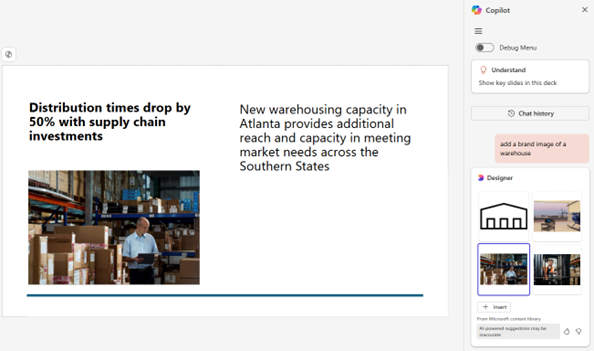

# Introduction

Your organization can now enable Copilot to provide an on-brand asset experience. Specify the organization asset libraries you want Copilot to search from and users within your organization are able to query for images, logos, or illustrations directly from chat.

> [!NOTE]
> Organization asset libraries can currently be searched from PowerPoint and Word Copilot chat, on both desktop and web. Support for further Copilot features, endpoints and M365 applications are currently in development.
> This feature is currently in preview.

## How does it work?

- Assigning an organization image library authorizes Copilot to search and download content directly from the library. 
- Powered by Designer, any image request that utilizes “brand” or “enterprise” in the prompt will direct the query to the search the assigned organization asset library. For example, “add a brand image of a warehouse” would query the assigned library for any image with associated metadata that matches “warehouse.”

- Powered by Graph search. Copilot uses the image tags, file name, description, and location added to the content in the organization asset library to find a relevant image.
 
## Use Microsoft PowerShell to specify an organization image document library to be searchable

First, if you haven't, [download the latest SharePoint Online Management Shell](https://go.microsoft.com/fwlink/p/?LinkId=255251).

> [!NOTE]
> If you installed a previous version of the SharePoint Online Management Shell, go to Add or remove programs and uninstall "SharePoint Online Management Shell."

Connect to SharePoint as a [SharePoint Administrator or higher](./sharepoint-admin-role.md) in Microsoft 365. To learn how, see [Getting started with SharePoint Online Management Shell](/powershell/sharepoint/sharepoint-online/connect-sharepoint-online).

Run the following command to designate a document library as an organization image library and enable Copilot search functionality. 

```PowerShell
Add-SPOOrgAssetsLibrary -LibraryUrl <URL> [-ThumbnailUrl <URL>] [-OrgAssetType ImageDocumentLibrary] [-CdnType <Public or Private>] [-CopilotSearchable <True or False>] 
```
- *LibraryURL* is the absolute URL of the library to be designated as a central location for organizational assets. 

- *ThumbnailURL* is the URL for the image file that you want to appear in the card's background in the file picker; this image must be on the same site as the library. The name publicly displayed for the library is the organization's name. 

- *OrgAssetType* must be ImageDocumentLibrary. For now search functionality only supports ImageDocumentLibrary. 

- *CopilotSearchable* is the toggle of the search functionality. To enable the organization image library, set CopilotSearchable to true in this location. 
If you don't specify the CdnType, it enables a private CDN by default. 

Run the following command to existing organization image library and enable Copilot search functionality:

```PowerShell
Set-SPOOrgAssetsLibrary -LibraryUrl <URL> [-ThumbnailUrl <URL>] [-OrgAssetType ImageDocumentLibrary] [-CopilotSearchable <True or False>] 
```

- *LibraryURL* is the absolute URL of the library to be designated as a central location for organizational assets. 

- *ThumbnailURL* is the URL for the image file that you want to appear in the card's background in the file picker; this image must be on the same site as the library. The name publicly displayed for the library is the organization's name. 

- *OrgAssetType* must be ImageDocumentLibrary. For now search functionality only supports ImageDocumentLibrary. 

- *CopilotSearchable* is the toggle of the search functionality. To enable the organization image library, set CopilotSearchable to true in this location. 

> [!NOTE]
> - You can only use image document libraries.
> - Ensure SharePoint Management Shell version is above 16.0.24915.12000 
> - Copilot image search is only available for Word and PowerPoint on both desktop and web versions.
> - You can specify only 1 organization image library to be searchable. We will support more libraries in the future.
> - If you don’t already have an organization asset library created, use Microsoft PowerShell to specify an existing library as an organization asset library
> - For the organization assets library to appear to a user in PowerPoint on the web, the user must be assigned a license to Office 365 E3 or E5. Users who use the Word, Excel, or PowerPoint desktop app also need Microsoft 365 Apps Version 2002 or later. (The organization assets library is not available in Word on the web or Excel on the web.) 
> - Allow up to 24 hours for the organization assets library to appear to a user in the desktop apps. 
- Users need at least read permissions on the root site for your organization for the organization assets library to appear in the desktop apps.

## Best Practices

Follow these guidelines to improve the organization asset library image search experience from Copilot:
- Avoid Multiple formats and resolutions of the same image. Copilot may return multiple versions of the same image reducing the breadth of search results. 
- Avoid exceptionally large images. Images over 10 MB result in search latency and slow downloads, host application limits may also apply.
- Remove any files that aren’t image based. Non-image files may be included in search results but fail on insertion.
- Insufficient tagging and descriptions. Successful search results require meaningful file names, image tags, location, and descriptions to be included with the content in the organization image asset library. Insufficient metadata reduces search hit rates and lower result relevancy.
- The following image formats are supported. JPEG, PNG, SVG, BMP, GIF, TIFF, WEB P, HEIF, ICO.

## Reference

- [Create an organization assets library](/sharepoint/organization-assets-library) 
- [Add-SPOOrgAssetsLibrary](/powershell/module/sharepoint-online/add-spoorgassetslibrary)
- [Set-SPOOrgAssetsLibrary](/powershell/module/sharepoint-online/set-spoorgassetslibrary)
