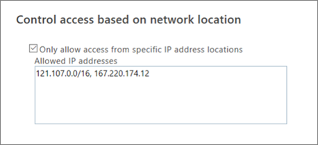

# Control access to SharePoint Online and OneDrive data based on network location

As an IT admin, you can control access to SharePoint and OneDrive resources based on defined network locations that you trust. This is also known as location-based policy.
  
To do this, you define a trusted network boundary by specifying one or more authorized IP address ranges. Any user who attempts to access SharePoint and OneDrive from outside this network boundary (using web browser, desktop app, or mobile app on any device) will be blocked.
  

  
Here are some important considerations for setting a location-based policy:
  
- **External Sharing**: As per the policy, users who try to access SharePoint resources from outside the defined IP address range will be blocked, including guest users outside of the range with whom files have been externally shared. 
    
- **Access from first and third-party apps**: Normally, a SharePoint document can be accessed from apps like Exchange, Yammer, Skype, Teams, Planner, Flow, PowerBI, PowerApps, OneNote, and so on. When a location-based policy is enabled, apps that do not support location-based policies are blocked. The only apps that currently support location-based policies are Teams, Yammer, and Exchange. This means that all other apps are blocked, even when these apps are hosted within the trusted network boundary. This is because SharePoint cannot determine whether a user of these apps is within the trusted boundary. 
    
    > [!NOTE]
    > We recommend that when a location-based policy is enabled for SharePoint, the same policy and IP address ranges should be configured for Exchange and Yammer. SharePoint relies on these services to enforce that the users of these apps are within the trusted IP range. 
  
- **Access from dynamic IP ranges**: Several services and providers host apps which have dynamic originating IP addresses. For example, a service that accesses SharePoint while running from one Azure data center may start running from a different data center due to a failover condition or other reason, thus dynamically changing its IP address. The location-based conditional access policy relies on fixed, trusted IP address ranges. If the IP address range cannot be determined up front, location-based policy may not be an option for your environment. 
    
## Set a location-based policy in the SharePoint admin center

> [!NOTE]
> It can take up to 15 minutes for these settings to take effect. 
  
1. Sign in to Office 365 as a global admin or SharePoint admin.
    
2. Select the app launcher icon  in the upper-left and choose **Admin** to open the Office 365 admin center. (If you don't see the Admin tile, you don't have Office 365 administrator permissions in your organization.) 
    
3. In the left pane, choose **Admin centers** \> **SharePoint**.
    
4. In the left pane, click **device access**.
    
5. Under **Control access based on network location**, select **Only allow access from specific IP address locations**
    
6. Enter the IP address, address range, or multiple addresses separated by commas in the **Allowed IP addresses** box. 
    

  
## Set a location-based policy using Windows PowerShell

1. [Download the latest SharePoint Online Management Shell](https://go.microsoft.com/fwlink/p/?LinkId=255251).
    
2. Connect to SharePoint Online as a global admin or SharePoint admin in Office 365. To learn how, see [Getting started with SharePoint Online Management Shell](https://go.microsoft.com/fwlink/?linkid=869066).
    
3. Run [Set-SPOTenant](https://go.microsoft.com/fwlink/?linkid=872571) to specify your allowed IP addresses, as in this example (replace the example IP address "131.102.0.0/16" with your own): 
    
  ```
  Set-SPOTenant -IPAddressAllowList "131.102.0.0/16"
  ```

    > [!IMPORTANT]
    >  Use IPv4 or IPv6 formats ony. >  Verify that there are no overlapping IP address ranges. >  Double check the IP range(s) before enabling this policy to ensure you do not lock yourself out. 
  
4. Enforce the allowable IP ranges you just set as in this example:
    
  ```
  Set-SPOTenant -IPAddressEnforcement $true
  
  ```


