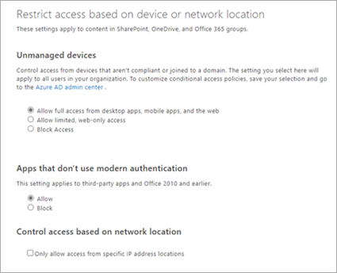
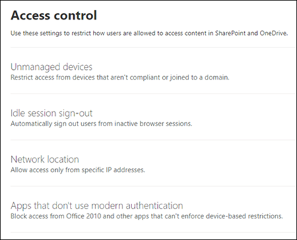

# Find control access features in the new SharePoint admin center

This article covers all the features on the control access page and where you can find them in the new SharePoint admin center.

## Control access

|**Classic**|**New**|
|:-----|:-----|
|| |

|**Classic**|**New**|
|:-----|:-----|
| Unmanaged devices   Allow full access from desktop apps, mobile apps, and the web   Allow limited, web-only access   Block Access   |Unmanaged devices    |
|   |Idle session sign-out    |
| Control access based on network location   Only allow access from specific IP address locations   |Network location  |
| Apps that don't use modern authentication   Allow   Block   |Apps that don't use modern authentication   |

