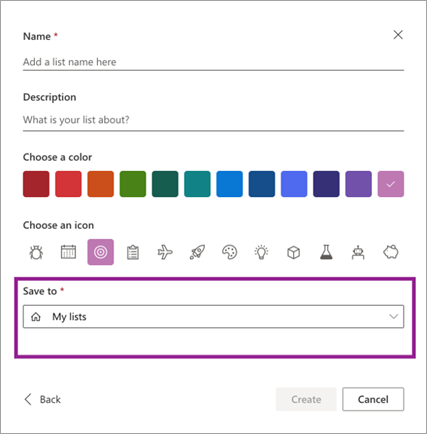
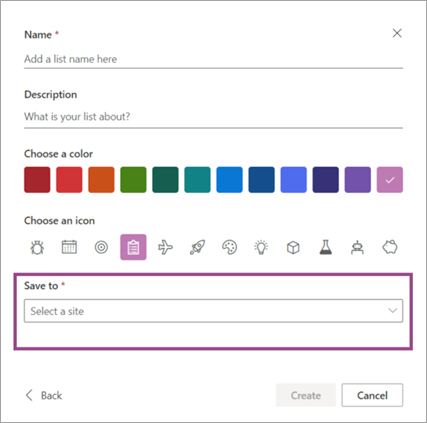
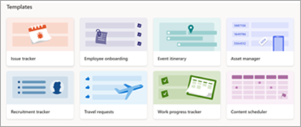
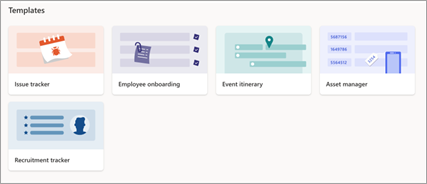
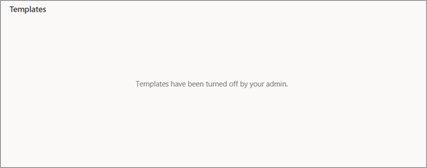

# Control settings for Microsoft Lists

As a global or SharePoint admin in Microsoft 365, you can control settings for Microsoft Lists. You can:

- Disable the creation of personal lists (prevent users from saving new lists to "My lists").
- Disable built-in list templates that aren't relevant for your organization.

You control both of these settings by using Microsoft PowerShell.

## Disable creation of personal lists

If you change this setting, when users create a list, they must select a SharePoint site for saving the list. The "Save to" setting doesn't include the "My lists" option. 

| Default | Personal list creation disabled |
|:-----|:-----|
| ||
  
1. [Download the latest SharePoint Online Management Shell](https://go.microsoft.com/fwlink/p/?LinkId=255251).

    > [!NOTE]
    > If you installed a previous version of the SharePoint Online Management Shell, go to Add or remove programs and uninstall "SharePoint Online Management Shell." <br>On the Download Center page, select your language and then click the Download button. You'll be asked to choose between downloading a x64 and x86 .msi file. Download the x64 file if you're running the 64-bit version of Windows or the x86 file if you're running the 32-bit version. If you don't know, see [Which version of Windows operating system am I running?](https://support.microsoft.com/help/13443/windows-which-operating-system). After the file downloads, run it and follow the steps in the Setup Wizard.

2. Connect to SharePoint as a [global admin or SharePoint admin](/sharepoint/sharepoint-admin-role) in Microsoft 365. To learn how, see [Getting started with SharePoint Online Management Shell](/powershell/sharepoint/sharepoint-online/connect-sharepoint-online).

3. Run the following command:
  
    ```PowerShell
    Set-SPOTenant -DisablePersonalListCreation $true
    ```

To re-enable the creation of personal lists, set the parameter to `$false`.

## Disable built-in list templates

Disabling these templates removes them from all places users create lists (the Lists app, Microsoft Teams, and SharePoint sites).

| Default | Built-in list templates disabled |
|:-----|:-----|
| |Some templates disabled<br/>All templates disabled|
  
1. [Download the latest SharePoint Online Management Shell](https://go.microsoft.com/fwlink/p/?LinkId=255251).

    > [!NOTE]
    > If you installed a previous version of the SharePoint Online Management Shell, go to Add or remove programs and uninstall "SharePoint Online Management Shell." <br>On the Download Center page, select your language and then click the Download button. You'll be asked to choose between downloading a x64 and x86 .msi file. Download the x64 file if you're running the 64-bit version of Windows or the x86 file if you're running the 32-bit version. If you don't know, see [Which version of Windows operating system am I running?](https://support.microsoft.com/help/13443/windows-which-operating-system). After the file downloads, run it and follow the steps in the Setup Wizard.

2. Connect to SharePoint as a [global admin or SharePoint admin](/sharepoint/sharepoint-admin-role) in Microsoft 365. To learn how, see [Getting started with SharePoint Online Management Shell](/powershell/sharepoint/sharepoint-online/connect-sharepoint-online).

3. Run the following command:
  
    ```PowerShell
    Set-SPOTenant -DisableModernListTemplateIds '<template ID>'
    ```

Where the template ID is:

- Issue tracker: 'C147E310-FFB3-0CDF-B9A3-F427EE0FF1CE'
- Employee onboarding: 'D4C4DAA7-1A90-00C6-8D20-242ACB0FF1CE'
- Event itinerary: '3465A758-99E6-048B-AB94-7E24CA0FF1CE'
- Asset manager: 'D2EDA86E-6F3C-0700-BE3B-A408F10FF1CE'
- Recruitment tracker: '3A7C53BE-A128-0FF9-9F97-7B6F700FF1CE'
- Travel requests: 'C51CF376-87CF-0E8F-97FF-546BC60FF1CE'
- Work progress tracker: 'B117A022-9F8B-002D-BDA8-FA266F0FF1CE'
- Content scheduler: '9A429811-2AB5-07BC-B5A0-2DE9590FF1CE'
- Incidents: 'E3BEEF0B-B3B5-0698-ABB2-6A8E910FF1CE'
- Patient care coordination: '0134C13D-E537-065B-97D1-6BC46D0FF1CE'
- Loans: '7C920B56-2D7A-02DA-94B2-57B46E0FF1CE'

To re-enable a built-in template, use the parameter `EnableModernListTemplateIds`.
