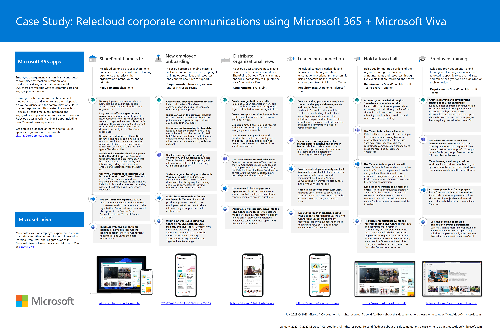

# Organizational communications: Guidance, methods, and products

Employee engagement is a significant contributor to workplace satisfaction, loyalty, and productivity at any organization. Across Microsoft 365, there are multiple ways to communicate. Knowing which method (or combinations of methods) to use and when to use them depends on your audience and the communication culture of your organization.

Learn how to keep everyone informed and engaged using SharePoint, Microsoft Teams, Yammer, Stream, and Viva Connections. Learn more about the powerful strategies and communication tools available to you that help drive engagement in your organization.

**In this solution:**

- Discover applications best suited for your communication goals and audience
- Get started planning for specific scenarios like Viva Connections, holding a town hall, or distributing organizational news
- Understand technical and license requirements before getting started
- Learn how to launch, manage, and maintain corporate communications over time

## Overview of setup
Start by learning about Microsoft 365 tools that are designed for your specific scenario. Then, learn how to scope your audience. Finally, get started planning by learning how to create, launch, measure, and maintain a one-time communication or communications over time.
 
 

| Step 1: Learn about tools and define your audience profile    | Step 2: Identify the scenario(s) to meet your communication goal |Step 3: Plan, build, and launch your communication strategy   |Step 4: Manage and maintain communication and content over time   |
| :------------------: | :------------------: |:---------------:|:---------------:|
|   |    |    |  |
| Review common scenarios & outcomes|Select a scenario(s)   | Gather requirements and content  |Update permissions and settings as needed   |
| Review Microsoft 365 tools                 | Learn how to get started planning    |  Align with partners      | Maintain relevant content           |
| Scope your audience                   | Review considerations based on audience preferences        | Prepare and test environment             | Maintain performant sites, pages, and lists         |
|Check technical and license requirements          | Learn how to use and integrate M365 apps    | Determine success metrics & plan the launch  |Retire content when it’s no longer needed          |

#### Step 1: Learn more about communication tools and define your audience profile
Start by getting familiar with [common corporate communications scenarios](plan-communication-strategy.md). Next, [review Microsoft 365 communication apps](review-communication-apps.md) to make sure you understand engagement opportunities and analytics options. Then, learn how to [define and scope your audience](audience-profile.md). After following these basic steps, you will be ready to select the right communication solution that fits your organization's needs.

#### Step 2: Identify the scenario(s) to meet your communication goal
Once you have defined your audience profile and scoped the size of your audience,you can [choose a corporate communication solution](choose-communication-method.md) or combination of solutions. Each communication solution covers step-by-step guidance and includes best practices to ensure your success.

#### Step 3: Plan, build, and launch your communication strategy
Once you've selected a solution or combination of solutions, you'll learn how to plan, build, and launch. Each communication solution can be customized and integrated with other communication solutions depending on your goals. Understanding your audience's needs and how they currently use M365 apps will heavily influence how you make decisions.   

#### Step 4: Manage and maintain communication and content over time
Some communication solutions are a one-time event while others may have several occurrences over time. Depending on the communication solution, there may be some maintenance requirements and next steps. Learn how to prepare for the long-term success of your communication strategy.
 
 

## Overview of corporate communication solutions:
Learn how to plan your communication strategy by reviewing common communication scenarios, solutions, and outcomes. Next, review how Microsoft 365 tools and apps can engage and inform the audiences you want to reach. Then determine which communication scenario meets your communication goals and get started planning, launching, and maintaining your communication solution. 

This poster illustrates how Relecloud keeps employees informed and engaged across popular communication scenarios. Relecloud uses a variety of M365 apps, including a new offering, Viva Connections.

[Download the PDF version of this poster](https://download.microsoft.com/download/0/3/4/034fbee5-ecf4-4559-86d3-815e898f21ea/relecloud-corporate-communication-poster.pdf) or [download this poster as a Visio file](https://download.microsoft.com/download/0/3/4/034fbee5-ecf4-4559-86d3-815e898f21ea/relecloud-corporate-communication-poster.vsdx) to make custom edits for your organization.
 
 

| Icon                 | Scenario             | Solution details|
| :------------------: | :------------------- |:----------------|
| | **Plan your strategy** | Review common communication scenarios   Learn about tools and solutions   Scope your audience and determine your specific scenario    [Get started planning your strategy](plan-communication-strategy.md) |
|  | **Use Viva Connections**   | Create employee experiences that connect your organization   Provide an easy way to catch up on news   Create a branded company app within Microsoft Teams    [Set up Viva Connections](guide-to-setting-up-viva-connections.md) |
|  | **Get a home site for your intranet**    |Take the first step in getting ready for Viva Connections   Schedule and launch a healthy portal   Set up global navigation in the SharePoint app bar    [Get a SharePoint home site](home-site-plan.md) |
| | **Plan and produce a town hall**  |Bring your organization together for a live or prerecorded event   Record, share, and keep the conversation going   Measure engagement and expand reach using news    [Plan a town hall](hold-town-hall-using-yammer.md) |
| | **Distribute organizational news**  | Share organization news and announcements across your company    Create news site, news posts, and use the News web part   Measure engagement and expand reach using Viva Connections    [Distribute organizational news](distribute-corporate-news-to-your-organization.md) |
||  **Leadership connection**   | Create communication channels and networking opportunities   Create engaging experiences in Yammer and live events   Expand reach using Viva Connections    [Connect your organization with leaders](leadership-connection.md)|
| | **New employee onboarding** |Create an end-to-end experience to onboard new employees   Create a home base to welcome new employees and share resources    Expand reach using Viva Connections    [Onboard new employees](onboard-employees.md)| 
| | **Build a learning and training experience** |Build a scalable learning and training experience   Surface training opportunities to specific audiences    Use tools like Viva Learning to deploy learning experience    [Build a learning and training experience](build-learning-and-training-experiences-for-employees.md)|

### End-user guidance and support
Give end users a head start by helping them use and engage using popular M365 communication apps that may be a part of your solution. Consider using existing training playlists in [Microsoft 365 Learning Pathways](/office365/customlearning) to help end users learn more about M365 apps like Teams and SharePoint. Or, help train people at your organization who will be managing corporate communications using [Microsoft Learn training](/training).

| Logo                 | Communication app     | Guidance              | 
| :------------------: | :-------------------- | :-------------------- |
| | **Teams** | [Learn more about teams and channels](https://support.microsoft.com/office/first-things-to-know-about-teams-and-channels-5e4fd702-85f5-48d7-ae14-98821a1f90d3)   [Tips for meetings in Teams](https://support.microsoft.com/office/tips-for-teams-meetings-23dd847d-52a6-4325-b0dd-9d8f2b29af50)   [Share content in Teams meetings](https://support.microsoft.com/office/share-content-in-a-meeting-in-teams-fcc2bf59-aecd-4481-8f99-ce55dd836ce8)   [Use @mention's to get someone's attention](https://support.microsoft.com/office/use-mentions-to-get-someone-s-attention-in-teams-eb4f059d-320e-454e-b111-03361d4d6855)| 
|  | **Teams live events**                 | [Attend a live event in Teams](https://support.microsoft.com/office/attend-a-live-event-in-teams-a1c7b989-ebb1-4479-b750-c86c9bc98d84)   [Participate in a live event Q&A](https://support.microsoft.com/en-us/office/participate-in-a-q-a-in-a-live-event-in-teams-01d57b8c-23b9-4cff-adc0-4e57618b59b4)   [Use live captions in a live event](https://support.microsoft.com/office/use-live-captions-in-a-live-event-1d6778d4-6c65-4189-ab13-e2d77beb9e2a)           |
| | **SharePoint**  | [Get started with SharePoint](https://support.microsoft.com/office/get-started-with-sharepoint-909ec2f0-05c8-4e92-8ad3-3f8b0b6cf261)   [Upload, view, and share files](https://support.microsoft.com/office/upload-view-and-remove-project-files-or-documents-bf64f2b5-c32c-4ee9-9c1c-452f22ef832f) |
| | **Yammer**                   |  [Introduction to Yammer](https://support.microsoft.com/office/welcome-to-new-yammer-8c749c30-2d17-4153-a3cc-37a70f254681)   [Join a Yammer community](https://support.microsoft.com/office/join-and-create-a-community-in-yammer-56aaf591-1fbc-4160-ba26-0c4723c23fd6)   [Use reactions in Yammer](https://support.microsoft.com/office/use-reactions-in-new-yammer-02b05cf1-e920-4891-a5a4-0f181948adad)    [Use topics and hashtags in Yammer](https://support.microsoft.com/office/use-topics-and-hashtags-in-yammer-98c0a0bb-aad0-45d3-88f1-4f6d12bb1772)   [Use Q&A in a Yammer community](https://support.microsoft.com/office/use-questions-and-answers-in-a-yammer-community-a4f1b722-d1bf-42be-a592-7288c7c0b895)   [Pin, report, and close conversations](https://support.microsoft.com/office/pin-close-and-report-conversations-in-yammer-62a5fbc2-ff1b-4418-9334-d2b4b17062cb)                  | 
|  | **Yammer live events**                 | [Attend a live event in Yammer](https://support.microsoft.com/office/attend-a-live-event-in-new-yammer-41f1afe3-2a8e-4998-a25b-843d96791b10)                 | 
| | **Outlook**                 | [Set up email on a mobile device](https://support.microsoft.com/office/set-up-office-apps-and-email-on-a-mobile-device-7dabb6cb-0046-40b6-81fe-767e0b1f014f)   [Use @mention's to get someone's attention](https://support.microsoft.com/office/use-mentions-to-get-someone-s-attention-90701709-5dc1-41c7-aa48-b01d4a46e8c7)                  | 
|    |**Stream**              |  [Introduction to Microsoft Stream](https://support.microsoft.com/office/what-is-microsoft-stream-025ee4bc-e519-45ca-a157-05bc5bad616c)   [Follow channels in Stream](https://support.microsoft.com/office/follow-channels-efe86a71-dbbe-47c9-8517-56470eabd5c5)         | 
|    |**Viva**              |  [Introduction to Microsoft Viva](https://support.microsoft.com/topic/introducing-microsoft-viva-3c1012cb-6c85-4d49-bd7f-b18a6e7873e0)   [Get started with Viva Connections](https://support.microsoft.com/office/viva-connections-on-your-desktop-3da30f39-684a-4bde-bb81-2e1407d59b52)         | 

## Key capabilities by product license

| Capability or feature  | Description                | Licensing         |
| :------------------- | :-------------------- |:---------------- |
| Outlook email and calendar | Connect and stay organized with business-class email, calendaring, and contacts all in one place. | M365 E5   M365 E3 |
| Microsoft Teams meetings, chats, and voice   | Deliver elevated meeting experiences with sophisticated call functionality and a central hub for meetings, chat, content, and calling.                | M365 E5   M365 E3  |
| SharePoint and Yammer   | Connect and engage across your organization with an intelligent, mobile intranet and enterprise social networking.                 | M365 E5   M365 E3            |
| Files and content management in OneDrive     | Access files from any device, at any time. Engage with intelligent video and create visually striking content in minutes.                | M365 E5   M365 E3     |
| Live events in Yammer                |Product and host a live event for people inside your organization. Keep the conversation going with live and moderated Q&A.               | M365 E5   M365 E3         |
| Live events in Microsoft Teams             | Host and record public or private live events. Decide how you want event attendees to participate.       | M365 E5   M365 E3         |
| Microsoft Viva        | Bring together organizational news, tools, knowledge, learning, and insights with a full employee experience suite.   | [Learn more](https://www.microsoft.com/microsoft-viva/pricing)     |

 

## Up next:

**Step 1:** [Learn how to plan for your communication scenario](plan-communication-strategy.md)
 

**Step 2:** [Review Microsoft 365 communication tools and methods](review-communication-apps.md)
 

**Step 3:** [Scope audience size and preferences](audience-profile.md)
 

**Step 4:** [Get started planning for your scenario](choose-communication-method.md)

 
 

