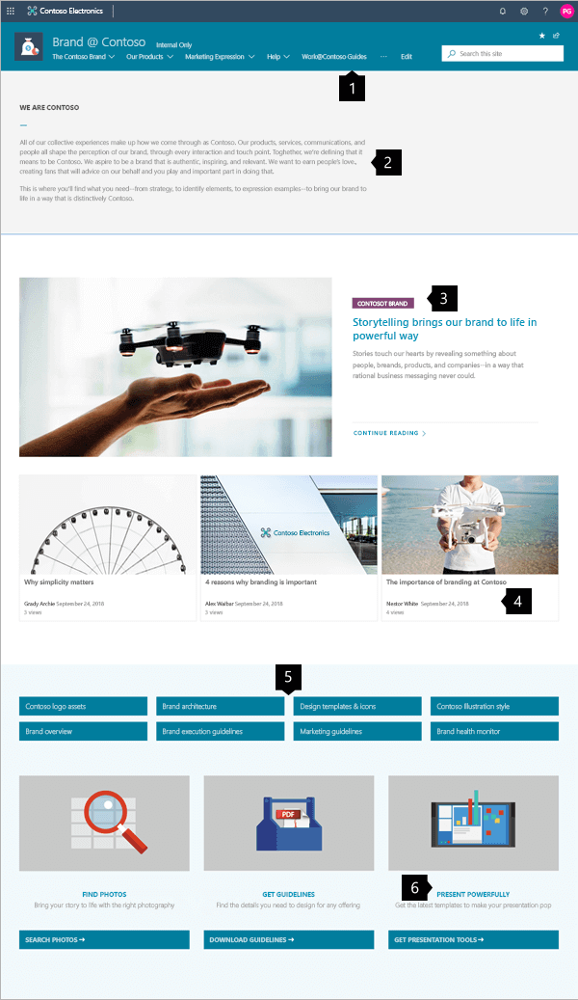
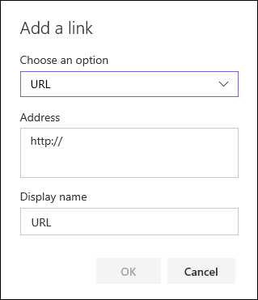
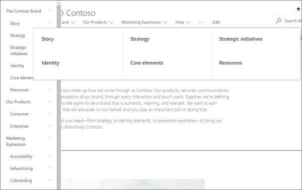
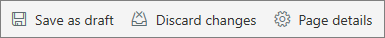
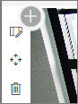
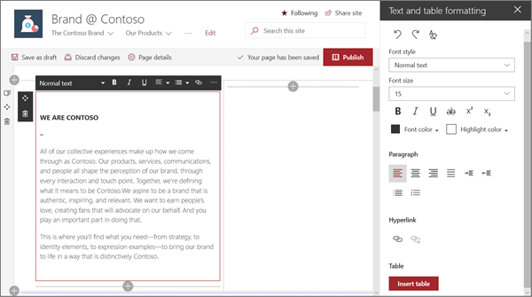
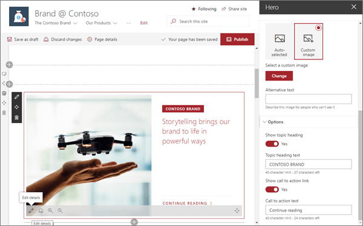
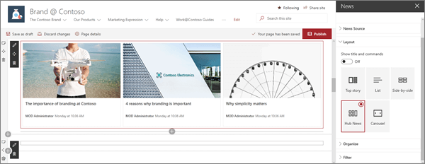
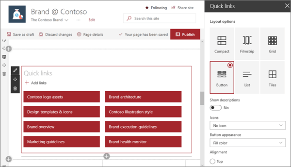
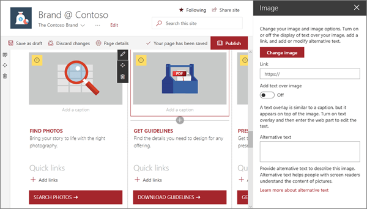

# Guided Walkthrough - Create a Communication site for your organization

In this article, we show you elements of a communication site to inspire you and help you learn how to create similar sites for your own organization. In this example, the site is optimized to communicate your strategy and guide employees in how to express your brand in their work.

First, if you haven't already created a Communication site, check out the [Create your site](#create-your-site) section in this article. 

Once you have your created your site and know how to edit pages, you can use the steps below to add the elements shown.
 
 

## Example Communication site

|  Image of the homepage               |  Customization instructions                |
| :------------------- | :------------------- |
|      | **1. Make discovery of content easy** Quickly guide visitors with navigation. [*Learn how*](#create-a-clear-and-useful-navigation)    **2. Set the mission** A text web part highlights the mission. [*Learn how*](#add-formatted-text-with-the-text-web-part)   **3. Feature content** Emphasize ideas with the Hero web part. [*Learn how*](#focus-on-priorities-with-the-hero-web-part)   **4. Display topical news** Show the latest news. [*Learn how*](#add-important-news-with-the-news-web-part)   **5. Offer important links** Show related resources with Quick links. [*Learn how*](#use-color-and-icons-with-the-quick-links-web-part)   **6. Call-to-action** Combine web parts to increase impact.  [*Learn how*](#create-call-to-action-elements)|

 

## Create your site
To make a site like the one shown here, you'll create a [Communication site](https://support.microsoft.com/office/use-the-sharepoint-topic-showcase-and-blank-communication-site-templates-94a33429-e580-45c3-a090-5512a8070732). To do this, click **Create site** from the SharePoint start page (or, if you're going to associate this site with a Hub site, navigate to the hub site and click **Create site** there so that the communication site is automatically be associated with that hub site).

   

Next, choose **Communication site**, and then the **Topic** layout. Fill out your site name, description, and other information, and click **Finish**.

   

For more details, see [Create a communication site in SharePoint Online](https://support.microsoft.com/office/create-a-communication-site-in-sharepoint-7fb44b20-a72f-4d2c-9173-fc8f59ba50eb).

[Back to top](#example-communication-site)

## Create a clear and useful navigation

**Phases of change management:**

Make your site easy to get around so users can find what they're looking for, or to help users discover more content.

   

Click **Edit** to the right of the top menu, hover over the location in the menu where you want to add a link, and click +. Then add the type of link, your link, and a name to display in the navigation bar in the **Add a link** dialog box. Want to reorder your navigation links? Just drag them into the position you want. Learn more about how to [customize the navigation on your SharePoint site](https://support.microsoft.com/office/customize-the-navigation-on-your-sharepoint-site-3cd61ae7-a9ed-4e1e-bf6d-4655f0bf25ca).

   

### Mega menu

When a communication site is associated with a [hub site](https://support.microsoft.com/office/what-is-a-sharepoint-hub-site-fe26ae84-14b7-45b6-a6d1-948b3966427f#bkmk_associatingsitestoahub), site owners can quickly and easily customize the organization and navigation of a  SharePoint site. Learn what you need to know about mega menus in [Create a mega menu in hub sites](https://support.microsoft.com/office/create-a-mega-menu-on-communication-sites-and-hub-sites-d6768545-2391-4c66-9a8c-a85eb76b4cf5).

   

Clicking **Edit** on the top menu opens a three-level outline list on the left. The example site uses only two of three possible levels on its mega menu: the main menu and a sub menu.

- Click the **…** control on the right of the item name to set the item's link and outline level.

[Back to top](#example-communication-site)

## Manage sections and web parts

Start editing by clicking **Edit** on the top right of the page.

   

While editing, on the left, below the header your drafts can be saved for later or discarded.

   

The + symbol before or after a section will add a section using one of several layouts.

   

Sections make up your page, and are you place one or more web parts. While editing the page, each section will show controls to edit the layout, move, or delete the sections. For information on working with sections, see [Add or remove sections and columns on a page](https://support.microsoft.com/office/add-sections-and-columns-on-a-sharepoint-modern-page-fc491eb4-f733-4825-8fe2-e1ed80bd0899).

   

Click the plus symbol  in a section, which may appear before or after a web part in a section, to see the many types of web parts available. For more information on all web parts, see [Using web parts on SharePoint pages](https://support.microsoft.com/en-us/office/using-web-parts-on-sharepoint-pages-336e8e92-3e2d-4298-ae01-d404bbe751e0).

   

Web parts may be edited, moved, or deleted within sections. The **Edit web part** icon opens detailed controls unique to each web part type.

   

When your page updates are ready, click **Publish** to make them visible to everyone in your organization who has permissions to view the content.

   

> [!TIP]
> To manage all of your pages on the site, click **Pages** on the top menu.

For more details on using pages, see [Create and use modern pages on a SharePoint site](https://support.microsoft.com/office/using-web-parts-on-sharepoint-pages-336e8e92-3e2d-4298-ae01-d404bbe751e0).

[Back to top](#example-communication-site)

## Add formatted text with the Text web part
For more details on using the Text web part, see [Add text and tables to your page with the Text web part](https://support.microsoft.com/office/add-text-and-tables-to-your-page-with-the-text-web-part-729c0aa1-bc0d-41e3-9cde-c60533f2c801).

### Enhance the message

The example site creates a balance of text and imagery using several different web parts. At its core, the site is designed to inspire visitors to adopt branding guidelines and provide the tools needed to follow through.

### Layout matters

The first section of the page uses the section layout tools with a Text web part to create impact by enforcing white space to the right of the mission statement.

### Refined typography

The Text web part builds on style of the built-in site template. The Text web part is using the **Normal** text style. Clicking the **…** control at the right end of the formatting toolbar offers additional options to the right of the web part.

In this example, the web part is in a two-column section.
   

[Back to top](#example-communication-site)

## Focus on priorities with the Hero web part

Let your team know what’s most important with high-impact hero images, company branding, and important news. The initial impact of the site home page is created by large and eye-catching images of the Hero web part. The page uses the Hero web part in its **Layers** option.
 

### Hero layout

Editing the web part presents layout options. The **Layers** option, such as the one shown above, sets each image as a layer with the image next to the title. Up to five layers are possible, so that you can use the web part to fill the entire page.

In this example, the Hero web part uses one layer and is in a full-width section.

   

### Customize each layer

Options for adding a heading and a linked call to action allow each layer to be a the starting point for a deeper message.

It is possible to create an entire visual homepage with just the Hero web part using **Layers**.

For more details on using the Hero web part, see [Use the Hero web part](https://support.microsoft.com/office/use-the-hero-web-part-d57f449b-19a0-4b0d-8ce3-be5866430645).

[Back to top](#example-communication-site)

## Add important news with the News web part

### Automatically collect news and timely content

The News web part provides controls to choose the **News Source** and **Layout**, and to **Organize** and **Filter** the content to keep the content topical.

For more details on using the News web part, see Use the [News web part on a SharePoint page](https://support.microsoft.com/office/use-the-news-web-part-on-a-sharepoint-page-c2dcee50-f5d7-434b-8cb9-a7feefd9f165).

### Refine impact with news layouts

Changing the layout will change impact a news feed has. Under **Layout**, there are five options to adjust how news items are presented. In this example, news stories are using the **Hub News** layout. The stories are presented side-by-side with three equal-sized images because only three news stories on the site are published.

In this example, the web part is in a one-column section.

   

[Back to top](#example-communication-site)

## Use color and icons with the Quick Links web part

The Quick links web part provides dozens of professional styles for links created from a few easy-to-use options.

Start with the six base layouts, then adjust by color and alignment. Optionally, you can add icons or text descriptions to increase the menu impact. In this site example, this web part uses the Button layout.

For more details on using the Quick Links web part, see [Use the Quick Links web part](https://support.microsoft.com/office/use-the-quick-links-web-part-e1df7561-209d-4362-96d4-469f85ab2a82).

   

[Back to top](#example-communication-site)

## Create call-to-action elements

The example site uses images to enhance the page look. It combines the Image web part with the Text and Quick links web parts to create a high visibility call-to-actions menu guiding visitors to key branding actions.

In the example shown below, the web parts are in the second column of a three-column section. For more details on using the Image web part, see [Use the Image web part](https://support.microsoft.com/office/use-the-image-web-part-a63b335b-ad0a-4954-a65d-33c6af68beb2).

  

[Back to top](#example-communication-site)

### Want more?
Get inspired with more examples in the [SharePoint Look Book](https://sharepointlookbook.azurewebsites.net/)

