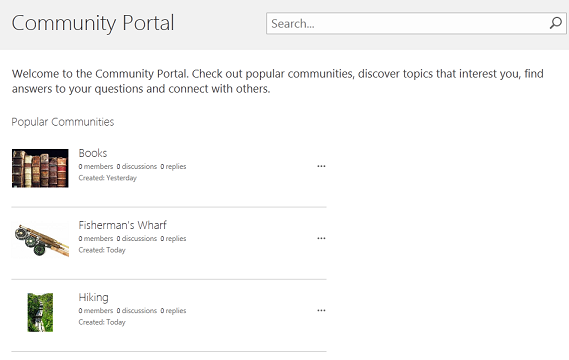

# Create a community portal

A community portal is a directory that lists all community sites available on your company intranet. Through the community portal users can search for, discover, follow, visit, and participate in communities of interest. 
  

  
## How it works

The community portal works in conjunction with My Sites and Enterprise Search Center. It is an enterprise site template that requires very little configuration or maintenance by the owner or administrator. Once the portal is built it is continually updated with new communities and community statistics, such as creation date, number of members, number of discussions, and so on. This continuous updating is made possible through tight integration with Enterprise Search, which automatically crawls the intranet every few minutes then indexes and displays new communities and their data. 
  
Inclusion of communities in the community portal doesn't depend on a particular hierarchy, nor does it support the creation of community sites beneath the community portal site collection. It is recommended that each community be its own site collection. Search will crawl all community sites and site collections and do the curating for you. Community sites will be listed in order of popularity. 
  
To ensure your community portal works as expected, make sure to do the following:
  
1. Create a community portal site collection.
    
2. Create individual community sites or site collections (only communities built with the Community Site template will be added to the community portal).
    
    > [!NOTE]
    >  An enterprise search center is provisioned for you when you sign up for Office 365 and SharePoint Online so you don't need to create one to support the community portal. 
  
[A community portal is a directory that lists all community sites available on your company intranet. Through the community portal users can search for, discover, follow, visit, and participate in communities of interest. ](create-a-community-portal.md#__top)
  
### Create a community portal site collection

To create a community portal, you must be a member of the SharePoint Online Administrator's group. For more information see [Understanding permission levels in SharePoint](https://support.office.com/article/87ecbb0e-6550-491a-8826-c075e4859848).
  
1. In the SharePoint Admin Center on the Site Collections ribbon tab, Contribute section, click **New** **\> Private Site Collection**.
    
2. In the New Site Collection dialog box, enter the following information:
    
  - In the Title box, type a title for the site collection.
    
  - For Public Website Address, select a domain name and a URL path (for example, /sites/) from the list, and then type a URL name for your community portal site collection. 
    
  - Under Template Selection, in the Select a language dropdown, choose a language for the site collection. It is important to select the appropriate language for the site collection because once it's chosen, it cannot be changed. You can enable the SharePoint multiple language interface on your sites, but the primary language for the site collection will remain the same.
    
  - Under Template Selection, in the Select a template section, choose **Enterprise \> Community Portal**. 
    
  - Under Time Zone, select the standard time zone appropriate for the location of the site collection.
    
  - Under Administrator, in the box for user name, type the user name of your site collection administrator. You can also use the **Check names** or **Browse** buttons to find a user to make site collection administrator. 
    
  - Under Storage Quota, type the number of MB to allocate to this site collection. Check the MB available value to make sure you don't exceed the MB available.
    
  - Under Server Resource Quota, type the usage quota to allocate to the site collection. If you plan to customize your site using sandbox solutions, you will want to make sure the amount of allocated resources is enough to run your code. Use the default value if you aren't sure. 
    
3. Click **OK**. It might take a few minutes before your new community portal site collection appears in the URL list. 
    
### Create individual communities

Here are the basic steps for creating a community. For more information, see [Create a community](https://support.office.com/article/8b6bb936-7ebc-4e60-b8ab-2d4897499af9).
  
1. In the SharePoint Administration Center on the Site Collections ribbon tab, Contribute section, click **New** **\> Private Site Collection**.
    
2. In the New Site Collection dialog box, enter the following information:
    
  - In the Title box, type a title for the site collection.
    
  - For Public Website Address, select a domain name and a URL path (for example, /sites/) from the list, and then type a URL name for your community portal site collection. 
    
  - Under Template Selection, in the Select a language dropdown, choose a language for the site collection. It is important to select the appropriate language for the site collection because once it's chosen, it cannot be changed. You can enable the SharePoint multiple language interface on your sites, but the primary language for the site collection will remain the same.
    
  - Under Template Selection, in the Select a template section, choose **Collaboration \> Community Site**. 
    
  - Under Time Zone, select the standard time zone appropriate for the location of the site collection.
    
  - Under Administrator, in the box for user name, type the user name of your site collection administrator. You can also use the **Check names** or **Browse** buttons to find a user to make site collection administrator. 
    
  - Under Storage Quota, type the number of MB to allocate to this site collection. Check the MB available value to make sure you don't exceed the MB available.
    
  - Under Server Resource Quota, type the usage quota to allocate to the site collection. If you plan to customize your site using sandbox solutions, you will want to make sure the amount of allocated resources is enough to run your code. Use the default value if you aren't sure. 
    
3. Click **OK**. It might take a few minutes before your new community site collection appears in the URL list. 
    

