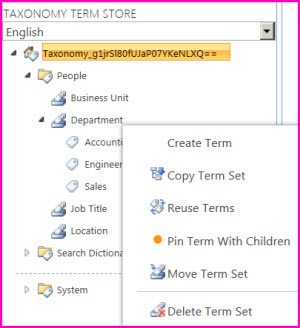

# Create and manage terms in a term set

You can use the Term Store management tool to create terms in a term set, or manage a term such as copy it or move it. If you have many terms that you want to add, it might be more practical to import all the terms in the term set instead of adding the terms individually. For information about how to import terms, see [Import term sets](https://support.office.com/article/168fbc86-7fce-4288-9a1f-b83fc3921c18) . 
  
> [!IMPORTANT]
>  To create and manage terms in the Term Store management tool, you must be a Contributor, a Group Manager, or a Term Store Administrator. 
  

  
## 

Online, 2016, 2013
### To create a term in a term set

To create a term in a term set, follow these steps
  
> [!NOTE]
>  If you are adding a term to a local term set, you must start this procedure from the site collection to which the term set belongs. If you are updating a global term set, you can open the Term Store Management Tool from any site. 
  
1. Open the Term Store management tool. To learn how, see [Open the Term Store management tool ](create-and-manage-terms-in-a-term-set.md#__toc327965089).
    
2. In the tree-view pane, expand the groups to find the term set to which you want to add a term.
    
3. Point to the term set where you want to add a term, select the arrow that appears, and then select **Create Term**.
    
4. Type the name that you want to use as the default label for the newly created term in the tree view.
    
5. In the **Properties** pane, specify the following information about the new term: 
    
6. **Available for tagging** Select the check box to make this term available for tagging. If you clear the check box, the term is visible but disabled in the tagging tools. 
    
7. **Language** Select the language for this label for the term. 
    
8. **Description** Type a description to help users understand how to apply this term, or to differentiate it from similar terms. 
    
9. **Default Label** Enter the word or phrase that you want to use as the default label for the term in this language. 
    
10. **Other Labels** Enter any synonyms for this term. To add multiple synonyms, type the first synonym and then press **ENTER** to add more lines. 
    
### Open the Term Store management tool

To open the Term Store management tool, select the SharePoint environment that you use, and then follow the steps.
  
 **In SharePoint Online**
  
1. [Sign in to Office 365](e9eb7d51-5430-4929-91ab-6157c5a050b4) with your work or school account. 
    
2. Go to the [SharePoint admin center](about-the-admin-center).
    
3. Select **Term Store**.
    
 **In SharePoint Server**
  
1. From the site collection Home page, select **Site Contents**
    
2. On the **Site Contents** page, select **Settings**.
    
3. On the **Site Settings** page, in the **Site Administration** group, select **Term store management**.
    
After you open the Term Store management tool, you can continue with creating a term, or taking another action with terms.
  
### Take another action with terms

There are several actions that you can take on terms that will help you build and manage term sets as the business needs of your organization evolve. 
  
To take any of the following actions, first [Open the Term Store management tool ](create-and-manage-terms-in-a-term-set.md#__toc327965089), and then point to the term that you want to use for the action.
  
#### Copy a term

- Select **Copy Term** The name of the new term is Copy of <original term name>. No child terms for the source term are copied. 
    
#### Reuse a term

1. Select **Reuse Terms**.
    
2. In the **Term Reuse** dialog box, expand the groups and term sets to find the term that you want to reuse under your selected parent term. 
    
3. Select the term and then select **OK**. 
    
#### Pin term with children

1. When you pin a term with children, you reuse the term in a different security group. 
    
2. Select **Pin term with children**.
    
3. In the **Reuse and Pin Term: Select a Source** dialog box, expand the groups and term sets. 
    
4. Select the term that you want to reuse and pin as a child of the selected term or term set.
    
5. Check or clear **Block users from using this keyword outside the context of its new Term Set destination**.
    
6. Select **OK**.
    
#### Merge a term with another

1. Select **Merge Term**.
    
2. In the **Term Merge** dialog box, expand the term set that contains the term with which you want to merge you selected term. 
    
3. Select the target term.
    
4. Select **OK**. 
    
#### Deprecate a term

- Select **Deprecate Term** This action makes any instances of this term in any term set to which it belongs unavailable for tagging. Any child terms of the term are not deprecated. 
    
#### Move a term

1. Select **Move Term**.
    
2. In the **Term Move** dialog box, expand the groups or term sets to find where you want to move the term. 
    
3. Select the target term set or term. 
    
4. Select **OK**. 
    
#### Delete a term

1. Select **Delete Term**.
    
2. Select **OK**.
    
This action deletes the term and its child terms. If this term is a source term that other locations reuse, it is put in the Orphaned Terms term set in the System group.
  
2010
### Term set scale and structure

The following table lists the recommended guidelines for the organization of managed metadata in a Term Store. 
  
|**Limit**|**Maximum value**|**Limit type**|**Notes**|
|:-----|:-----|:-----|:-----|
|Maximum number of levels of nested terms in a term set    |7    |Supported    |Terms can be nested up to seven levels deep within a Term Store.    |
|Maximum number of term sets in a term store    |1,000    |Supported    |You can have up to 1,000 term sets in a term store.    |
|Maximum number of terms in a term set    |30,000    |Supported    |30,000 is the maximum number of terms in a term set. Additional labels for the same term, such as synonyms and translations, do not count as separate terms.    |
|Total number of items in a term store    |1,000,000    |Supported    |An item is either a term or a term set. The total number of terms and term sets together cannot exceed 1,000,000. Additional labels for the same term, such as synonyms and translations, do not count as separate terms.    > [!NOTE]>  You cannot have both the maximum number of term sets and the maximum number of terms simultaneously in a Term Store.           |
   
Before you build out term sets, you should engage in some planning in order to organize your term sets into groupings that are both logical and useful. You may want to factor in issues like usability and how site users are likely to interact with the data. Even though it may be possible to build a very large and highly nested term set, that may not be desirable in all usage scenarios. For example, is it practical to expect site users to sort through thousands of entries in a term set to find the right term? If not, then the term sets you create for some scenarios might need to be smaller than for other scenarios. For more information about planning term sets, see [Plan terms and term sets](https://technet.microsoft.com/en-us/library/ee519604.aspx).
  
### Add a term to a term set

You can use the Term Store Management Tool to manually create term sets and terms.
  
If you want to import a term set, which may be the more practical way to create a term set that will contain a large number of terms, then you can also import a term set. 
  
If you are adding a term to a local term set, you must start this procedure from the site collection to which the term set belongs. If you are updating a global term set, you can open the Term Store Management Tool from any site.
  
1. On the **Site Actions** menu, click **Site Settings**.
    
2. Under **Site Administration**, click **Term Store management**.
    
3. In the **Properties** pane, select the Managed Metadata Service application you want, if it is not already selected. 
    
4. In the tree view pane on the left, expand the groups to find the term set to which you want to add a term.
    
5. Point to the term set where you want to add a term, click the arrow that appears, and then click **Create Term**.
    
6. Type the name that you want to use as the default label for your term in the newly created term in the tree view.
    
7. In the **Properties** pane, specify the following information about the new term: 
    
|**In this field:**|**Do this:**|
|:-----|:-----|
|Available for tagging    |Select the check box to make this term available for tagging. If you clear the check box, the term will be visible but disabled in the tagging tools.    |
|Language    |Select the language for this label for the term.    |
|Description    |Type a description to help users understand how to apply this term, or to differentiate it from similar terms.    |
|Default Label    |Enter the word or phrase you want to use as the default label for the term in this language.    |
|Other Labels    |Specify any synonyms for this term. Do this if you want several words or phrases with the same meaning treated as a single entity for the purposes of metadata management. To add multiple synonyms, type a word, and then press ENTER to create additional lines.    For example, if you are creating a term for the color blue you could use "blue" as the default label, and then add "azure," "sapphire," "indigo," and "cobalt" as possible synonyms.    |
   
### Copy, reuse, merge, deprecate, move, or delete terms

There are a number of actions you can take on terms that will help you build and manage term sets as the business needs of your organization evolve. 
  
1. Go to the site where you want to update terms (if you are updating a local term set).
    
2. On the **Site Actions** menu, click **Site Settings**.
    
3. Under **Site Administration**, click **Term Store management**.
    
4. In the **Properties pane**, select the Managed Metadata Service application you want, if it is not already selected.
    
5. In the tree view pane on the left, expand the groups and term sets to find the term or terms you want to update.
    
6. Point to the term, click the arrow that appears, and then do one of the following:
    
|**To do this:**|**Do this:**|**Impact of action:**|
|:-----|:-----|:-----|
|Copy the term    | Click **Copy Term**.    |A copy of the term will be created within the original term set.    The new term will be named Copy of \<original term name\>. No child terms for the source term will be copied.    |
|Reuse a term    |
Click Reuse Terms. In the Term Reuse dialog box, expand the groups and term sets to find the term you want to reuse under your selected parent term. Select the term and click OK. |Adds the reused term underneath the selected term in the tree view pane.    You must have Contributor rights for the group for any term you want to reuse.    |
|Merge a term with another    |
Click Merge Term. In the Term Merge dialog box, expand the term set that contains the term with which you want to merge you selected term. Select the target term. Click OK. |The selected term, as well as any of its synonyms and translations, will be merged into the selected target term.    The original IDs of each term are preserved so that tags that used the old term IDs still work for search (old IDs will not be available for new tagging).    Content tagged with the merged term will not be updated, but it will be returned in searches for the term that is the merge target.    Terms can be merged only if they are siblings in the hierarchy in all term sets in which they both exist.    To merge terms, you must have contributor rights to the groups for both terms.    |
|Deprecate a term    | Click **Deprecate Term**.    |This action makes any instances of this term in any term set to which it belongs unavailable for tagging. Any child terms of the term are not deprecated.    To make the term available for use again, point to it, click the arrow that appears, and click **Enable Term**.    |
|Move a term    |
Click Move Term. In the Term Move dialog box, expand the groups or term sets to find the location to which you want to move the term. Select the target term set or term. Click OK. |Moves the selected term, and any child terms for that term, to the selected target location.    |
|Delete a term    |
Click Delete Term. Click OK. |Deletes the term and any child terms below it. If this term is a source term for terms that are reused in other locations, it will be placed in the Orphaned Terms term set in the System group.    If the term is a unique term (not reused in other locations), the term is completely deleted.    If the term is a reused term, it removes the term from the current term set.    |
   
### Specify custom sort order for terms in a term set

Terms within a term set are displayed in the default sort order for their language. If you want to specify a particular order for terms that will remain constant, regardless of the display language or of changes to the default labels for the terms, you can apply a custom sort order to the terms within the term set.
  
For example, if you create a term set that contains labels for the different stages of a business process, you might want the terms to appear in the sequential order in which the stages occur, rather than in alphabetical order. You use a custom sort order to do this.
  
1. Go to the site where you want to custom sort terms (if you are updating a local term set).
    
2. On the **Site Actions** menu, click **Site Settings**.
    
3. Under **Site Administration**, click **Term Store management**.
    
4. In the **Properties** pane, select the Managed Metadata Service application you want, if it is not already selected. 
    
5. In the tree view pane on the left, expand the groups to find the term set that you want, and then select the term set.
    
6. In the pane on the right, click the **Custom Sort** tab. 
    
7. Under **Custom Sort Order**, select **Use custom sort order**.
    
8. Click the arrows in the boxes next to the terms to reorder the terms in the sequence that you want.
    
9. Click **Save**.
    
### Specify synonyms for a term

Synonyms function as alternate labels for a term. If there are several possible words or phrases that users might use to describe a single concept, then it might be a good idea to add these words or phrases as synonyms of the official term. That way, users do not have to know the exact term to use to accurately apply a tag to content. Users can search on the synonyms and see results for any items that have been tagged with the default label or any of its synonyms.
  
For example, if you create a term set called Colors, and you add a term with the default label "blue" you could add "azure," "sapphire," "indigo," and "cobalt" as possible synonyms. If a user updates a managed metadata column mapped to the color term set, and types indigo, it will be the same as if the user had selected blue.
  
If there are common abbreviations for the terms in your term sets, it might also be useful to add these as synonyms. For example, if you have a term set that contains the names of the months of the year, you might want to add the common abbreviation(s) for each month as synonyms.
  
You can specify synonyms for a term when you create it, but you can also update the properties for a term at any time to add other synonyms.
  
1. Go to the site where you want to update the synonyms for a term.
    
2. On the **Site Actions** menu, click **Site Settings**.
    
3. Under **Site Administration**, click **Term Store management**.
    
4. In the **Properties** pane, select the Managed Metadata Service application you want, if it is not already selected. 
    
5. In the tree view pane on the left, expand the groups and term sets to find the term that you want.
    
6. Select the term.
    
7. In **Properties** pane on the right, in the **Other Labels** section, type the word or phrase you want to use as a synonym. 
    
8. To add additional synonyms, press ENTER to create additional lines where you can type more synonyms.
    
9. When you finish adding all of the synonyms you want, click **Save**.
    

