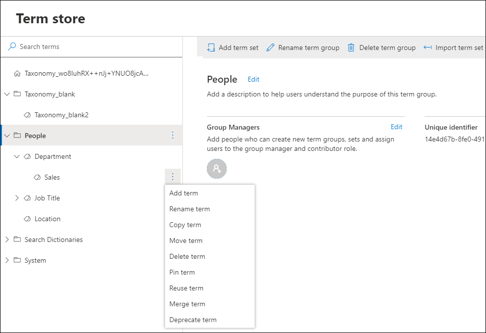

# Create and manage terms in a term set

To create and manage terms, you must be a contributor, a group manager, or a term store admin. (If you have many terms that you want to add, consider [importing them](https://support.office.com/article/168fbc86-7fce-4288-9a1f-b83fc3921c18).)
  
> [!NOTE]
>  If you are adding a term to a local term set, you must [open term store management at the site level](open-term-store-management-tool.md#open-term-store-management-for-a-site). 

To create a term in a term set
  
1. In the SharePoint admin center, under **Content services**, click **Term store**.
    
2. In the tree-view pane, select the term set to which you want to add a term.

3. Click **Add term**.
    
    
    
4. Type a name for the term and press ENTER.
    
5. Update the term settings as needed: 
    
    - On the **General** tab, to add languages, translations, and synonyms, select **Add**. The **Add translation and synonyms** panel appears. Select your language, translation, description, and add synonyms. Select **Save**.

    - On the **Usage settings** tab, to make the term available to the users and content editors of sites consuming this term set, select **Edit**. The **Available for tagging** panel appears. By default, the term is enabled for tagging. To disable, select the **Enable** checkbox. Select **Save**.

    - On the **Advanced** tab, to use shared or local custom properties to store additional data about a term sets, select **Edit**. The **Edit shared custom properties** panel appears. Add property names and values. Select **Save**. 

  
## Take another action with terms

There are several actions that you can take on terms that will help you build and manage term sets as the business needs of your organization evolve. 
  
To take any of the following actions, first select the term that you want to update.
  
### Rename term

- Select **Rename term**. 
    
    
### Copy term

- Select **Copy term**. This action shows the name of the new term as **Copy of \<original term name\>**. No child terms for the source term are copied. 
    
### Move term

1. Select **Move term**. The **Move to** panel appears.
    
2. Select the target term set or term. 
    
3. Select **Move**.
    
### Delete term

If you delete this term, any terms below it will also be deleted. Terms that are shared with other term sets will be placed in the Orphaned terms term set under System.

1. Select **Delete term**.
    
2. Select **Delete**.
    
### Pin term

Pinning a term makes linked copies of the term and its children available at the destination. You can only create or edit the children of a pinned term at the source and the changes will reflect everywhere the term is used.

1. Select **Pin term**. The **Pin term to** panel appears.

2. Select the target term set or term where you want to pin the term. 
    
3. Select **Pin**.
    
### Reuse term

Reusing a term makes linked copies of the term and its children available at the destination. You can create children for a reused term anywhere it is used but will exist only in the term set they were created.

1. Select **Reuse term**. The **Reuse term to** panel appears.
    
2. Select the target term set or term where you want to reuse the term. 
    
3. Select the term, and then select **Reuse**.    

### Merge term

Merging this term with another will collapse its synonyms, translations and custom properties into the other term.

1. Select **Merge term**. The **Merge to** panel appears.
    
2. Select the target term set or term where you want to merge the term. 
    
3. Select **Merge**.
    
### Deprecate term

This action makes any instances of this term in any term set to which it belongs unavailable for tagging. Child terms of the term are not deprecated.

- Select **Deprecate term**. 
