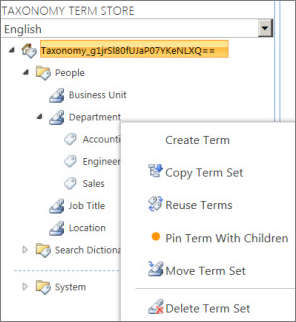

# Create and manage terms in a term set

You can use the Term Store management tool to create terms in a term set, or manage a term such as copy it or move it. If you have many terms that you want to add, it might be more practical to import all the terms in the term set instead of adding the terms individually. For information about how to import terms, see [Import term sets](https://support.office.com/article/168fbc86-7fce-4288-9a1f-b83fc3921c18). 
  
> [!IMPORTANT]
>  To create and manage terms in the Term Store management tool, you must be a Contributor, a Group Manager, or a Term Store Administrator. 
  

  
To create a term in a term set, follow these steps
  
> [!NOTE]
>  If you are adding a term to a local term set, you must start this procedure from the site to which the term set belongs. If you are updating a global term set, you can open the Term Store management tool from any site. 
  
1. Open the Term Store management tool. To learn how, see [Open the Term Store management tool](open-term-store-management-tool.md).
    
2. In the tree-view pane, expand the groups to find the term set to which you want to add a term.
    
3. Point to the term set where you want to add a term, select the arrow that appears, and then select **Create Term**.
    
4. Type the name that you want to use as the default label for the newly created term in the tree view.
    
5. In the **Properties** pane, specify the following information about the new term: 
    
6. **Available for tagging** Select the check box to make this term available for tagging. If you clear the check box, the term is visible but disabled in the tagging tools. 
    
7. **Language** Select the language for this label for the term. 
    
8. **Description** Type a description to help users understand how to apply this term, or to differentiate it from similar terms. 
    
9. **Default Label** Enter the word or phrase that you want to use as the default label for the term in this language. 
    
10. **Other Labels** Enter any synonyms for this term. To add multiple synonyms, type the first synonym and then press **ENTER** to add more lines. 
  
## Take another action with terms

There are several actions that you can take on terms that will help you build and manage term sets as the business needs of your organization evolve. 
  
To take any of the following actions, first [Open the Term Store management tool](open-term-store-management-tool.md), and then point to the term that you want to use for the action.
  
### Copy a term

- Select **Copy Term** The name of the new term is Copy of \<original term name\>. No child terms for the source term are copied. 
    
### Reuse a term

1. Select **Reuse Terms**.
    
2. In the **Term Reuse** dialog box, expand the groups and term sets to find the term that you want to reuse under your selected parent term. 
    
3. Select the term and then select **OK**. 
    
### Pin term with children

1. When you pin a term with children, you reuse the term in a different security group. 
    
2. Select **Pin term with children**.
    
3. In the **Reuse and Pin Term: Select a Source** dialog box, expand the groups and term sets. 
    
4. Select the term that you want to reuse and pin as a child of the selected term or term set.
    
5. Check or clear **Block users from using this keyword outside the context of its new Term Set destination**.
    
6. Select **OK**.
    
### Merge a term with another

1. Select **Merge Term**.
    
2. In the **Term Merge** dialog box, expand the term set that contains the term with which you want to merge you selected term. 
    
3. Select the target term.
    
4. Select **OK**. 
    
### Deprecate a term

- Select **Deprecate Term** This action makes any instances of this term in any term set to which it belongs unavailable for tagging. Any child terms of the term are not deprecated. 
    
### Move a term

1. Select **Move Term**.
    
2. In the **Term Move** dialog box, expand the groups or term sets to find where you want to move the term. 
    
3. Select the target term set or term. 
    
4. Select **OK**. 
    
### Delete a term

1. Select **Delete Term**.
    
2. Select **OK**.
    
This action deletes the term and its child terms. If this term is a source term that other locations reuse, it is put in the Orphaned Terms term set in the System group.
  

