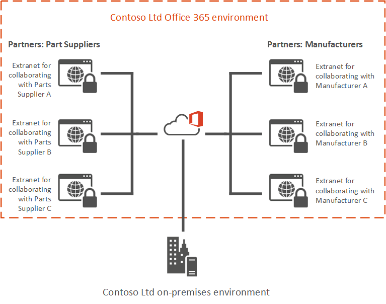

# Use SharePoint Online as a business-to-business (B2B) extranet solution

An extranet site in SharePoint Online is a site that you create to let external partners have access to specific content, and to collaborate with them. Extranet sites are a way for partners to securely do business with your organization. The content for your partner is kept in one place and they have only the content and access they need. They don't need to email the documents back and forth or use tools that are not sanctioned by your IT department.
  
Traditionally, deploying a SharePoint  *on-premises*  extranet site involves complex configuration to establish security measures and governance, including granting access inside the corporate firewall, and expensive initial and on-going cost. 
  
But with Office 365, partners connect directly to a members-only site in SharePoint Online, without access to your on-premises environment or any other SharePoint Online sites. Office 365 Extranet sites can be accessed anywhere there's an Internet connection.
  
Industry verticals where business-to-business (B2B) collaboration is key to their business success include automotive, manufacturing, retail and energy. The following example shows how Contoso Ltd uses a separate extranet site for collaboration with each of their partners and vendors.
  

  
## SharePoint Online collaboration features

 Key features offered in SharePoint Online collaboration include: 
  
- **Allow users to Invite new partner users:** In certain site collections, admins can optionally allow users to invite new partner users. In this model, an email invite is sent to the partner user and the user must redeem that invite to access the resource. See [Manage external sharing for your SharePoint Online environment](external-sharing-overview.md) for details. 
    
- **Sharing by site owners only:** Ability to have site collections where only site owners can bring in or share with new users. Site members, who are typically external partner users, can see only the existing site members in the site. This helps in governing what partners can see and with whom they can share documents. 
    
- **Restricted domains sharing:** Admins can control the list of partner domains that their employees can share with outside the organization. Either an allow list of email domains or a deny list of email domains can be configured. See [Restricted Domains Sharing in O365 SharePoint Online and OneDrive for Business](restricted-domains-sharing.md) more details. 
    
- **Auditing &amp; Reporting:** Activities of the business partner users are audited and reports can be viewed in Office 365 Activity Reports. 
    
## Why use Office 365 for B2B extranet sites?

 **Time-to-value and Cost savings:** Office 365 B2B extranet sites eliminate the need for creating a costly on-premises extranet sites. No additional hardware is required and using Office 365 greatly reduces the resource and labor costs. Your IT department can focus on more important tasks than creating and maintaining extranet infrastructure. 
  
 **Secure sharing:** Office 365 B2B extranet provides a highly secure sharing experience with the IT governance and policies that you require, including: 
  
- The ability to protect yourself against accidental sharing by using  *site-owners only*  sharing which prevents site users from inviting new users to that site. 
    
- The ability to restrict partner users to a single site. They cannot search for or view any content outside of their site. 
    
- The ability to restrict the External partner users to be able to only accept invitations from the email address to which the invitation was sent, external partner users to use their corporate Office 365 organization account or Microsoft account to access a site that was created solely for them.
    
 **Seamless Collaboration:** Collaborate with your partner users as if they are part of your organization, including allowing them instant messaging and the ability to make Skype conference calls. 
  
 **Governance and Audit Reporting**. Office 365 B2B extranet offers visibility into the access of your content by external partner users. One of the key IT benefits is to be able to audit usage, including being able to see who is inviting whom and when an external user logs in to access the content.
  
## Compare Office 365 Hybrid Extranet with a traditional SharePoint On-premises Extranet

||||
|:-----|:-----|:-----|
||**Office 365 Hybrid Extranet**   |**SharePoint "on-premises" Extranet**   |
|Firewall access required for external users    |No    |Yes    |
|Complex network and infrastructure configuration required    |No    |Yes    |
|Security hardening    |Managed through Office 365 configurations    |Manually configured by IT staff    |
|IT labor intensive    |No    |Yes    |
|Ongoing maintenance needed    |Minimal    |Considerable    |
|Additional hardware needed    |No    |Often    |
|Controlling sharing experience for extranet sites    |Part of Office 365 sites functionality    |Often requires custom solutions/apps    |
   
## Get started

To get started setting up a SharePoint Online extranet site:
  
1. Read [Planning SharePoint Online business-to-business (B2B) extranet sites](plan-b2b-extranet-sites.md) to learn about the different guest invitation models. 
    
2. Read [Securing a SharePoint Online extranet site](secure-extranet-site.md) to learn about the options for restricting your extranet site to only the users you want. 
    
3. Deploy your extranet by using [standard SharePoint Online sharing options](external-sharing-overview.md) or by [importing external users into Azure AD](/azure/active-directory/active-directory-b2b-what-is-azure-ad-b2b).
    

