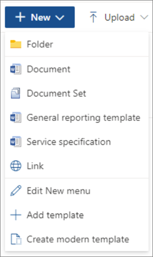
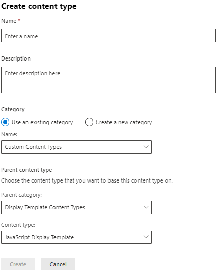

# Create or customize a content type

Content types help make it easy to provide consistency across a site. You create or customize a content type with the characteristics that you want, such as a certain template, specific metadata, and so on. For example, when a user chooses an item from the **New Item** or **New Document** menu, you can ensure that customized content is used.

To learn more about content types, see [Introduction to content types and content type publishing](https://support.microsoft.com/office/e1277a2e-a1e8-4473-9126-91a0647766e5).

To create a content type, follow these steps:

**To create a content type**

1. Go to the SharePoint admin center.

2. Under **Content services**, select **Content type gallery**.

3. Select **Create content type**. The **Create content type** panel appears.

4. On the **Create content type** panel, provide a name and description for the new content type.

    

5. In the **Parent content type** section, from the **Category** amd **Content type** dropdowns, select the content type that you want to base this content type on.

6. In the **Category** section, you are provided two choices:

    - To put the new content type in an existing category, select **Use an existing category**, and from the **Category** dropdown, select a category.
    
    - To put the content in a new category, select **Create a new category**, and in the **Category name** box, provide a name. 

7. Select **Create**.

The new content type appears in the **Content type gallery**.

## To change the name of a content type

1. Go to the SharePoint admin center.

2. Under **Content services**, select **Content type gallery**.

3. On the **Content type gallery** page, under the **Site content type** column, select the name of the site content type that you want to change.

4. On the content type page, on the menu bar, select **Edit**. The **Edit content type** panel appears.

5. In the **Name** text box, change the name of the content type.

6. When done, select **Save**.

## Associate a document template with a content type

To make sure that documents have consistent content across a site, you can associate a Word, Excel, or PowerPoint template with a site content type.

For example, you might want employees to use a standard Excel template when they create a weekly time sheet. If you associate the template with a Timesheet content type, every time someone uses the Timesheet content type, the correct template is automatically loaded in the worksheet.

You can make it even easier for users by adding the Timesheet content type to a library. Then, users can open the correct timesheet just by selecting **Timesheet** on the **New Documents** menu. To learn how to do this, see [Add a content type to a list or library](https://support.microsoft.com/office/917366ae-f7a2-47ad-87a5-9689a1884e60).

**To associate a template with a content type**

1. Go to the SharePoint admin center.

2. Under **Content services**, select **Content type gallery**.

3. On the **Content type gallery** page, under the **Site content type** column, select the name of the  document-based content type that you want to change by associating a Word, Excel, or PowerPoint template.

4. In the menu bar, under **Settings**, select **Advanced Settings**. The **Advanced Settings** panel appears.

5. Enter the location of the template:

    - If the template is stored on your site, select **Use an existing template**, and then enter the URL for the template that you want to use. To edit the template, select **Edit template**.

    - If the document template is stored on your local computer, select **Upload a new document template**, and then select **Upload**. From the explorer page, locate the file that you want to use, select it, and then select **Open**.

6. Under **Permissions**, to select whether the content type can be modified, select either **Read** or **Edit**. You can change this setting later from this page by anyone with permissions to edit this content type.

7. Under **Update site and lists**, if you want to update all site and list content types that inherit from this content type with the settings on this page, select **Enable**.

8. Select **Save**.

## Related topics

[Add columns to a content type](add-columns-content-type.md)

[Create or customize a site content type](https://support.microsoft.com/office/27eb6551-9867-4201-a819-620c5658a60f)