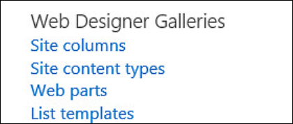
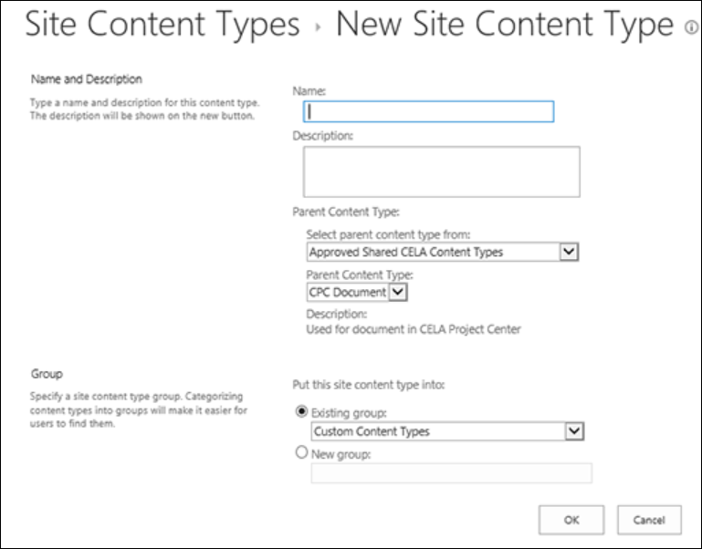
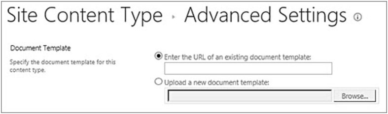
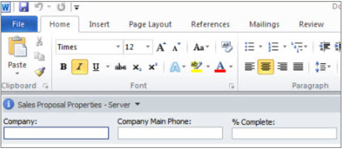

# Create or customize a site content type

Site content types help make it easy to provide consistency across a site. As a site owner, you create or customize a content type with the characteristics that you want, such as a certain template, specific metadata, and so on. For example, when a user chooses an item from the **New Item** or **New Document** menu, you can ensure that customized content is used.

To learn more about content types, see [Introduction to content types and content type publishing](https://support.microsoft.com/office/introduction-to-content-types-and-content-type-publishing-e1277a2e-a1e8-4473-9126-91a0647766e5).

> [!IMPORTANT]
> To create site content types for a site, you must have Full Control for that site. To create site content types for the top-level site in a site collection, you must be a site collection admin.

To create a site content type that people can use everywhere on a site, follow these steps:

**Create a content type**

1. Go to the site where you want to create a site content type.

2. Select **Settings** , and then select **Site Settings**.

3. Under **Web Designer Galleries**, select **Site content types**

The Gallery shows all the existing site content types, grouped in categories. The one that you select becomes the parent group of your new content type.

4. In the **Show Group** box, select the group that you want to use, and then select **Create**.

5. On the **New Site Content** page, provide a name and description for the new content type.

6. In the **Parent Content Type** section, select the name of the parent group, and then select the **Parent Content Type**.

7. In the **Group** section, decide whether to put the new content type in an existing group, or to create a new group.

8. Select **OK**.

When SharePoint creates the new content type, it opens the **Site Content Type** page for it, where you can customize it further.

## Change the name of a site content type

1. Go to the home page of the site that contains the content type that you want to rename.

2. Select **Settings** , and then select **Site Settings**.

3. In the **Web Designer Galleries** group, select **Site Content Types**.

4. On the **Site Contents Types** page, select the name of the content type that you want to change.

5. On the **Site Content Type Information** page, under **Settings**, select **Name, description, and group**.

6. In the **Name** text box of the **Name and description** section, change the name of the content type.

7. When done, select **OK**.

## Associate a document template with a site content type

To make sure that documents have consistent content across a site and its subsites, you can associate a Word, Excel, or PowerPoint template with a site content type.

For example, you might want employees to use a standard Excel template when they create a weekly timesheet. If you associate the template with a Timesheet content type, every time someone uses the Timesheet content type, the correct template is automatically loaded in the worksheet.

You can make it even easier for users by adding the Timesheet content type to a library. Then, users can open the correct timesheet just by selecting **Timesheet** on the **New Documents** menu. To learn how to do this, see [Add a content type to a list or library](https://support.microsoft.com/office/add-a-content-type-to-a-list-or-library-917366ae-f7a2-47ad-87a5-9689a1884e60).

To associate a template with a site content type, follow these steps.

1. Go to the site for which you want to associate a template with a site content type.

2. Select **Settings** , and then select **Site Settings**.

3. Under **Web Designer Galleries**, select **Site content types**.

4. Select the name of the content type that you want to change by associating a Word, Excel, or PowerPoint template.

5. Under **Settings**, select **Advanced settings**.

6. Enter the location of the template:

    - If the template is stored on your site, select **Enter the URL of an existing document template**, and then enter the URL for the template that you want to use.

    - If the document template is stored on your local computer, select **Upload a new document template**, and then select **Browse**. In the **Choose File** dialog box, locate the file that you want to use, select it, and then select **Open**.

    

7. Under **Update all content types inheriting from this type?**, if you want to update all content types that inherit from this content type with the document template, select **Yes**.

8. Select **OK**.

## Add columns to a site content type

The columns for a content type represent metadata. To add a metadata element, add a new column.

For example, your organization might want to track specific metadata for purchase orders, such as account number, project number, and project manager. If you add columns for this information to the purchase order content type, SharePoint prompts users to provide the information when they save their work. In addition, if you add the content type to a list or library, you can define a view to display the columns.

> [!NOTE]
> To add a column to a content type, you must first select the content type. If you are not able to select the content types that appear, the site inherits its content types from a parent site. To add a column to the content type, you must change it on the parent site.

1. Go to the site for which you want to add a column to a site content type.

2. Select **Settings** , and then select **Site Settings**.

3. Under **Web Designer Galleries**, select **Site content types**.

4. Select the name of the content type to which you want to add a column.

5. Under **Columns**, select **Add from existing site columns**.

6. In the **Select Columns** section, under **Select columns from**, choose the parent group for the column.

7. Under **Available columns**, select the name of the column that you want, and then select **Add**.

8. In the **Update List and Site Content Types** section, decide whether you want to update all content types that inherit from this site content type by selecting **Yes** or **No**.

## Set up the Document Information Panel for a site content type

The Document Information Panel is available for Word, Excel, and PowerPoint in Microsoft Office 2010 and later. The Document Information Panel displays an InfoPath form on these documents where you can enter metadata information in the panel.

For example, suppose that you want to make sure that salespeople provide the company name and phone number for every sales proposal. You can create a Proposal content type, and include company name and phone number in the Document Information Panel. When they open a Proposal document, users enter or update the required name and phone number. When they save the document, SharePoint automatically updates the metadata stored as columns in the document library.

To learn more about content types and metadata, see [Add metadata columns to a content type](https://support.microsoft.com/office/add-columns-to-a-content-type-1806e29e-8bcd-4058-b0e7-3aac40a3ae9a).

To set up a Document Information Panel for a document content type, follow these steps.

1. Go to the site for which you want to change a site content type.

2. Select **Settings** , and then select **Site Settings**.

3. Under **Web Designer Galleries**, select **Site content types**.

4. Choose the name of the site content type that you want to change.

> [!NOTE]
> If names of the content types that appear are not hyperlinks, then this site inherits its site content types from another (parent) site. To update the site content type, go to the parent site.

5. Under **Settings**, select **Document Information Panel settings**.

6. In the **Document Information Panel Template** section, do one of the following:

    - To use a default template that displays the metadata (columns) that you defined for the content type, select **Use the default template for Microsoft Office applications**.

    - To use an existing custom template, select **Use existing custom template (URL, UNC, or URN)**, and then enter the path of the location of the template.

    - To upload an existing custom template (XSN), select **Upload an existing custom template (XSN) to use**, and to locate the template that you want to use, select **Browse**.

    - To create a custom panel in InfoPath, select **Create a new custom template**.

    > [!NOTE]
    > If you select this option, InfoPath starts and displays the default template which you can customize to create a custom panel.

7. In the **Show Always** section, specify whether you want documents of this content type to show the information panel automatically.

8. Select **OK**.