# Guided walkthrough: Create a hub site for your organization

In this article, we show you elements of an example Hub site to inspire you, and help you learn how to create similar sites for your own organization. Hub sites empower visitors to find information and resources fast. This example Hub site offers news, links to key resources, events, and contacts. This example of a Human Resources hub site also suggests a custom app for employee time-off requests

First, if you haven't already created a Communication site, check out the [Create your site](#create-your-site) section in this article.  If you need to learn how to edit and publish the page on your site, check out the section [Edit, work with sections and web parts, and publish](#manage-sections-and-web-parts) in this article.

Once you have your created your site and know how to edit pages, you can use the steps below to add the elements shown.

## Example Hub Site

|Image of the homepage|Customization instructions|
|---|---|
|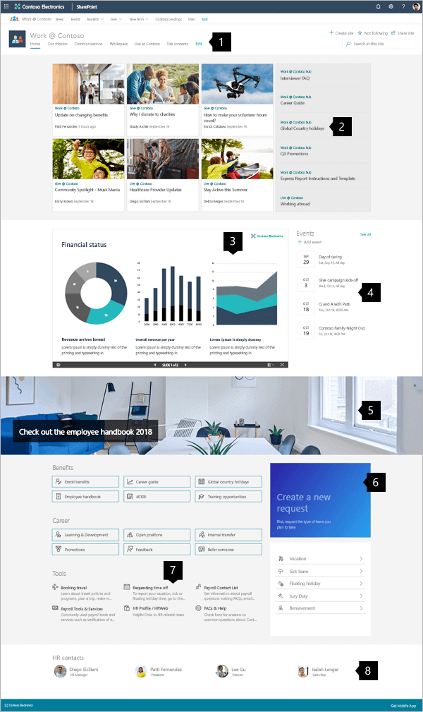|**1. Mega menus and edit controls** Quickly guide visitors to the information they seek. This area also provides admins access to editing tools. [*Learn how*](#managing-the-mega-menu) 
 **2. Share news** Collect important news relevant to the site's area of focus. [*Learn how*](#manage-sections-and-web-parts) 
 **3. Feature important content** Easily share financial presentations, charts, and reports. [*Learn how*](#add-important-news-with-the-news-web-part) 
 **4. Keep up-to-date on events** Offer quick access to information on upcoming events. [*Learn how*](#style-links-to-match-the-page-with-the-quick-links-web-part) 
 **5. Create visual impact** Add visual impact with banner images. [*Learn how*](#add-graphics-with-the-image-web-part) 
 **6. Guide visitors to tools** Add custom tools to streamline process like requesting time off.  [*Learn how*](#share-files-interactively-with-the-file-viewer-web-part) 
 **7. Provide a clear path** Guide users to the correct information and tools with icons and text summaries. [*Learn how*](#add-a-calendar-of-events-with-the-events-web-part) 
 **8. Feature the experts** Guide visitors to the experts who can help them resolve issues effectively.  [*Learn how*](#feature-people-with-the-people-web-part)|

## Create your site

To make a site like the one shown here, you'll create a [Communication site](https://support.microsoft.com/office/use-the-sharepoint-topic-showcase-and-blank-communication-site-templates-94a33429-e580-45c3-a090-5512a8070732). To do this, select **Create site** from the SharePoint start page (or, if you're going to associate this site with an existing Hub site, navigate to the hub site and select **Create site** there so that the communication site is automatically associated with that hub site).

   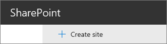

Next, choose **Communication site**, and then the **Topic** layout. Fill out your site name, description, and other information, and select *Finish*. Then you'll get a template with the same type of layout as the example in this article.

   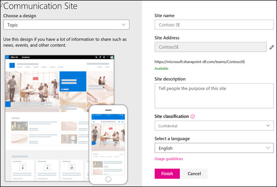

For more information, see [Create a communication site in SharePoint Online](https://support.microsoft.com/office/create-a-communication-site-in-sharepoint-7fb44b20-a72f-4d2c-9173-fc8f59ba50eb).

[Back to top](#example-hub-site)

## Managing the Mega Menu

The Hub site is optimized to organize and present links to other locations effectively.

   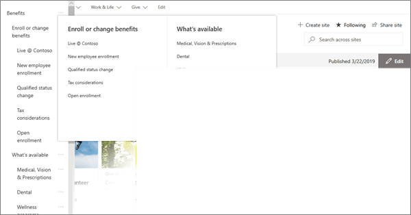

Clicking **Edit** on the top menu opens a simple three-level outline list on the left. The outline level equates to the menu parts: Main menu, Header item, or Menu item.

- Select the **...** control on the right of the item name to set the items link and outline level.

On the right, below the header, select **Edit** to begin editing your page. While editing, your drafts can either be saved for later or discarded. When your page updates are ready, select **Publish** to reveal them to your entire organization.

   

[Back to top](#example-hub-site)

## Manage sections and web parts

To create sections, start editing by clicking **Edit** on the top right of the page.

   

The **+** symbol before or after a section will add a section using one of several layouts.

   

Sections make up your page, and are you place one or more web parts. While editing the page, each section will show controls to edit the layout, move, or delete the sections. For information on working with sections, see [Add or remove sections and columns on a page](https://support.microsoft.com/office/add-sections-and-columns-on-a-sharepoint-modern-page-fc491eb4-f733-4825-8fe2-e1ed80bd0899).

   

Select the plus symbol  in a section, which may appear before or after a web part in a section, to see the many types of web parts available. For more information on all web parts, see [Using web parts on SharePoint pages](https://support.microsoft.com/office/using-web-parts-on-sharepoint-pages-336e8e92-3e2d-4298-ae01-d404bbe751e0).

   

Web parts may be edited, moved or deleted within sections. The **Edit web part** icon opens detailed controls unique to each web part type.

   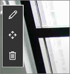

When your page updates are ready, select **Publish** to make them visible to your audience.

   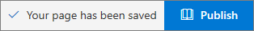

> [!TIP]
> To manage all of your pages on the site, click **Pages** on the top menu.

For more details on using pages, see [Create and use modern pages on a SharePoint site](https://support.microsoft.com/office/create-and-use-modern-pages-on-a-sharepoint-site-b3d46deb-27a6-4b1e-87b8-df851e503dec).

[Back to top](#example-hub-site)

## Add important news with the News web part

The News web part provides controls to choose the **News Source** and **Layout**, and to **Organize** and **Filter** the content. Hub sites bring information and resources together so visitors can find what they need and move forward in completing tasks efficiently. This site uses the **Hub News** layout, which is one of five options. Once a layout is chosen, explore the **Organize** tools to refine priorities in how the news is displayed.

In this example, the web part is in a one-column section.

   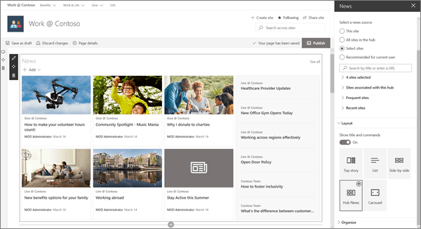

For more details on using the News web part, see [Use the News web part on a SharePoint page](https://support.microsoft.com/office/use-the-news-web-part-on-a-sharepoint-page-c2dcee50-f5d7-434b-8cb9-a7feefd9f165).

[Back to top](#example-hub-site)

## Style links to match the page with the Quick Links web part

The Hub site features the Quick links web part, and while it's lower on the Hub page, it is a key feature of the page. The Quick links web part provides several Layout options that use icons and text to help visitors locate the link they need.

In this site example, the **Compact** layout is used for Career resources, and the **List** layout is used for Tools, which allows short text summaries for each link.

   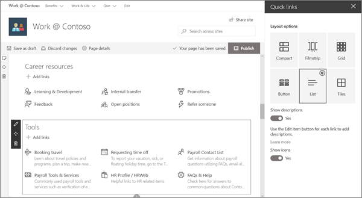

For more details on using the Quick Links web part, see [Use the Quick Links web part](https://support.microsoft.com/office/use-the-quick-links-web-part-e1df7561-209d-4362-96d4-469f85ab2a82).

[Back to top](#example-hub-site)

## Add graphics with the image web part

**Use images to create impact**:

On this hub, an image with text guides visitor eyes to important links, information, and tools. This site also uses an image to suggest implementing a tool for employee time off requests.

**Flexible controls**:

The image can come from a location on the site, the cloud, or uploaded. Text options enhance communication and accessibility.

 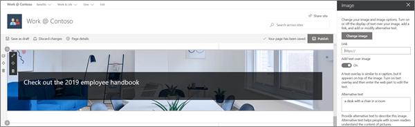

For more details on using the Image web part, see [Use the Image web part](https://support.microsoft.com/office/use-the-image-web-part-a63b335b-ad0a-4954-a65d-33c6af68beb2).

[Back to top](#example-hub-site)

## Share files interactively with the File Viewer web part

The File viewer web part allows important files in many formats to be posted to the page. The viewer allows visitors the choice to view and interact with the files using several methods. Visitors may:

- Download full copies

- Print to PDF

- View the files full screen in the browser

 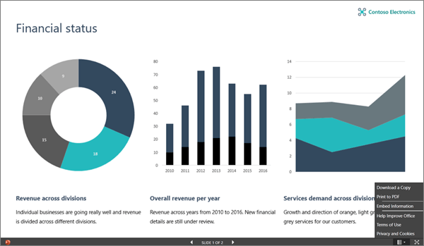

For more details on using the File viewer web part, see [Use the File viewer web part](https://support.microsoft.com/office/use-the-file-viewer-web-part-e53a9602-e7b3-4fff-9126-de2f18d1900c).
[Back to top](#example-hub-site)

## Add a calendar of events with the Events web part

Inform visitors of important events. The Events web part can summarize events from all over the organization or from a specific list or calendar, and viewers can easily click the event to add it to their calendars.

In this Hub site example, this web part uses the Compact layout.

  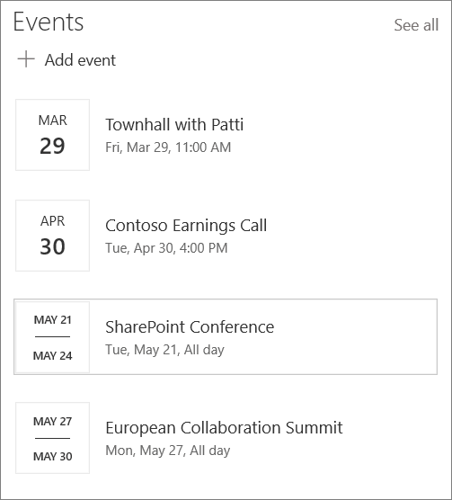

For more details on using the Events web part, see [Use the Events web part](https://support.microsoft.com/office/use-the-events-web-part-5fe4da93-5fa9-4695-b1ee-b0ae4c981909).

[Back to top](#example-hub-site)

## Feature people with the People web part

When visitors need to find stakeholders or expertise, make it easy by featuring them on the site. People tiles can be simple or provide extra detail, and one click brings up key details from their profile.

  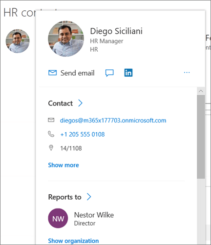

For more details on using the People web part, see [Show people profiles on your page with the People web part](https://support.microsoft.com/office/show-people-profiles-on-your-page-with-the-people-web-part-7e52c5f6-2d72-48fa-a9d3-d2750765fa05).

[Back to top](#example-hub-site)

### Want more?

Get inspired with more examples and the ability to add an example Giving site with the [SharePoint Look Book](https://adoption.microsoft.com/sharepoint-look-book).

