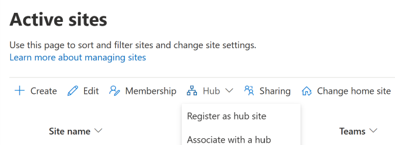

# Create a hub site in SharePoint

If you're a global or SharePoint admin in Office 365, you can convert any existing site to a hub site.
  
> [!NOTE]
>  We recommend selecting a communication site, or a team site that uses the new template. If you use a classic team site, the hub navigation will appear only on modern pages, and hub site settings will only appear on modern pages. Sites that are already associated with another hub can't be converted to a hub site.  You can create up to 2,000 hub sites for an organization. There is no limit on the number of sites that can be associated with a hub site.  When users associate their sites with a hub, it doesn't impact the permissions of either the hub site or the associated sites. It's important to make sure all users you allow to associate sites to the hub have permission to the hub. 
  
## Create a hub site in the new SharePoint admin center

1. Go to the [Active sites page of the new SharePoint admin center](https://admin.microsoft.com/sharepoint?page=siteManagement&modern=true) and sign in with an account that has [admin permissions](/sharepoint/sharepoint-admin-role) for your organization.

>[!NOTE]
>If you have Office 365 Germany, [sign in to the Microsoft 365 admin center](https://go.microsoft.com/fwlink/p/?linkid=848041), then browse to the SharePoint admin center and open the Active sites page.  If you have Office 365 operated by 21Vianet (China), [sign in to the Microsoft 365 admin center](https://go.microsoft.com/fwlink/p/?linkid=850627), then browse to the SharePoint admin center and open the Active sites page.

2. Select the site, select **Hub**, and then select **Register as hub site**.

    

    > [!TIP] 
    > Using the Hub site menu, you can also associate a site with the hub site, change a site's association to a different hub site, or disassociate a site from a hub site. 

3. Enter a display name for the hub site and specify the individual users or security groups you want to allow to associate sites with the hub.

    

    > [!IMPORTANT] 
    > If you leave the **People who can associate sites with this hub** box empty, any user can associate their site with the hub. If you later want to change the hub site display name or the list of people who can associate sites with the hub, you need to use PowerShell or go to hub site settings on the hub site.

4. Select **Save**.

    
## See also

- For info about using a site design that gets applied when sites join the hub, see [Set up a site design for your hub site](set-up-site-design-hub-site.md). For more info about site designs and site scripts, see [SharePoint site design and site script overview](/sharepoint/dev/declarative-customization/site-design-overview).

- To learn how to use Microsoft PowerShell to create and manage hub sites, see [Manage SharePoint hub sites](/sharepoint/dev/features/hub-site/hub-site-powershell).
    
- For info about how site owners can customize hub sites, see [Set up your SharePoint hub site](https://support.office.com/article/e2daed64-658c-4462-aeaf-7d1a92eba098).

- For info about removing a hub site, see [Remove a hub site](remove-hub-site.md).
