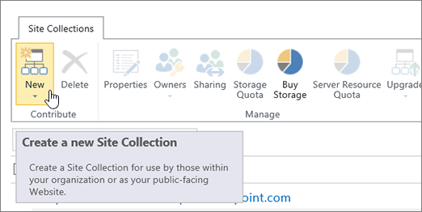

# Create a site collection

This article shows how Office 365 global admins and SharePoint admins can create classic SharePoint Online site collections in the classic SharePoint admin center.
  
> [!NOTE]
> For info about creating new team sites that are connected to Office 365 groups and communication sites in the new SharePoint admin center preview, see [Manage sites in the new SharePoint admin center](manage-sites-in-the-new-sharepoint-admin-center.md). 
  
## Create a classic site collection

SharePoint Online has several templates for classic site collections. For example, you can create sites for blogs, wikis, record storage, and publishing. Some previous Office 365 plans can have only one site collection. For info, see [SharePoint Online limits](https://support.office.com/article/8f34ff47-b749-408b-abc0-b605e1f6d498#__sharepoint_online_for_1).
  
1. Sign in to Office 365 as a global admin or SharePoint admin.
    
2. Select the app launcher icon  in the upper-left and choose **Admin** to open the Office 365 admin center. (If you don't see the Admin tile, you don't have Office 365 administrator permissions in your organization.) 
    
3. In the left pane, select **Resources**, and then select **Sites**.
    
  
4. Select **Add a site**.
    
  
    > [!NOTE]
    > If you don't see the options above, select **Admin centers** > **SharePoint** and then select **New** > **Private Site Collection**.
  
5. Fill out the new site collection properties:
    
  
  - In the **Title** box, enter a name for the site collection. 
    
  - In the **Web Site Address** drop-down lists **,** select a domain name and a URL path—either **/sites/** or **/teams/** —and then type a URL name for the site collection. 
    
  - In the **Template Selection** section, in the **Select a language** drop-down list, select a language for the site collection. You can enable the SharePoint multiple language interface on your sites, but the primary language for the site collection will remain the one you select here. 
    
    > [!NOTE]
    > It's important to select the appropriate language for the site collection, because once it's set, it cannot be changed. After creating a site collection, verify the locale and regional settings are accurate. (For example, a site created for Chinese will have its locale set to China.) 
  
  - In the **Template Selection** section, under **Select a template**, choose the template that most closely describes the purpose of your site collection. For example, if your site collection will be used for a team collaboration, choose **Team Site**.
    
    > [!TIP]
    > For more information on templates, see [Using templates to create different kinds of SharePoint sites](https://support.office.com/article/449eccec-ff99-4cf3-b62e-dcfee37e8da4). 
  
  - In the **Time Zone** box, select the time zone that's appropriate for the location of the site collection. 
    
  - In the **Administrator** box, type the user name of your site collection administrator. You can also use the **Check Names** or **Browse** button to find a user to make site collection administrator. 
    
  - In the **Storage Quota** box, type the number of megabytes (MB) you want to allocate to this site collection. Do not exceed the available amount that is displayed next to the box. 
    
  - In the **Server Resource Quota** box, accept the resource quota default. This setting no longer affects the resource amounts available for the site collection. 
    
6. Click **OK**.
    
    The new site collection will appear in the URL list. The URL is the site collection location at which the administrator can start to create and manage sites.
    
## See also

#### Other Resources

[Enable or disable site collection features](https://support.office.com/article/A2F2A5C2-093D-4897-8B7F-37F86D83DF04)
  
[Introduction to multilingual features](https://support.office.com/article/53411469-53e3-4570-95e2-3651f166174f)

