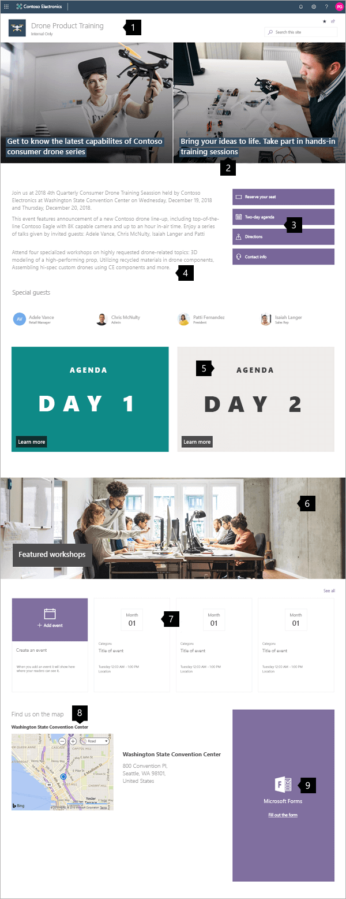
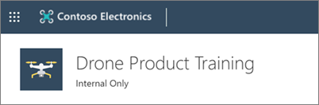
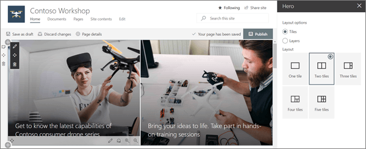
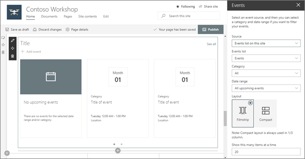
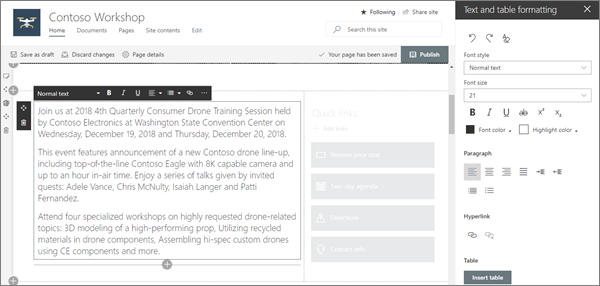
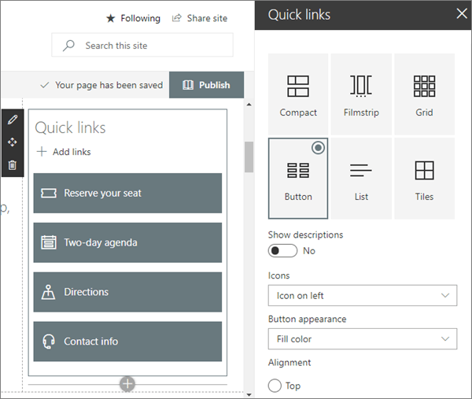
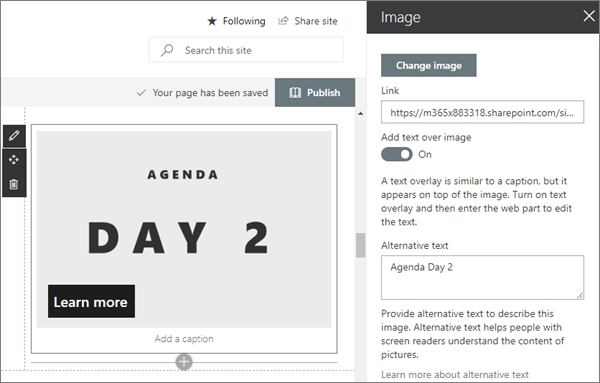
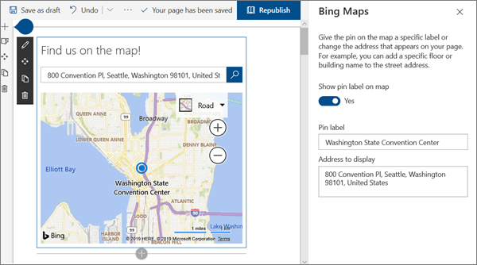
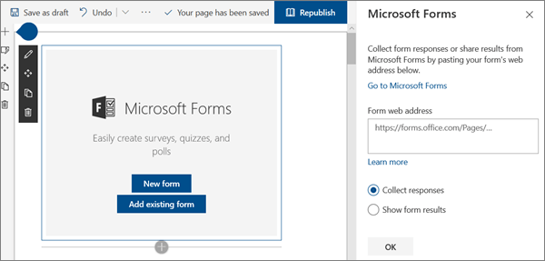

# Guided walkthrough: Creating a Training site for your organization

In this article, we show you elements of an example Training site to inspire you, and help you learn how to create similar sites for your own organization. This example site provides info about a specific event and guides the user toward learning and registration. It relies on visual impact to engage and motivate the visitor.

First, if you haven't already created a Communication site, check out the [Create your site](#create-your-site) section in this article. If you need to learn how to edit and publish the page on your site, check out the section [Edit, work with sections and web parts, and publish](#manage-sections-and-web-parts) in this article.

Once you have your created your site and know how to edit pages, you can use the following guidance to add the elements shown.

## Example Training site

|Image of the homepage|Customization instructions|
|---|---|
||**1. Logo and site classification** Customize your logo and classify your site. [*Learn how*](#logo-and-site-classification) 
 **2. Create impact** Use the hero web part to visually communicate your value. [*Learn how*](#create-impact-with-the-hero-web-part) 
 **3. Guide users to key action** Lead visitors to register or discover more. [*Learn how*](#guide-users-to-key-actions-with-quick-links) 
 **4. Describe the event** Use text to describe the "what" and "why" of the event. [*Learn how*](#describe-the-event-with-the-text-web-part) 
 **5. Use images with links** Increase visibility and link to detailed agenda pages. [*Learn how*](#use-images-with-links) 
 **6. Highlight detailed information** Images can define areas of important information. [*Learn how*](#use-images-with-links) 
 **7. Show event dates** Provide an event calendar so users can plan their schedules. [*Learn how*](#show-event-dates) 
 **8. Add a map** Use a map to help users get to where they need to be. [*Learn how*](#add-maps-with-the-bing-maps-web-part) 
 **9. Provide on-page registration** Add a form for easy registration. [*Learn how*](#add-forms-for-registration)|

## Create your site

To make a site like the one shown here, you create a [Communication site](https://support.microsoft.com/office/use-the-sharepoint-topic-showcase-and-blank-communication-site-templates-94a33429-e580-45c3-a090-5512a8070732). To do this, select **Create site** from the SharePoint start page (or, if you're going to associate this site with a Hub site, navigate to the hub site and select **Create site** there so that the communication site is automatically associated with that hub site).

Next, choose **Communication site**, and then the **Topic** layout. Fill out your site name, description, and other information, and select **Finish**. Then you get a template with the same type of layout as the example in this article.

For more information, see [Create a communication site in SharePoint Online](https://support.microsoft.com/office/create-a-communication-site-in-sharepoint-7fb44b20-a72f-4d2c-9173-fc8f59ba50eb).

[**Back to top**](#example-training-site)

## Logo and site classification

In this example, the header area doesn't contain any navigation because it's a "stand-alone" page. However, the header area does contain a custom logo, and shows a label indicating that the site is classified as "Internal Only." Site classification uses values such as internal, confidential, high business impact, low business impact, and so on. These values can pertain to sensitivity of information or to the life cycle of information.

To learn how to change the logo and classify your site, see [Manage your SharePoint site settings](https://support.microsoft.com/office/change-a-site-s-title-description-logo-and-site-information-settings-8376034d-d0c7-446e-9178-6ab51c58df42).

[**Back to top**](#example-training-site)

## Manage sections and web parts

Start editing by clicking **Edit** on the top right of the page.

While editing, on the left, below the header your drafts can be saved for later or discarded.

The + symbol before or after a section will add a section using one of several layouts.

Sections make up your page, and are you place one or more web parts. When you edit the page, each section shows controls to edit the layout, move, or delete the sections. For information on working with sections, see [Add or remove sections and columns on a page](https://support.microsoft.com/office/add-sections-and-columns-on-a-sharepoint-modern-page-fc491eb4-f733-4825-8fe2-e1ed80bd0899).

Select the plus symbol  in a section, which may appear before or after a web part in a section, to see the many types of web parts available. For more information on all web parts, see [Using web parts on SharePoint pages](https://support.microsoft.com/office/using-web-parts-on-sharepoint-pages-336e8e92-3e2d-4298-ae01-d404bbe751e0).

Web parts may be edited, moved, or deleted within sections. The **Edit web part** icon opens detailed controls unique to each web part type.

When your page updates are ready, select **Publish** to make them visible to your entire organization.

> [!TIP]
> To manage all of your pages on the site, click **Pages** on the top menu.

For more information on using pages, see [Create and use modern pages on a SharePoint site](https://support.microsoft.com/office/create-and-use-modern-pages-on-a-sharepoint-site-b3d46deb-27a6-4b1e-87b8-df851e503dec).

[**Back to top**](#example-training-site)

## Create impact with the Hero web part

Let your visitors know the focus of your Workshop with the Hero web part. The layout used in this example is **Two tiles**.

**Hero layout: Tiles or Layers**:

Editing the web part presents layout options. The **Tiles** option presents layouts for between one and five tiles. The **Layers** option sets each image as a layer with the image next to the title. Up to five layers are possible allowing one web part to create an entire page.

**Each tile can be edited**:

Use the **Move item** control on the left to rearrange the tiles within the Hero web part. Controls on the right allow you to **Edit details** adjusting the text and image used, **Set focal point** for the hover animation, plus **Zoom in** and **Zoom out** of the image.

In this example, the Hero web part is in a full-width section.

For more information on using the Hero web part, see Use the [Hero web part](https://support.microsoft.com/office/use-the-hero-web-part-d57f449b-19a0-4b0d-8ce3-be5866430645).

[**Back to top**](#example-training-site)

## Show event dates

The Events web part automatically displays event information. The events shown are controlled by filters for **Source**, **Event list**, **Category**, and **Date range**. Events can be shown with detailed summaries in **Filmstrip** view or in a **Compact** view.

In this Workshop site example, this web part uses the **Filmstrip** layout.

For more information on using the Events web part, see [Use the Events web part](https://support.microsoft.com/office/use-the-events-web-part-5fe4da93-5fa9-4695-b1ee-b0ae4c981909).

[**Back to top**](#example-training-site)

## Describe the event with the Text web part

The leadership drop quote and the Monthly Q&A descriptions use the Text web part. This web part allows basic text formatting for creating fixed sections of formatted text.

When editing text, this web part offers basic formatting tools to set styles and add enhancements like **bold** and *italics*. Selecting the ... control at the right end of the formatting toolbar offers more options to the right of the web part.

In this Workshop site example shown before, the web part is in a one-column section.

For more information on using the Text web part, see [Add text and tables to your page with the Text web part](https://support.microsoft.com/office/add-text-and-tables-to-your-page-with-the-text-web-part-729c0aa1-bc0d-41e3-9cde-c60533f2c801).

[**Back to top**](#example-training-site)

## Guide users to key actions with Quick links

The Quick links web part offers several easy to use menu formats for listing links to other pages or sites.

In this site example, the web part uses the **Button** layout for quick and easy reference.

For more information on using the Quick Links web part, see [Use the Quick Links web part](https://support.microsoft.com/office/use-the-quick-links-web-part-e1df7561-209d-4362-96d4-469f85ab2a82).

[**Back to top**](#example-training-site)

## Use images with links

The Image web part places a fixed image on the page. Images can be photographs, diagrams, or even used to bring impact to text. Captions and alt-text keep images accessible.

For more information on using the Image web part, see [Use the Image web part](https://support.microsoft.com/office/use-the-image-web-part-a63b335b-ad0a-4954-a65d-33c6af68beb2).

[**Back to top**](#example-training-site)

## Add maps with the Bing Maps web part

The Bing Maps web part offers an easy visual map reference and quick link to allow visitors to plan their route to your workshop.

For more information on using the Bing Maps web part, see [Use the Bing Maps web part](https://support.microsoft.com/office/use-the-bing-maps-web-part-c0e3f2f6-dc0d-49df-9308-1bf7c888e794).

[**Back to top**](#example-training-site)

## Add forms for registration

If you created a form for registration using [Microsoft Forms](https://support.microsoft.com/office/create-a-form-with-microsoft-forms-4ffb64cc-7d5d-402f-b82e-b1d49418fd9d), you can place that form directly on the page with the Microsoft Forms web part. It's an easy way for attendees to fill out their information, and an easy way for you to collect it.

For more information on using the Microsoft Forms web part, see [Use the Microsoft Forms web part](https://support.microsoft.com/office/use-the-microsoft-forms-web-part-d4b4d3ce-7860-41e4-8a98-76380efe7256).

[**Back to top**](#example-training-site)

### Want more?

Get inspired with more examples in the [SharePoint Look Book](https://adoption.microsoft.com/sharepoint-look-book).