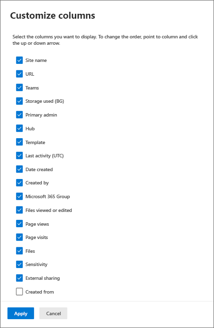

# Customize the SharePoint admin center site list

The <a href="https://go.microsoft.com/fwlink/?linkid=2185220" target="_blank">**Active sites** page in the SharePoint admin center</a> lets you view the SharePoint sites in your organization. You sort and filter sites, search for sites, and customize the columns and views.

## Sort and filter the site list

Sorting and filtering the site list is just like sorting and filtering other lists in SharePoint.
  
1. Select the arrow next to the column header.
    
2. Select how you want to arrange the items. The options vary depending on the column. For example, you might have options to sort alphabetically, in numeric order, or chronologically.
    
    If the column allows filtering, a "Filter by" option appears. Select the value or values that you want to show. Your selections appear with a check mark beside them. To remove a selection, select that value again. To clear all filters on the column, select **Clear filters**.
    
    

## Customize columns

1. Select the arrow next to any column header, and then select **Customize columns**.
    
2. To show and hide columns, select and clear check boxes.
    
3. To rearrange the columns, point to a column, and select the up or down arrow to move the column up or down.
    
    
    
    > [!NOTE]
    > Data in the following columns is not available for US Government GCC High and DoD customers:
    > - Last activity
    > - File views or edited
    > - Page views
    > - Page visits
    > - Files
    > - Storage used
  
## Switch views and create custom views

The <a href="https://go.microsoft.com/fwlink/?linkid=2185219" target="_blank">SharePoint admin center</a> comes with a few built-in views: **All sites**, **Sites connected to Teams**, **Microsoft 365 Group sites**, **Sites without a group**, **Classic sites**, **Largest sites**, **Least active sites**, and **Most popular shared sites**.

To select a different view:

- On the far right of the command bar, select the **Change view** arrow next to the name of your current view, and then select a different view.

    

To create and save a custom view:
  
1. Customize columns, sort, and filter your view the way you want. (Views that are filtered through search can't be saved.)
    
2. On the far right of the command bar, select the **Change view** arrow next to the name of your current view.
    
3. Select **Save view as**.
    
4. In the **Save as** dialog box, enter a name for the view. 
    
    > [!NOTE]
    > To set the view as default, in the list of views, select **Set current view as default**. 
  
## Track a view

When you select a built-in or custom view, you can add a card to your home page that shows the number of sites in the view and summarizes info about the set of sites. 

1. Select the **Change view** arrow, and then select the view you want to track.
2. Select **Track view**.
3. Select **Add card**.
4. Go to your home page to see the card for the tracked view.

    

> [!NOTE]
> If you remove a tracked view card from your home page, you can't add it back from the Add cards panel. You need to open the view on the Active sites page and select **Track view**.

## Search for a site

You can search for a site by name, URL, primary admin, or template. To do this, enter keywords in the Search box, and press Enter.

> [!NOTE] 
> Search doesn't look in hub site display names for the keywords you enter.  All characters you enter are treated as part of the query. Search doesn't recognize operators or wildcards (*). 
  
## Export to CSV

To export the site list you're viewing as a .csv file that you can work with in Excel, select **Export**.
  
> [!NOTE]
> The .csv file lists the hub as a GUID and the template as an ID (for example, STS#0).
  

