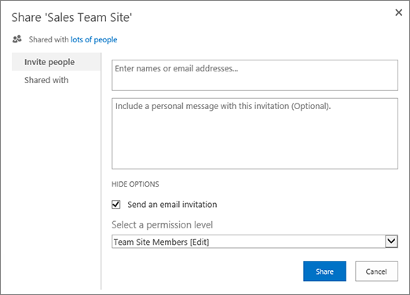

# SharePoint site permissions

While SharePoint allows considerable customization of site permissions, we highly recommend using the built-in SharePoint groups for communication site permissions and managing team site permissions through the associated Microsoft 365 group. For information about managing permissions in the SharePoint modern experience, see [Sharing and permissions in the SharePoint modern experience](modern-experience-sharing-permissions.md).

If you do need to customize SharePoint groups, this article describes how.

## Customize site permissions

A SharePoint group is a collection of users who all have the same set of permissions to sites and content. Rather than assign permissions one person at a time, you can use groups to conveniently assign the same permission level to many people at once. 
  
> [!NOTE]
>  To do the following steps, you need a permission level that includes permissions to  *Create Groups*  and  *Manage Permissions*  . The **Full Control** level has both. For more information, see [Understanding permission levels in SharePoint](understanding-permission-levels.md).

### Create a group

1. On your website or team site, click **Settings** , and click **Site settings**. If you don't see **Site settings**, click **Site information**, and then click **View all site settings**. On some pages, you may need to click **Site contents**, then click **Site settings**.
    
2. On the **Site Settings** page, under **Users and Permissions**, click **Site Permissions**.
  
The permissions page opens.
    
3. On the **Permissions** tab, click **Create Group**. 
    
4. On the **Create Group** page, in the **Name** and **About me** boxes, type a name and description for this SharePoint group. 
    
5. In the **Owner** box, specify a single owner of this security group. 
    
6. In the **Group Settings** section, specify who can view and edit the membership of this group. 
    
7. In the **Membership Requests** section, select the settings that you want for requests to join or leave the group. You can specify the email address to which requests should be sent. 
    
8. In the **Give Group Permissions to this Site** section, choose a permission level for this group. 
    
9. Click **Create**.
    
### Add users to a group

You can add users to a group at any time.
  
1. On your website or team site, click **Share**
  
    
  
    If you see **Members** instead of **Share**, click **Members**, and then click **Add members**.
    
2. By default, the **Share** dialog that appears displays the message **Invite people to Edit** or **Invite people**. This invites the users who you add to join the SharePoint Members group. To choose a different group and permission level, click **Show options** and then choose a different SharePoint group or permission level under **Select a group or permission level**.
  
    
  
1. In the **Enter names, email addresses, or Everyone** box, enter the name or email address of the user or group that you want to add. When the name appears in a confirmation box below your entry, select the name to add it to the text box. 
    
2.  If you want to add more names, repeat these steps. 
    
3.  (Optional) Enter a personalized message to send to the new users in **Include a personal message with this invitation**. 
    
4.  Click **Share**. 
    
### Remove users from a group

1. On your website or team site, click **Settings** , and click **Site settings**. If you don't see **Site settings**, click **Site information**, and then click **View all site settings**. On some pages, you may need to click **Site contents**, then click **Site settings**.
    
2. On the **Site Settings** page, under **Users and Permissions**, click **People and Groups**.
    
3. On the **People and Groups** page, in the Quick Launch, click the name of the group that you want to remove users from. 
    
4. Select the check boxes next to the users who you want to remove, click **Actions**, and then click **Remove Users from Group**. 
    
5. In the confirmation window, click **OK**.
    
### Grant site access to a group

1. On your website or team site, click **Settings** , and click **Site settings**. If you don't see **Site settings**, click **Site information**, and then click **View all site settings**. On some pages, you may need to click **Site contents**, then click **Site settings**.
    
2. On the **Site Settings** page, under **Users and Permissions**, click **Site Permissions**.
    
3. On the **Permissions** tab, click **Grant Permissions**.
    
4. In the **Share** dialog, type the name of the SharePoint group that you want to give access to. 
    
5. By default, the **Share** dialog displays the message **Invite people to Edit** or **Invite people** with **Can edit** permissions. This grants permissions in the SharePoint Members group. To choose a different permission level, click **Show options** and then choose a different SharePoint group or permission level under **Select a permission level** or **Select a group or permission level**. The drop down box shows both groups and individual permission levels, like **Edit** or **View Only**. 
    
6. Click **Share.**
    
### Delete a group

> [!CAUTION]
> We recommend that you don't delete any of the default SharePoint groups, because this can make the system unstable. You should only delete group(s) you have created and no longer want to use. 
  
1. On your website or team site, click **Settings** , and click **Site settings**. If you don't see **Site settings**, click **Site information**, and then click **View all site settings**. On some pages, you may need to click **Site contents**, then click **Site settings**.
    
2. On the **Site Settings** page, under **Users and Permissions**, click **People and Groups**.
    
3. On the People and Groups page, click the name of the SharePoint group that you want to delete. 
    
4. Click **Settings**, and then click **Group Settings**. 
    
5. At the bottom of the **Change Group Settings** page, click **Delete**. 
    
6. In the confirmation window, click **OK** **.**
    
### Assign a new permission level to a group

If you have customized a permission level or created a new permission level, you can assign it to groups or users.
  
1. On your website or team site, click **Settings** , and click **Site settings**. If you don't see **Site settings**, click **Site information**, and then click **View all site settings**. On some pages, you may need to click **Site contents**, then click **Site settings**.
    
2. On the **Site Settings** page, under **Users and Permissions**, click **Site Permissions**.
    
3. Select the check box next to the user or group to which you want to assign the new permission level.
    
4. On the **Permissions** tab, click **Edit User Permissions**.
    
5. On the **Edit Permissions** page, select the check box next to the name of the new permission level. If you select multiple permission levels, the permission level assigned to the group is the union of the individual permissions in the different levels. That is, if one level includes permissions (A, B, C), and the other level includes permissions (C, D), the new level for the group includes permissions (A, B, C, D). 
    
6. Click **OK**.

> [!NOTE]
> Permissions for the default SharePoint groups (Owners, Members, and Visitors) for Team sites that are connected to a Microsoft 365 group can't be modified.

### Add, change, or remove a site collection administrator

1. On the site, click **Settings** , and click **Site settings**. If you don't see **Site settings**, click **Site information**, and then click **View all site settings**. On some pages, you may need to click **Site contents**, then click **Site settings**.
    
2. On the **Site Settings** page, under **Users and Permissions**, click **Site Collection Administrators**.
    
3. In the **Site Collection Administrators** box, do one of the following: 
    
    - To add a site collection administrator, enter the name or user alias of the person who you want to add.
    
    - To change a site collection administrator, click the **X** next to the name of the person, and then enter a new name.
    
    - To remove a site collection administrator, click the **X** next to the name of the person.
    
4. Click **OK**.
    
    > [!NOTE]
    >  To see the Site Collection Administrators link, you must be a site collection administrator, or a global or SharePoint admin in your organization. This link is not displayed to site owners. 
  

