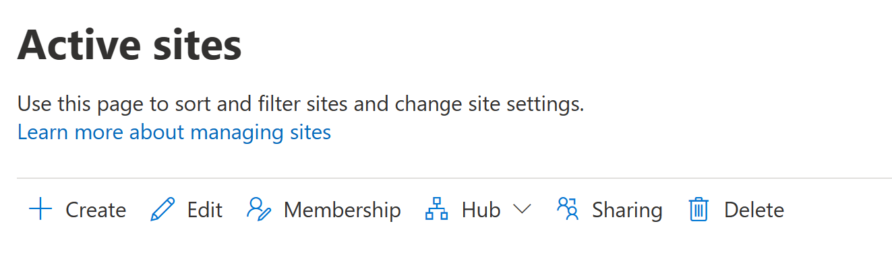

# Delete a site

When you, as a global or SharePoint admin in Office 365, delete a site (previously called a "site collection"), it's retained as a deleted site for 93 days. Deleting a site deletes everything within it, including:
  
- Document libraries and files.
    
- Lists and list data.
    
- Site settings and history.
    
- Any subsites and their contents.
    
You should notify the site admins and any subsite owners before you delete a site so they can move their data to another location, and also tell users when the sites will be deleted. 

> [!WARNING]
> We do not recommend deleting the root site for your organization. If you do, all your SharePoint sites will be inaccessible until you restore the site or create a new root site. Instead of deleting the root site, we recommend replacing it. [Learn more about the root site and how to replace it](modern-root-site.md)

## Delete a site in the new SharePoint admin center

By using the new SharePoint admin center, you can delete both classic and modern sites. Both global and SharePoint admins can now delete sites that belong to Office 365 groups. Deleting these sites will delete the group and all its resources, including the Outlook mailbox and calendar, and any Teams channels.
  
1. Go to the [Active sites page of the new SharePoint admin center](https://admin.microsoft.com/sharepoint?page=siteManagement&modern=true) and sign in with an account that has [admin permissions](/sharepoint/sharepoint-admin-role)
 for your organization.

>[!NOTE]
>If you have Office 365 Germany, [sign in to the Microsoft 365 admin center](https://go.microsoft.com/fwlink/p/?linkid=848041), then browse to the SharePoint admin center and open the Active sites page. <br>If you have Office 365 operated by 21Vianet (China), [sign in to the Microsoft 365 admin center](https://go.microsoft.com/fwlink/p/?linkid=850627), then browse to the SharePoint admin center and open the Active sites page.

2. In the left column, click to select a site.

3. Select **Delete**, and then select **Delete** to confirm.

    

> [!NOTE]
> To delete a hub site, you first need to unregister it as a hub site. <br>Deleted Office 365 groups are retained for only 30 days.<br>For info about deleting a site by using PowerShell, see [Remove-SPOSite](/powershell/module/sharepoint-online/remove-sposite).
 
## Permanently delete a site

To reuse a URL from a deleted site (recreate a site), you need to permanently delete the site. After the site is permanently deleted, it might take up to 24 hours for the URL to become available. On the Deleted sites page of the new SharePoint admin center, you can permanently delete all sites except those that belong to Office 365 groups. 

1. Go to the [Deleted sites page of the new SharePoint admin center](https://admin.microsoft.com/sharepoint?page=recycleBin&modern=true) and sign in with an account that has [admin permissions](/sharepoint/sharepoint-admin-role)
 for your organization.

>[!NOTE]
>If you have Office 365 Germany, [sign in to the Microsoft 365 admin center](https://go.microsoft.com/fwlink/p/?linkid=848041), then browse to the SharePoint admin center and open the Deleted sites page. <br>If you have Office 365 operated by 21Vianet (China), [sign in to the Microsoft 365 admin center](https://go.microsoft.com/fwlink/p/?linkid=850627), then browse to the SharePoint admin center and open the Deleted sites page.

2. In the left column, click to select a site.

3. Select **Delete**, and then select **Delete** to confirm.

To permanently delete sites (including Office 365 group-connected team sites) by using PowerShell, follow these steps:

1. [Download the latest SharePoint Online Management Shell](https://go.microsoft.com/fwlink/p/?LinkId=255251).

    > [!NOTE]
    > If you installed a previous version of the SharePoint Online Management Shell, go to Add or remove programs and uninstall “SharePoint Online Management Shell.” <br>On the Download Center page, select your language and then click the Download button. You’ll be asked to choose between downloading a x64 and x86 .msi file. Download the x64 file if you’re running the 64-bit version of Windows or the x86 file if you’re running the 32-bit version. If you don’t know, see https://support.microsoft.com/help/13443/windows-which-operating-system. After the file downloads, run it and follow the steps in the Setup Wizard. 

2. Connect to SharePoint Online as a [global admin or SharePoint admin](/sharepoint/sharepoint-admin-role) in Office 365
. To learn how, see [Getting started with SharePoint Online Management Shell](/powershell/sharepoint/sharepoint-online/connect-sharepoint-online).
    
3. Run the following command:
    
      ```PowerShell
      Remove-SPODeletedSite -Identity https://contoso.sharepoint.com/sites/sitetoremove
      ```
 (Where https://contoso.sharepoint.com/sites/sitetoremove is the URL of the site you want to permanently delete). For more info about using this command, see [Remove-SPODeletedSite](/powershell/module/sharepoint-online/remove-spodeletedsite).

## Summary of options


|Site type  |How to delete  |How to permanently delete  |
|---------|---------|---------|
|Root site     |Not recommended. [Replace the root site with a different site](modern-root-site.md#replace-your-root-site). When the site is no longer a root site, its URL will be /sites/archive-*datetime*, and you can delete it from the Active sites page of the new SharePoint admin center or by using PowerShell       |  From the Deleted sites page of the new SharePoint admin center or by using PowerShell        |
|Communication sites   |       Delete them from the Active sites page of the new SharePoint admin center or by using PowerShell  |     From the Deleted sites page of the new SharePoint admin center or by using PowerShell    |
|Office 365 group-connected team sites    |    Delete Office 365 groups and all their resources from the Microsoft 365 admin center, the Active sites page of the new SharePoint admin center, or by using PowerShell     |     From PowerShell only    |
|Hub sites (those designated with "(Hub site)" in the Hub column)   |   [Unregister them as hub sites](remove-hub-site.md) from the Active sites page of the new SharePoint admin center, or by using PowerShell, and then delete them based on their site type      |     Based on their site type    |
|Classic sites    | Delete them from the Active sites page of the new SharePoint admin center or by using PowerShell  |     From the Deleted sites page of the new SharePoint admin center or by using PowerShell    |

> [!NOTE]
> Sites associated with a hub can be deleted like any other site based on their template. 


## See also
<a name="__toc323551190"> </a>

[End user instructions for deleting sites and subsites](https://support.office.com/article/bc37b743-0cef-475e-9a8c-8fc4d40179fb)
