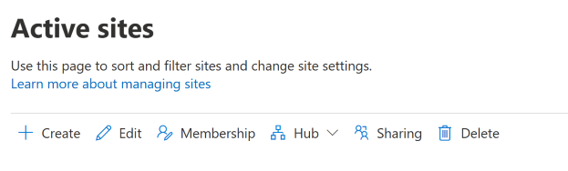

# Delete a site

When you, as a global or SharePoint admin in Office 365, delete a site (previously called a "site collection"), it's retained as a deleted site for 93 days. Deleting a site deletes everything within it, including:
  
- Document libraries and files.
    
- Lists and list data.
    
- Site settings and history.
    
- Any subsites and their contents.
    
You should notify the site admins and any subsite owners before you delete a site so they can move their data to another location, and also tell users when the sites will be deleted. 

> [!WARNING]
> If you delete the root site for your organization, all your SharePoint sites will be inaccessible until you restore the site or create a new root site.

## Delete a site in the new SharePoint admin center

By using the new SharePoint admin center, you can delete both classic and modern sites. 

SharePoint admins can now delete sites that belong to Office 365 groups. Deleting these sites will delete the group and all its resources, including the Outlook mailbox and calendar, and any Teams channels.
  
1. Sign in to https://admin.microsoft.com as a global or SharePoint admin. (If you see a message that you don't have permission to access the page, you don't have Office 365 administrator permissions in your organization.)
    
    > [!NOTE]
    > If you have Office 365 Germany, sign in at https://portal.office.de. If you have Office 365 operated by 21Vianet (China), sign in at https://login.partner.microsoftonline.cn/. Then select the Admin tile to open the admin center.  
    
2. In the left pane, under **Admin centers**, select **SharePoint**. (You might need to select **Show all** to see the list of admin centers.) 

3. If the classic SharePoint admin center appears, select **Try it now** to open the new SharePoint admin center. 

4. In the left pane of the new SharePoint admin center, select **Active sites**.

5. In the left column, click to select a site.

6. Select **Delete**, and then select **Delete** to confirm.

    

> [!NOTE]
> Deleted Office 365 groups are retained for only 30 days.
 
## Permanently delete a site

On the Deleted sites page of the new SharePoint admin center, you can permanently delete all sites except those that belong to Office 365 groups. 

1. In the left pane of the new SharePoint admin center, select **Deleted sites**.

2. In the left column, click to select a site.

3. Select **Delete**, and then select **Delete** to confirm.

To permanently delete sites (including Office 365 group-connected team sites) by using PowerShell, follow these steps:

1. [Download the latest SharePoint Online Management Shell](https://go.microsoft.com/fwlink/p/?LinkId=255251).

    > [!NOTE]
    > If you installed a previous version of the SharePoint Online Management Shell, go to Add or remove programs and uninstall “SharePoint Online Management Shell.” <br>On the Download Center page, select your language and then click the Download button. You’ll be asked to choose between downloading a x64 and x86 .msi file. Download the x64 file if you’re running the 64-bit version of Windows or the x86 file if you’re running the 32-bit version. If you don’t know, see https://support.microsoft.com/help/13443/windows-which-operating-system. After the file downloads, run it and follow the steps in the Setup Wizard. 

2. Connect to SharePoint Online as a global admin or SharePoint admin in Office 365. To learn how, see [Getting started with SharePoint Online Management Shell](/powershell/sharepoint/sharepoint-online/connect-sharepoint-online).
    
3. Run the following command:
    
      ```PowerShell
      Remove-SPODeletedSite -Identity https://contoso.sharepoint.com/sites/sitetoremove
      ```
 (Where https://contoso.sharepoint.com/sites/sitetoremove is the URL of the site you want to permanently delete). For more info about using this command, see [Remove-SPODeletedSite](/powershell/module/sharepoint-online/remove-spodeletedsite).

## Delete a classic site in the classic SharePoint admin center
<a name="__toc323551190"> </a>

1. Sign in to https://admin.microsoft.com as a global or SharePoint admin. (If you see a message that you don't have permission to access the page, you don't have Office 365 administrator permissions in your organization.)
    
    > [!NOTE]
    > If you have Office 365 Germany, sign in at https://portal.office.de. If you have Office 365 operated by 21Vianet (China), sign in at https://login.partner.microsoftonline.cn/. Then select the Admin tile to open the admin center.  
    
2. In the left pane, under **Admin centers**, select **SharePoint**. (You might need to select **Show all** to see the list of admin centers.) If this opens the new SharePoint admin center, select **Classic SharePoint admin center** in the left pane.
    
3. Select the check box next to the site collection or multiple site collections that you want to delete.
    
4. On the **Site Collections** tab, select **Delete**.
    
    
  
5. Confirm the information in the **Delete Site Collections** dialog box, and then select **Delete**.
    
    
  
To empty the deleted site from the Recycle Bin, you need to use the new SharePoint admin center or PowerShell. For info, see [Permanently delete a deleted site](delete-site-collection.md#permanently-delete-a-site).
    


## See also
<a name="__toc323551190"> </a>

[End user instructions for deleting sites and subsites](https://support.office.com/article/bc37b743-0cef-475e-9a8c-8fc4d40179fb)

