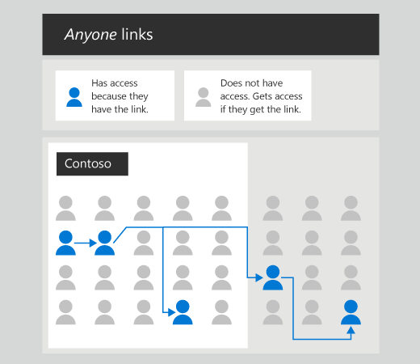
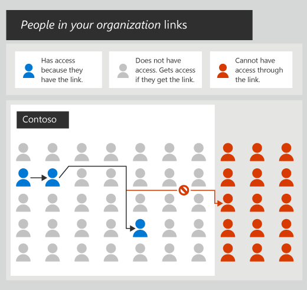

# File collaboration in SharePoint with Microsoft 365

With Microsoft 365 services, you can create a secure and productive file collaboration environment for your users. SharePoint powers much of this, but the capabilities of file collaboration in Microsoft 365 reach far beyond the traditional SharePoint site. Teams, OneDrive, and a variety of governance and security options all play a role in creating a rich environment where users can collaborate easily and where your organization's sensitive content remains secure.

In the sections below, we call out the options and decisions that you as an administrator should consider when setting up a collaboration environment:

  - How SharePoint relates to other collaboration services in Microsoft 365, including OneDrive, Microsoft 365 Groups, and Teams.

  - How you can create an intuitive and productive collaboration environment for your users.

  - How you can protect your organization's data by managing access through permissions, data classifications, governance rules, and monitoring.

We recommend that you download the [Microsoft Teams and related productivity services in Microsoft 365 for IT architects](https://aka.ms/ProductivityArch) poster and refer to it while you read this article. This poster provides detailed illustrations of how the collaboration services in Microsoft 365 relate to each other and interact.

Also see the [File Protection Solutions in Microsoft 365](https://docs.microsoft.com/Office365/Enterprise/microsoft-cloud-it-architecture-resources#BKMK_O365fileprotect) diagram for an overview of recommended solutions to protect your data.

## Creating a successful collaboration experience

The technical implementation options that you choose for file collaboration in Microsoft 365 should balance what can seem to be contradictory requirements:

  - Protecting your intellectual property

  - Enabling self-service

  - Creating a smooth user experience

**Protecting your intellectual property**

There are several options discussed later in this article for protecting your intellectual property. These include limiting who files can be shared with, applying governance policies based on sensitivity labels, and managing the devices that users use to access content.

In considering which options to choose, we recommend a balanced approach:

A configuration that allows users to share content freely can lead to accidental sharing of confidential data. However, a user experience that is difficult to use or too restrictive can lead to users finding alternative collaboration options that circumvent your governance policies, ultimately leading to even greater risk.

By using a combination of features – depending on the sensitivity of your data – you can create a collaboration environment that's easy to use and provides the security and auditing controls that you need.

**Enabling self-service**

In SharePoint Server on-premises, many organizations chose an IT-focused model where users must request sites and provide a business justification. This was done to prevent site sprawl and to apply governance policies around access to sensitive data.

In Microsoft 365, we recommend allowing users to create Teams, Microsoft 365 Groups, and SharePoint sites as needed. You can use sensitivity labels to enforce permissions governance, take advantage of security features that protect your content, and use expiration and renewal policies to make sure unused sites don't accumulate.

By choosing options that favor user self-service, you can minimize the impact on your IT staff while creating an easier experience for your users.

**Creating a smooth user experience**

The key to creating a smooth user experience is to avoid creating barriers for your users that they don't understand or that they must escalate to your help desk. For example, turning external sharing off for a site might cause user confusion or frustration; whereas labeling the site and its contents as confidential and using data loss prevention policy tips and emails to educate your users in your governance policies, can lead to a much smoother experience for them.

## SharePoint, Microsoft 365 Groups, and Teams

In Microsoft 365, SharePoint is integrated with a variety of other services to provide a much richer experience than is possible with on-premises solutions such as SharePoint Server. These integrations affect how you manage user permissions and what your users can do in a collaboration scenario.

Traditionally, SharePoint permissions have been managed through a set of permissions groups within a site (Owners, Members, Visitors, etc.). In SharePoint, each SharePoint team site is part of a Microsoft 365 group. a Microsoft 365 group is a single permissions group that is associated with a variety of Microsoft 365 services, including a SharePoint site, an instance of Planner, a mailbox, a shared calendar, and others. When you add owners or members to the Microsoft 365 group, they are given access to the SharePoint site along with the other connected services.

While you can continue to manage SharePoint site permissions separately by using SharePoint groups, we recommend managing permissions for SharePoint by adding people to or removing them from the associated Microsoft 365 group. This provides easier administration as well as giving users access to a host of related services that they can use for better collaboration.

Microsoft Teams provides a hub for collaboration by bringing together all the Microsoft 365 group-related services, plus a variety of Teams-specific services, in a single user experience with persistent chat. Teams uses the associated Microsoft 365 group to manage its permissions. Within the Teams experience, users can directly access SharePoint along with the other services without having to switch applications. This provides a centralized collaboration space with a single place to manage permissions. For collaboration scenarios in your organization, we highly recommend using Teams rather than using services such as SharePoint independently.

For details about how SharePoint and Teams interact, see [How SharePoint and OneDrive interact with Microsoft Teams](https://docs.microsoft.com/microsoftteams/sharepoint-onedrive-interact).

## Collaboration in client applications

Office applications such as Word, Excel, and PowerPoint provide a wide variety of collaboration features, including co-authoring and @mentions, and are also integrated with sensitivity labels and data loss prevention (discussed below).

We highly recommend deploying Microsoft 365 Apps for enterprise. Microsoft 365 Apps for enterprise provides an always up-to-date experience for your users, with the latest features and updates delivered on a schedule that you can control.

For details about deploying Microsoft 365 Apps for enterprise, see [Deployment guide for Microsoft 365 Apps for enterprise](https://docs.microsoft.com/DeployOffice/deployment-guide-for-office-365-apps-for-enterprise).

## OneDrive libraries
While SharePoint provides shared libraries for shared files that teams can collaborate on, users also have an individual library in OneDrive where they can store files that they own.

When a user adds a file to their individual library, that file is not shared with anyone else. Users' individual libraries do, however, provide the same sharing capabilities as SharePoint, so users can share files in their individual libraries as needed.

A user's individual library can be accessed from Teams, as well as from the OneDrive web interface and mobile application.

On devices running Windows or macOS, users can install the OneDrive sync app to sync files from both OneDrive and SharePoint to their local disk. This allows them to work on files offline and also provides the convenience of opening files in their native application (such as Word or Excel) without the need of going to the web interface.

The two main decisions to consider for using OneDrive in collaboration scenarios are:

  - Do you want to allow Microsoft 365 users to share files in their own library with people outside your organization?

  - Do you want to restrict file sync in any way – such as only to managed devices?

These settings are available in the [OneDrive admin center](https://admin.onedrive.com/).

OneDrive is an important part of the Microsoft 365 collaboration story. For information about how to deploy OneDrive in your organization, see [OneDrive guide for enterprises](https://docs.microsoft.com/OneDrive/plan-onedrive-enterprise).

## Securing your data 

A big part of a successful collaboration solution is making sure your organization's data remains secure. Microsoft 365 provides a variety of features to help you keep your data secure while enabling a seamless collaboration experience for your users.

To help protect your organization's information, you can:

  - **Control sharing** – by configuring sharing settings for each site that are appropriate to the type of information in the site, you can create a collaboration space for users while securing your intellectual property.

  - **Classify and protect information** – by classifying the types of information in your organization, you can create governance policies that provide higher levels of security to information that is confidential compared to information that is meant to be shared freely.

  - **Manage devices** – with device management, you can control access to information based on device, location, and other parameters.

  - **Monitor activity** – by monitoring the collaboration activity happening in Teams and SharePoint, you can gain insights into how your organization's information is being used. You can also set alerts to flag suspicious activity.

  - **Protect against threats** – by using policies to detect malicious files in SharePoint, OneDrive, and Teams, you can help ensure the safety of your organization's data and network.

These are each discussed in more detail below. There are many options to choose from. Depending on the needs of your organization, you can choose the options that give you the best balance of security and usability. If you are in an highly regulated industry or work with highly confidential data, you may want to put more of these controls in place; whereas if your organization's information is not sensitive you may want to rely on basic sharing settings and malicious file alerts.

### Control sharing

The sharing settings that you configure for SharePoint and OneDrive determine who your users can collaborate with, both inside and outside your organization. Depending on your business needs and the sensitivity of your data, you can:

  - Disallow sharing with people outside your organization.

  - Require people outside your organization to authenticate.

  - Restrict sharing to specified domains.

You can configure these settings for the entire organization, or for each site independently. For detailed information, see [Turn sharing on or off](https://docs.microsoft.com/sharepoint/turn-external-sharing-on-or-off) and [Turn sharing on or off for a site](https://docs.microsoft.com/sharepoint/change-external-sharing-site).

See [Limit accidental exposure to files when sharing with guests](https://docs.microsoft.com/Office365/Enterprise/sharing-limit-accidental-exposure) for additional guidance around sharing with people outside your organization.

When users share files and folders, a shareable link is created which has permissions to the item. There are three primary link types:

  - *Anyone* links give access to the item to anyone who has the link. People using an *Anyone* link do not have to authenticate, and their access cannot be audited.
  
    
      
    An *anyone* link is a transferrable, revocable secret key. It's transferrable because it can be forwarded to others. It's revocable because by deleting the link, you can revoke the access of everyone who got it through the link. It's secret because it can't be guessed or derived. The only way to get access is to get the link, and the only way to get the link is for somebody to give it to you.  

  - *People in your organization* links work for only people inside your Microsoft 365 organization. (They do not work for guests in the directory, only members).  

    
      
    Like an *anyone* link, a *people in my organization* link is a transferrable, revocable secret key. Unlike an *anyone* link, these links only work for people inside your Microsoft 365 organization. When somebody opens a *people in my organization* link, they need to be authenticated as a member in your directory. If they're not currently signed-in, they'll be prompted to sign-in.  

  - *Specific people* links only work for the people that users specify when they share the item.  

    
      
    A *specific people* link is a non-transferable, revocable secret key. Unlike *anyone* and *people in my organization* links, a *specific people* link will not work if it's opened by anybody except for the person specified by the sender.  
      
    *Specific people* links can be used to share with internal or external users. In both cases, the recipient will need to authenticate as the user specified in the link.  

It's important to educate your users in how these sharing links work and which they should use to best maintain the security of your data. Send your users links to [Share OneDrive files and folders](https://support.office.com/article/9fcc2f7d-de0c-4cec-93b0-a82024800c07) and [Share SharePoint files or folders](https://support.office.com/article/1fe37332-0f9a-4719-970e-d2578da4941c), and include information about your organization's policies for sharing information.

**Unauthenticated access with *Anyone* links**

*Anyone* links are a great way to easily share files and folders with people outside your organization. However, if you're sharing sensitive information, this may not be the best option.

If you require people outside your organization to authenticate, *Anyone* links will not be available to users and you'll be able to audit guest activity on shared files and folders.

Though *Anyone* links do not require people outside your organization to authenticate, you can track the usage of *Anyone* links and revoke access if needed. If people in your organization frequently email documents to people outside your organization, *Anyone* links may be a better option.

If you want to allow *Anyone* links, there are several options for a more secure sharing experience.

You can restrict *Anyone* links to read-only. You can also set an expiration time limit, after which the link will stop working.

Another option is to configure a different link type to be displayed to the user by default. This can help minimize the chances of inappropriate sharing. For example, if you want to allow *Anyone* links but are concerned that they only be used for specific purposes, you can [set the default link type](https://docs.microsoft.com/sharepoint/change-default-sharing-link) to *Specific people* links or *People in your organization* links instead of *Anyone* links. Users would then have to explicitly select *Anyone* links when they share a file or folder.

***People in your organization* links**

*People in your organization* links are a great way to share information within your organization. *People in your organization* links work for anyone in your organization, so users can share files and folders with people who aren't part of a team or members of a site. The link gives them access to the particular file or folder and can be passed around inside the organization. This allows for easy collaboration with stakeholders from groups that may have separate teams or sites – such as design, marketing, and support groups.

Creating a *People in your organization* link does not cause the file or folder to show up in search or give everyone direct access to the file or folder. Users must have the link in order to access the file or folder. The link does not work for guests or other people outside your organization.

***Specific people* links**

*Specific people* links are best for circumstances where users want to limit access to a file or folder. The link only works for the person specified and they must authenticate in order to use it. These links can be internal or external (if you've enabled guest sharing).

### Classify and protect information

Data loss prevention in Microsoft 365 provides a way to classify your teams, groups, sites, and documents, and to create a series of conditions, actions, and exceptions to govern how they're used and shared.

By classifying your information and creating governance rules around them, you can create a collaboration environment where users can easily work with each other without accidentally or intentionally sharing sensitive information inappropriately.

With data loss prevention policies in place, you can be relatively liberal with your sharing settings for a given site and rely on data loss prevention to enforce your governance requirements. This provides a friendlier user experience and avoids unnecessary restrictions that users might try to work around.

For detailed information about data loss prevention, see [Overview of data loss prevention](https://docs.microsoft.com/office365/securitycompliance/data-loss-prevention-policies).

**Sensitivity labels**

Data loss prevention sensitivity labels provide a way to classify groups, sites and documents with descriptive labels that can then be used to enforce a governance workflow.

Using sensitivity labels helps your users to share information safely and to maintain your governance policies without the need for users to become experts in those policies.

For example, you could configure a policy that requires Microsoft 365 groups classified as confidential to be private rather than public. In such a case, a user creating a group, team, or SharePoint site would only see the "private" option when they choose a classification of confidential.

**Conditions and actions**

With data loss protection conditions and actions, you can enforce a governance workflow when a given condition is met.

Examples include:

  - If customer information is detected in a document, then users cannot share that document with guests.

  - If an Office document is saved to a site marked as confidential, then a watermark is automatically added to the document.

  - If a document contains the name of a confidential project, then guests cannot open the document even if it has been shared with them.

Microsoft Cloud App Security offers additional granular conditions, actions, and alerts to help you secure your content. These include the ability to remove a user's permissions or quarantine the user when the specified condition is met.

**User notifications**

User notifications provide a way to communicate to your users – via email or policy tips – that data loss prevention has detected something that they should be aware of. The user can then decide the best course of action depending on the situation. For example, if a user unknowingly attempts to share a document that contains a credit card number, the user is prompted that a credit card number has been found and advised of your organization's policy regarding this.

### Manage access for your organization and guest users

Microsoft 365 provides a variety of governance features to help you create an intuitive but secure collaboration environment for your users.

  - Use device management to ensure your organization's information is accessed only by compliant devices.

  - Use conditional access to ensure your confidential data is accessed only from locations and apps that you trust.

  - Monitor information sharing in real time and through reports to ensure your governance requirements are met and sensitive information is being kept secure.

Additionally, you can use [Azure Active Directory access reviews](https://docs.microsoft.com/azure/active-directory/governance/access-reviews-overview) to automate a periodic review of group and team ownership and membership.

**Device Management**

Through device management, you can take additional steps to secure your organization's information. You can manage pretty much any device that your users might have – PCs, Macs, mobile devices, and Linux computers.

Examples include:

  - Ensure devices have the latest updates before allowing access to Microsoft 365

  - Prevent copy and paste of confidential data to personal or unmanaged apps

  - Erase company data from managed devices

As you consider your options governing access to information through device management, keep in mind that guest users are likely to have unmanaged devices. For sites where you've enabled guest sharing, be sure to provide the needed access to unmanaged devices, even if that's just web access via a PC or Mac. Azure Active Directory conditional access (discussed below) offers some options to reduce the risk of guest users with unmanaged devices.

Intune in Microsoft 365 provides detailed device profiling options and can also deploy and manage individual apps such as Office apps and OneDrive. For detailed information about Intune and device management, see [What is Microsoft Intune?](https://docs.microsoft.com/intune/what-is-intune).

You can configure device management from the [Microsoft 365 Device Management admin center](https://devicemanagement.microsoft.com).

**Conditional access**

Azure Active Directory conditional access provides additional controls to prevent users from accessing your organization's resources in risky situations, such as from untrusted location or from devices that aren't up to date.

Examples include:

  - Block guest users from logging in from risky locations

  - Require multi-factor authentication for mobile devices

You can create access policies that are specifically for guest users, allowing risk mitigation for users who most likely have unmanaged devices.

For detailed information, see [What is Conditional Access?](https://docs.microsoft.com/azure/active-directory/conditional-access/overview).

**Real-time monitoring with alerts**

Microsoft Cloud App Security provides an extensive policy infrastructure that you can use to monitor activity that you consider to be risky for your organization's data.

Examples include:

  - Raise an alert when a confidential file is shared externally.

  - Raise an alert when there's a mass download by a single user.

  - Raise an alert when an externally shared file hasn't been updated for a specified period of time.

Cloud App Security can also watch for anomalous behavior such as unusually large uploads or downloads, access from unusual locations, or unusual admin activity.

By configuring alerts in Cloud App Security, you can be more confident in allowing an open sharing experience for your users.

You can see the alerts on the [Cloud App Security alerts page](https://security.microsoft.com/alerts).

For detailed information about Cloud App Security, see [Microsoft Cloud App Security overview](https://docs.microsoft.com/cloud-app-security/what-is-cloud-app-security).

**Monitoring with reports**

A variety of reports are available in Microsoft 365 to help you monitor site usage, document sharing, governance compliance, and a host of other events.

For info about how to view reports on SharePoint site usage, see [Microsoft 365 Reports in the Admin Center - SharePoint site usage](https://docs.microsoft.com/office365/admin/activity-reports/sharepoint-site-usage).

For info about how to view data loss prevention reports, see [View the reports for data loss prevention](https://docs.microsoft.com/office365/securitycompliance/view-the-dlp-reports).

For info about how to view Cloud App Security reports, see [Generate data management reports](https://docs.microsoft.com/cloud-app-security/built-in-reports).

### Manage threats

You can use ATP Safe Attachments (part of [Microsoft 365 Advanced Threat Protection](https://docs.microsoft.com/office365/securitycompliance/office-365-atp)) to protect against users uploading malicious files to OneDrive, SharePoint, or Teams.

When ATP discovers a malicious file, that file is locked so that users cannot open, move, or copy the file.

The locked file is included in a list of quarantined items that you can monitor. You can then delete or release the file as appropriate.

For detailed info, see [Microsoft 365 ATP for SharePoint, OneDrive, and Microsoft Teams](https://docs.microsoft.com/office365/securitycompliance/atp-for-spo-odb-and-teams).

## Migrate files from on-premises

Microsoft 365 offers much greater versatility in collaboration scenarios than on-premises solutions such as SharePoint Server. If you have files in document libraries on SharePoint Server or in file shares, you can migrate them to SharePoint by using the SharePoint Migration Tool. The SharePoint Migration Tool can move files, OneDrive libraries, and even entire sites to SharePoint.

As part of your migration, you can use the [Azure Information Protection scanner](https://docs.microsoft.com/azure/information-protection/deploy-aip-scanner) to scan and label sensitive information in your on-premises environment. With this information, you can reorganize your data if needed before migrating it to similarly labeled sites in SharePoint.

If the content that your users are collaborating on is located in SharePoint Server 2010 or SharePoint Server 2013, or in file shares, we recommend that you migrate it to Microsoft 365 to take advantage of the broader range of collaboration capabilities.

For information on how to migrate content with the SharePoint Migration Tool, see [Download and install the SharePoint Migration Tool](https://docs.microsoft.com/sharepointmigration/introducing-the-sharepoint-migration-tool).

## Related topics

[Create a secure guest sharing environment](https://docs.microsoft.com/office365/Enterprise/create-a-secure-guest-sharing-environment)

[Best practices for sharing files and folders with unauthenticated users](https://docs.microsoft.com/office365/Enterprise/best-practices-anonymous-sharing)

[Understanding how Microsoft Information Protection capabilities work together](https://youtu.be/FcOMnAL_LKA)

[How to deal with external sharing in Microsoft 365](https://youtu.be/9GKM15kqrF8)

[Tutorial: Automatically apply Azure Information Protection classification labels](https://docs.microsoft.com/cloud-app-security/use-case-information-protection)

[What's new in external sharing and collaboration with OneDrive and SharePoint](https://www.youtube.com/watch?v=KvcYz3ERZSY)

[Protect and collaborate on files in the cloud with OneDrive, SharePoint, and Microsoft Teams](https://www.youtube.com/watch?v=GpsrVYh_OIU)
