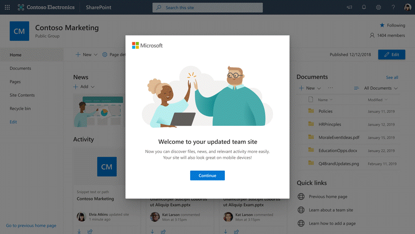

# Classic home page modernization

You have a new home page for your team site. Now it's easier to post news and use on mobile than ever before. 

This article covers all the details on how the feature works and the controls you have as an administrator. 

## How it works? 

If a classic team site meets the following criteria for being updated, the home page will automatically modernize the next time a user visits. When users first experience the change, they’ll see a walkthrough that highlights the new capabilities and includes a link to a help article with more details. 

We encourage users to adopt the change in order to benefit from the power of modernized pages. However, if site admins or site owners want to revert to the classic home page, they can. Instructions are available in the [support article](https://support.office.com/article/new-sharepoint-team-home-page-77cbbd3c-2a23-4a76-bfd7-c5bf95afe1c6). 

### Update criteria: 

- Classic team site (STS#0) only 

- Home page name is ‘Home.aspx’ 

- Contains default web parts only: getting started (GettingStartedWebPart), Newsfeed (SiteFeedWebPart), and document library (XsltListViewWebPart). 

- No text is present (wiki HTML is not customized) 

- DisplayFormTemplateName = "WikiEditForm" 

- ModernizeHomepageOptOut feature is not activated 

>[!NOTE]
>All update criteria must be met in order for a team site home page to qualify for the automatic upgrade.

### The technical details: 

- Applies to both STS#0 site collections and all corresponding subsites

- The update only applies to the home page. No other classic pages will be changed. We recommend using the [SharePoint PnP modernization framework](https://docs.microsoft.com/sharepoint/dev/transform/modernize-userinterface-site-pages) for all other site pages. 

- The new modern home page is named ‘Home.aspx’ and the classic page gets renamed to ‘Home(old).aspx’ 

- This update does not create an [Office 365 Group](https://docs.microsoft.com/sharepoint/dev/transform/modernize-connect-to-office365-group) for the team site 

- Classic site themes will not carry over to the new team site home page. [Learn how to brand your modern team site home page.](https://docs.microsoft.com/en-us/sharepoint/branding-sharepoint-online-sites-modern-experience)

- Only site collection admins can revert to the classic home page through the link appearing in the left navigation. Site owners can revert to the classic page by visiting site pages and marking the classic page as their home page. 

- Update happens on demand based on next site access. If a subsite is accessed, it will trigger the update for its root site collection and its other subsites. Remember, the update only applies to the root site collection and subsites if the criteria are met. 

## Why update classic team site home pages to modern? 

Over the years SharePoint modern pages have become powerful tools for collaboration and productivity at work and we want more users to take advantage of these capabilities. Automatically modernizing team site home pages that are not customized is the first step to helping classic SharePoint users get more out of their products. 

## What to expect after a classic team site home pages is updated to modern

When users first experience the change, they’ll see a walkthrough that highlights the new capabilities and includes a link to a help article with more details like this:

. 

Review this Power Point presentation deck to understand more about what your new modern home page can do.

## How to prevent specific sites from being updated? 

We understand there may be sites you don’t want updated. You can use the following tools to disable the update on specific sites: 

**Option 1**: Use [PnP PowerShell](https://docs.microsoft.com/powershell/sharepoint/sharepoint-pnp/sharepoint-pnp-cmdlets?view=sharepoint-ps) to prevent a specific site from being upgraded by enabling a web scoped feature on each site and sub site that’s being impacted.

Connect to the site using Connect-PnPOnline. For example,

`Connect-PnPOnline -Url https://[tenant].sharepoint.com/sites/siteurl -Credentials $cred`

To prevent modernization of an uncustomized home page, run:

`Enable-PnPFeature -Identity F478D140-B148-4038-9CB0-84A8F1E4BE09 -Scope Web`

If you later want to re-enable modernization of that page, run:

`Disable-PnPFeature -Identity F478D140-B148-4038-9CB0-84A8F1E4BE09 -Scope Web`

**Option 2**: Don’t know what sites will be impacted by this change? You can use the [SharePoint Modernization Scanner](https://docs.microsoft.com/sharepoint/dev/transform/modernize-scanner) and run the scanner in “HomePageOnly” mode. The output of the modernization scanner run contains a file called SitesWithUncustomizedHomePages.csv. Use this file to get a list of sites and sub sites that will get a modern homepage. This tool will enable you to message users impacted if desired. If needed, use the PowerShell cmdlet above, or the following sample script to opt multiple sites out of the update: https://github.com/SharePoint/sp-dev-modernization/tree/dev/Scripts/HomePageModernizationOptOut  
 

**Option 3**:
Add an out-of-the-box SharePoint [web part](https://support.office.com/en-us/article/classic-and-modern-web-part-experiences-3fdae6c3-8fc1-49ab-8708-8c104b882e64), a custom web part, or text to your team site home page.

>[!NOTE]
>It's highly recommended that you modernize your home site to benefit from the latest SharePoint features and to improve the viewing experience for users on desktop and mobile. 

## What about new classic team sites STS#0 created after this change? 

Classic team sites (STS#0) created during the rollout of this feature, that are not customized will get updated if the criteria are met. Once the feature rollout is completed, any classic team sites (STS#0) created will retain their classic home page. 

 
## Can I also modernize the other pages in my sites? 

For a more consistent user experience, we recommend that you modernize all pages on classic team sites. This can be self-service done via the open source [SharePoint PnP Page Transformation solution](https://docs.microsoft.com/sharepoint/dev/transform/modernize-userinterface-site-pages). 

## Getting excited about modern? 

For more help in transitioning to modern, refer to the following resources: 

- [Guide to modern experience in SharePoint](https://docs.microsoft.com/sharepoint/guide-to-sharepoint-modern-experience)

- [SharePoint modern inspiration](https://lookbook.microsoft.com/)  

- [Modernizing your classic sites](https://docs.microsoft.com/sharepoint/dev/transform/modernize-classic-sites)  

- [Transform classic pages to modern pages](https://docs.microsoft.com/sharepoint/dev/transform/modernize-userinterface-site-pages) 

 
