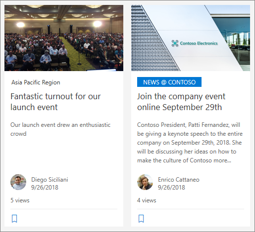
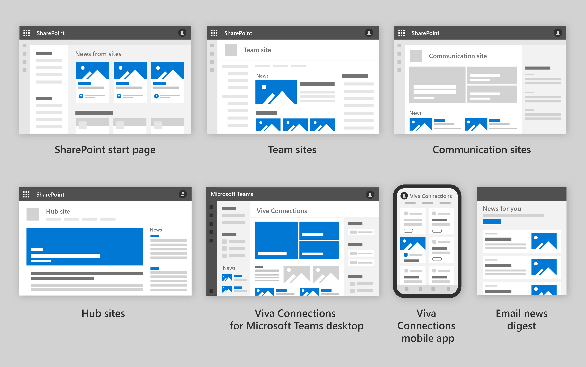
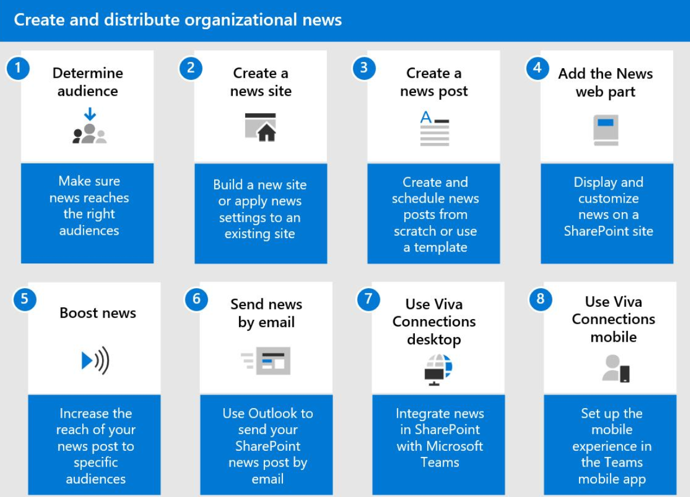
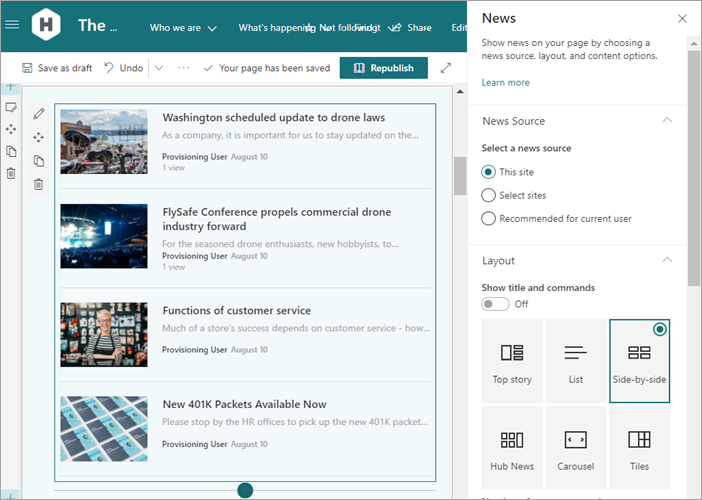
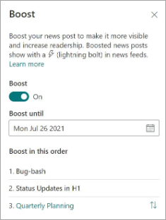
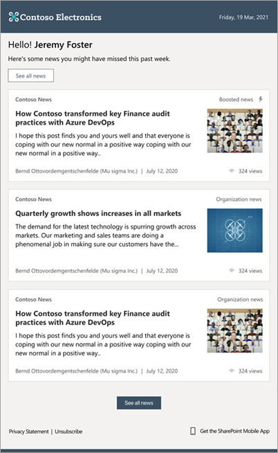
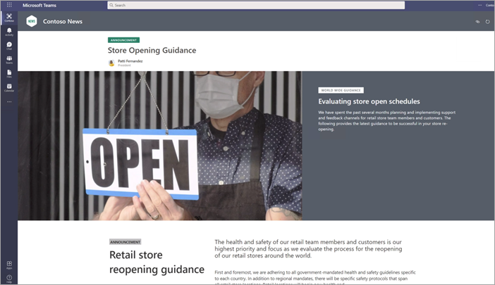
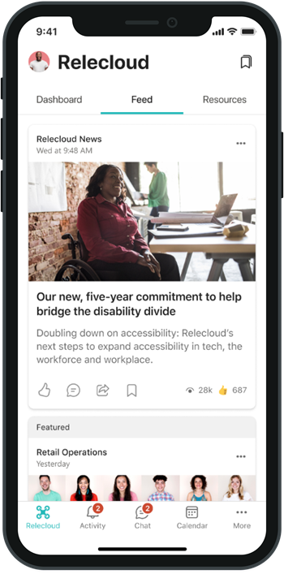

# Distribute corporate news to your organization

When you have organization-level announcements, CEO messages, philanthropic highlights, quarterly growth reports, or any other important stories that you want to share with your entire organization, you can create an organization news site where “official” or authoritative news can be posted and then distributed to your organization. 

News can be distributed on the SharePoint start page, on your home site, or on any page of a site where you want the news to be displayed. It’s also tightly integrated into Viva Connections for Teams Desktop and in the Viva Connections Feed where people can engage with corporate news wherever they are. 

When news is distributed from an organization news site, it gets special visual treatment (see the **"NEWS @ CONTOSO"** color block below).

## Places news is distributed

News is distributed across SharePoint, Microsoft Teams, and [Viva Connections](/viva/connections/viva-connections-overview).

| Location  |Details  |
|---------|---------|
|**SharePoint start page**     |    Automatically displayed in the **News from sites** section, based on relevance to the user    |
|**SharePoint communication sites, team sites, and hub sites**    |    Displays on a page in the site when the News web part is used    |
|**Viva Connections for Microsoft Teams Desktop**     |   Displays news on the home site in a feed    |
|**Viva Connections Mobile app**   |   Displays in the Feed based on relevance to the user      |
|**Viva Connections Dashboard**   |  Add one or more cards that highlight news from the organization or different departments. Decide your audiences and where and when you want to share the news.
|**Email in Outlook**     |    News digest automatically sent with your branding.   |    

## Steps to distribute organization news

**To distribute news across your organization, follow these steps:**

1. [Decide your audience](#decide-your-audience) and when and where you want to share the news.
1. [Create an organization news site](#create-an-organization-news-site).
1. [Create news posts on sites](#create-news-posts-on-sites).
1. [Add the news web part on your home site or other sites where you want your news to appear](#use-the-news-web-part-to-distribute-news-on-the-sites-you-want), and set options for your news posts, like ordering, audience targeting, and more.
1. [Boost news for greater discoverability](#boost-news-for-greater-discoverability).
1. [Send news in email](#send-news-in-email).
1. [Use Viva Connections to spread news in Teams](#use-viva-connections-for-teams-desktop-to-display-news-in-teams): If you’re using Viva Connections for Teams Desktop, news that you add to your home site will be available in Teams.
1. [Spread news on the Viva Connections mobile app](#display-news-in-the-viva-connections-teams-mobile-app): Add one or more cards to your dashboard that opens a news story. Additionally, if you have the Feed enabled for your app, news will automatically display there, based on relevance to each user.

## Step 1: Decide your audience

You may have different audiences for different messages. Understanding your audience helps you determine where and how you want messages to be shown. For example, you can use news web parts on specific sites, and [target your news](https://support.microsoft.com/office/use-the-news-web-part-on-a-sharepoint-page-c2dcee50-f5d7-434b-8cb9-a7feefd9f165#bkmk_audiencetarget) to full-time employees or employees of specific groups.

[Learn more about determining your audience.](audience-profile.md)

## Step 2: Create an organization news site

SharePoint administrators can specify any number of organization news sites. For multi-geo tenants, organization news sites would have to be set up for each geo location. Each geo location could use the same central organization news site, and/or have its own unique site that shows organization news specific to that region.

To enable and specify the site for organization news, a SharePoint administrator must use the latest [SharePoint Online PowerShell commands](/powershell/module/sharepoint-online):

- [Get-SPOOrgNewsSite](/powershell/module/sharepoint-online/get-spoorgnewssite)
- [Set-SPOOrgNewsSite](/powershell/module/sharepoint-online/set-spoorgnewssite)

For more information see [Create an organization news site](/sharepoint/organization-news-site).

## Step 3: Create news posts on sites

Create news posts on your organization news site. Anyone with permission to create pages on the site can author news posts. A news post is actually a SharePoint modern page with special properties that allow the post to be distributed as news.

To learn how to create a news post, see [Create and share news on your SharePoint sites](https://support.microsoft.com/office/create-and-share-news-on-your-sharepoint-sites-495f8f1a-3bef-4045-b33a-55e5abe7aed7).

To learn how to turn a page into a news post, see [Change a SharePoint modern page into a news post or create a modern page from a news post](https://support.microsoft.com/office/change-a-sharepoint-modern-page-into-a-news-post-or-create-a-modern-page-from-a-news-post-746884bc-33b4-4132-a3c1-9bf67af6eb7e).

## Step 4: Use the news web part to distribute news on the sites you want

SharePoint news will automatically show on SharePoint Start page, and in the Viva Connections feed. If you want news to show on the page of a specific site (like on a home site), add the news web part to that page.

With the news web part, you choose your organization site as the source of your news, and you can audience target your news. By using audience targeting, you can show news content to specific groups of people. This approach is useful when you want to present information that is relevant only to a particular group of people. For example, you can [target your news](https://support.microsoft.com/office/use-the-news-web-part-on-a-sharepoint-page-c2dcee50-f5d7-434b-8cb9-a7feefd9f165#bkmk_audiencetarget) stories about a specific project to only team members and stakeholders of the project. You can also choose the layout of news and how to order the posts.

To learn how to use the news web part on a SharePoint page, see [Use the News web part on a SharePoint page](https://support.microsoft.com/office/use-the-news-web-part-on-a-sharepoint-page-c2dcee50-f5d7-434b-8cb9-a7feefd9f165).

## Step 5: Boost news for greater discoverability

Boost important news and announcements from your organization to prioritize their visibility and to increase readership. Boosted news posts display with a lightning bolt icon. You can order your boosted news to determine which shows first, and you can set an expiration date for the boosting of individual posts.

- You can boost news posts from organization news sites only.
- Boosted news posts are currently shown in auto news digests only. Soon, boosted posts will be shown in additional types and locations of news feeds.
- A maximum of 10 news posts can be boosted at a time.
- You must have edit permissions on the organization news site to boost news posts.

To learn more boosting news, see [Boost news from organization news sites](https://support.microsoft.com/office/boost-news-from-organization-news-sites-46ad8dc5-8f3b-4d81-853d-8bbbdd0f9c83).

## Step 6: Send news in email

Many organizations send "newsletters" in email. With auto-news digest, emails are sent automatically to users with stories that are relevant to them that they may not have viewed yet. You can customize these emails with your own branding.

- To learn more about the automatic news digest feature, see [Automatically sending news post digests with branding](https://support.microsoft.com/office/automatically-sending-news-post-digests-with-branding-b930b579-0de5-4c67-86f0-de64b87c45e3).
- You can also manually curate a news digest and send it when you want. To learn how, see [Create and send a news digest](https://support.microsoft.com/en-us/office/create-and-send-a-news-digest-42efc3c6-605f-4a9a-85d5-1f9ff46019bf?ui=en-US&rs=en-US&ad=US).
- To learn about email notification settings, see [SharePoint email notifications](https://support.microsoft.com/office/sharepoint-email-notifications-5bd63d8a-d43e-48cc-82b3-03a7687d5dc4).

## Step 7: Display SharePoint news in Teams using Viva Connections

[Viva Connections](/viva/connections/viva-connections-overview) is an employee experience app in Microsoft Teams. Use Viva Connections to engage and empower frontline workers and information workers across your organization. Viva Connections integrates Microsoft 365 apps and tools to create experiences that meet users where they are, keeps them updated on news and announcements, and provides access to resources from a desktop or mobile device.

When you use Viva Connections for Teams Desktop, your home site in Teams displays news just like it does when viewed in SharePoint. To learn about adding Viva Connections, see [Add Viva Connections for Microsoft Teams desktop](viva-connections-overview.md).

## Step 8: Create a personalized news stream on in the Teams mobile app 

[Viva Connections](/viva/connections/viva-connections-overview) is a customizable app in Microsoft Teams that gives everyone a personalized destination to discover relevant news, conversations, and the tools they need to succeed. In the Viva Connections app, users will see a [personalized Feed](/viva/connections/faqs-viva-connections-feed) with relevant information from across their organization. 

The Feed automatically balances fresh and engaging content with corporate communications to keep users interested, while also ensuring that they see the most important messages. The Feed can also be incorporated into the home site to create a desktop view by using the [Feed web part](https://docs.microsoft.com/viva/connections/use-feed-web-part-for-viva-connections). 

**Ways to influence the order of content in the Feed:**

1. **Promote important and ‘official’ communications** - [Use News boost](https://support.microsoft.com/office/boost-sharepoint-news-from-organization-news-sites-46ad8dc5-8f3b-4d81-853d-8bbbdd0f9c83) to raise the visibility of crucial news posts.
2. **Highlight Yammer community discussions** - Feature posts in public [Yammer communities](https://support.microsoft.com/office/join-and-create-a-community-in-yammer-56aaf591-1fbc-4160-ba26-0c4723c23fd6) that you’d like seen by the entire organization.
3. **Publish from official news sources** - Official news sources are news posts published from SharePoint sites that are [official news sites](https://docs.microsoft.com/sharepoint/organization-news-site). News from these types of sites will be prioritized in the Feed. 
4. **Use Video news links in SharePoint** - Videos are an engaging way to reach users in your organization. Official organizational news sites have the option to post a [Video news post](/viva/connections/video-news-links) that will take priority over other content in the Feed.

### More Resources

[Learn how to plan for your communication scenario](plan-communication-strategy.md)

[Create an official organizational news site in SharePoint](https://docs.microsoft.com/sharepoint/organization-news-site)

[Overview of Viva Connections](https://docs.microsoft.com/viva/connections/viva-connections-overview)