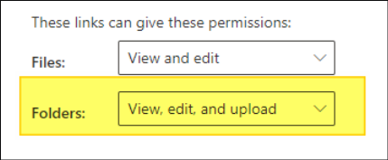
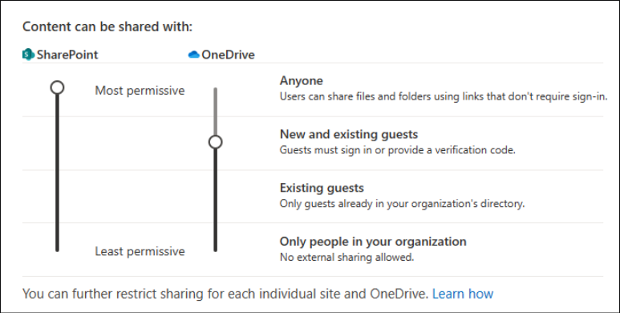

# Enable File Requests in SharePoint or OneDrive 

With the [file request feature](https://support.microsoft.com/office/create-a-file-request-f54aa7f8-2589-4421-b351-d415fc3b83af) in OneDrive, you can choose a folder where others can upload files using a link that you send them. People you request files from can only upload files; they can't see the content of the folder, edit, delete, or download files, or even see who else has uploaded files. 

Admins can use the SharePoint Online Management Shell to disable or enable the **Request files** feature on OneDrive or SharePoint sites. If there's no change on sharing capability for all sites, then the file request feature can be enabled. 

> [!IMPORTANT]
> **Request files** is available only if all of the following statement are true. Please contact your admin if you don't see this feature:
> - You're using OneDrive for work or school accounts.
> - Your admin has [enabled **Anyone** links for SharePoint](/sharepoint/turn-external-sharing-on-or-off).
> - Your admin has configured the **View, edit, and upload** permission for **Anyone** links as described in [Advanced settings for **Anyone** links](/sharepoint/turn-external-sharing-on-or-off#advanced-settings-for-anyone-links).
> - This feature is not available for Office 365 operated by 21Vianet, OneDrive for home, or Office 365 Germany.

> [!NOTE]
> In its current state, if you disable **Anyone** links for SharePoint in the SharePoint Admin Center, the ability to turn on **Request files** feature is also disabled at Site, SharePoint and OneDrive level.

## Enable or Disable Request Files for SharePoint

> [!NOTE]
> This is a newly released feature and may not be available to all tenants yet.
> Please note, if your tenant currently has Anyone Links enabled for SharePoint, we will be enabling this feature for SharePoint sites by default during the rollout. If you do not want File Requets to appears on SharePoint sites, you can opt out by running the following SharePoint Online management shell cmd "Set-SPOTenant -CoreRequestFilesLinkEnabled $False".

1. Check if you have enabled [**Anyone** links at the tenant level for SharePoint sites](/sharepoint/turn-external-sharing-on-or-off#change-the-organization-level-external-sharing-setting). 

2. Ensure folder permissions are set to **View, edit and upload**. 

   

3. Check `CoreRequestFilesLinkEnabled` is set correctly via [SharePoint Online Management Shell](/powershell/sharepoint/sharepoint-online/connect-sharepoint-online).  

   - Run `Get-SPOTenant`. 

   - Check if `CoreRequestFilesLinkEnabled` is set to **True**. If it isn't set to **True**, run `Set-SPOTenant -CoreRequestFIlesLinkEnabled $True`. 

     - If this is set to **True**, **Request files** link on the core partition for all SharePoint sites is enabled (not including OneDrive sites). If this value isn't set, **Request files** will only show for OneDrive with **Anyone** links enabled. 
     
4. You can also set the `RequestFilesLink` Expiration by using `Set-SPOTenant -CoreRequestFilesLinkExpirationInDays` (Optional).

## Enable or Disable Request Files for OneDrive

1. Check if you have enabled [**Anyone** links at the tenant level for SharePoint sites](/sharepoint/turn-external-sharing-on-or-off#change-the-organization-level-external-sharing-setting). 

2. Ensure folder permissions are set to **View, edit and upload**.

   

3. Configure OneDrive **Anyone** links at tenant level to your desired preference. It's only required that SharePoint **Anyone** links setting are configured to the most permissive (Anyone) at the tenant level.  

4. For example, you can set OneDrive sharing capability to **New and Existing guests** and still allow OneDrive File Requests by following the instructions below as long as SharePoint **Anyone** links are turned on.  

   
   
5. Check `OneDriveRequestFilesLinkEnabled` is set correctly via [SharePoint Online Management Shell](/powershell/sharepoint/sharepoint-online/connect-sharepoint-online).  

   - Run `Get-SPOTenant`.

   - Check if `OneDriveRequestFilesLinkEnabled` is set to **True**. If it isn't set to **True**, run `Set-SPOTenant -OneDriveRequestFIlesLinkEnabled $True`. 

     - If this is set to **True**, **Request files** link on the OneDrive partition for all OneDrive sites will be available. If this value isn't set, the **Request files** link will be disabled on OneDrive. 

6. You can also set the **Request files** Links to expire by using `Set-SPOTenant – OneDriveRequestFilesLinkExpirationInDays` (Optional).

## Enable or Disable Request Files per site

1. Check if you have enabled [Anyone links at the tenant level for SharePoint sites](/sharepoint/turn-external-sharing-on-or-off#change-the-organization-level-external-sharing-setting). 

2. Ensure folder permissions are set to **View, edit and upload** at Tenant Level in SharePoint tenant admin.

   

3. Check if `RequestFilesLinkEnabled` is set correctly via [SharePoint Online Management Shell](/powershell/sharepoint/sharepoint-online/connect-sharepoint-online).  

   - Run `$r=Get-SPOSite -Identity <SiteURL> -Detailed`.

   - Check if `RequestFilesLinkEnabled` is set to **True**. If it isn't set to **True**, run `Set-SPOSite -Identity <SiteURL> -RequestFIlesLinkEnabled $True` to enable the feature for that site and set it to **False** to disable it.

4. You can also set the **Request Files** link Expiration by using `Set-SPOSite -RequestFilesLinkExpirationInDays` (Optional).
  
For more information on File Requests, see [Create a file request](https://support.microsoft.com/office/create-a-file-request-f54aa7f8-2589-4421-b351-d415fc3b83af).
  
