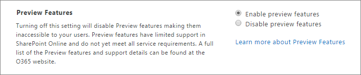

# Enable or disable preview features in SharePoint

The **Preview Features** setting in the SharePoint admin center lets you enable or disable integration with other services. The setting is enabled by default. 
  

  
> [!NOTE]
> The **Preview Features** setting isn't related to the Targeted release option, which allows you to receive new updates and features as they become available. If you're interested in signing up for that, see [Set up the Standard or Targeted release options in Office 365](/office365/admin/manage/release-options-in-office-365).
  
## What the Preview Features setting enables

Use the Preview Features setting to enable the following features, and others that are added in the future.
  
### Power BI integration with Excel on the web

When you use Power BI, your data is sent to the Power BI service. If you have implemented compliance policies for your SharePoint environment, these policies won't extend to the data as it's processed in Power BI. If this is a concern, select **Disable preview features** for this setting. 
  
> [!IMPORTANT]
> When you disable preview features, your users will no longer be able to use Excel on the web to view and edit workbooks that rely on Power BI. 
  
## To enable or disable preview features for your organization

1. Go to the [Settings page of the new SharePoint admin center](https://admin.microsoft.com/sharepoint?page=settings&modern=true) and sign in with an account that has admin permissions for your organization.

>[!Note]
>If you have Office 365 Germany, [sign in to the Microsoft 365 admin center](https://go.microsoft.com/fwlink/p/?linkid=848041), then browse to the SharePoint admin center and open the Settings page.  If you have Office 365 operated by 21Vianet (China), [sign in to the Microsoft 365 admin center](https://go.microsoft.com/fwlink/p/?linkid=850627), then browse to the SharePoint admin center and open the Settings page.
 
2. At the bottom of the page, select **classic settings page**.
  
3. Next to **Preview Features**, select **Enable preview features** or **Disable preview features**.
