# Export site mailboxes through PST (Manually)

You must have [Microsoft 365 admin permissions](https://docs.microsoft.com/microsoft-365/admin/add-users/assign-admin-roles?view=o365-worldwide) to access the [Microsoft 365 compliance center](https://docs.microsoft.com/microsoft-365/compliance/microsoft-365-compliance-center?view=o365-worldwide). 

For more information, see [Permissions and sharing](https://docs.microsoft.com/sharepoint/modern-experience-sharing-permissions).

1. Go to [https://compliance.microsoft.com/](https://compliance.microsoft.com/) and sign in with an account that has [admin permissions](https://docs.microsoft.com/sharepoint/sharepoint-admin-role) for your organization.

2. In the Microsoft 365 compliance center, choose **eDiscovery** > **Core**.

3. Select **Create a case**.

   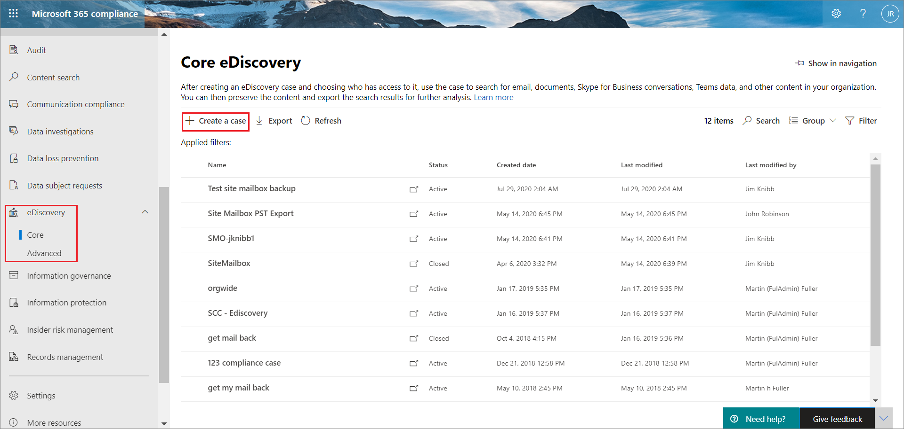

4. In **New case** details pane, enter a case name and description.

   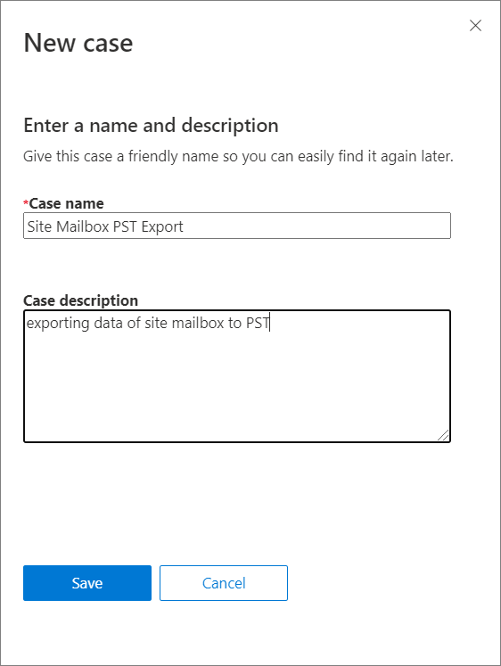

5. Click **Save**.

6. Select the case and click  to open the case.
   
   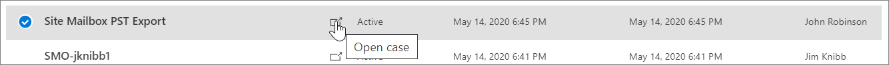

7. Select **Search**.

   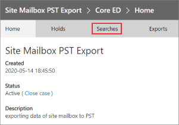

8. Select **+Guided search**.

9. In the **New search** details pane, under the **Name your search** tab, enter the name and description.

   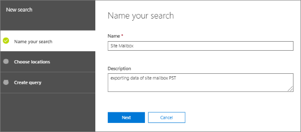

10. Click **Next**.

11. In **Choose locations** tab, select **Specific locations**.

12. Under **Locations**, click **Choose users, groups, or team**.
    
    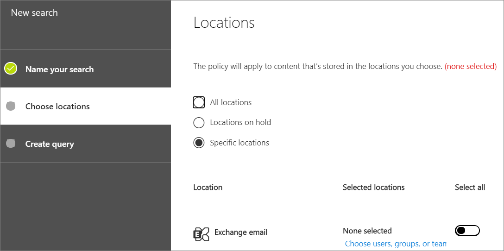
    
13. In **Edit locations** window, under **Exchange email**, click **Choose users, groups, or team**.

14. Enter the name of the site mailbox to be exported.

15. Check the confirmation box to ensure the site mailbox is added.

    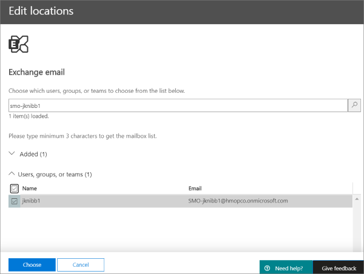
    
16. Click **Choose** and then click **Done**.

    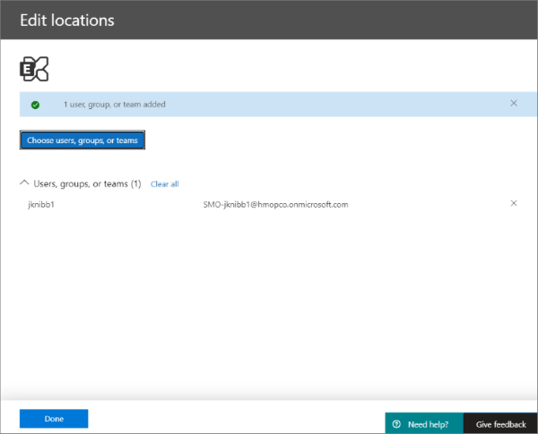
    
17. Under SharePoint sites option, click **Choose sites** to add the SharePoint site associated with the site mailbox.

    
    
18. To find the SharePoint URL for the site mailbox, run the following command in Powershell:

    ```Powershell

    PS D:\tools\PSSession> Get-SiteMailbox

    Name        ClosedTime SharePointUrl
    ----        ---------- -------------
    SMO-jknibb1            https://hmopco.sharepoint.com/jknibb1


    PS D:\tools\PSSession>
    ```

    Use ‘Get-SiteMailbox -BypassOwnerCheck’ option to list all the site mailboxes.

19. Enter the URL and check the confirmation box to ensure the URL is added.

    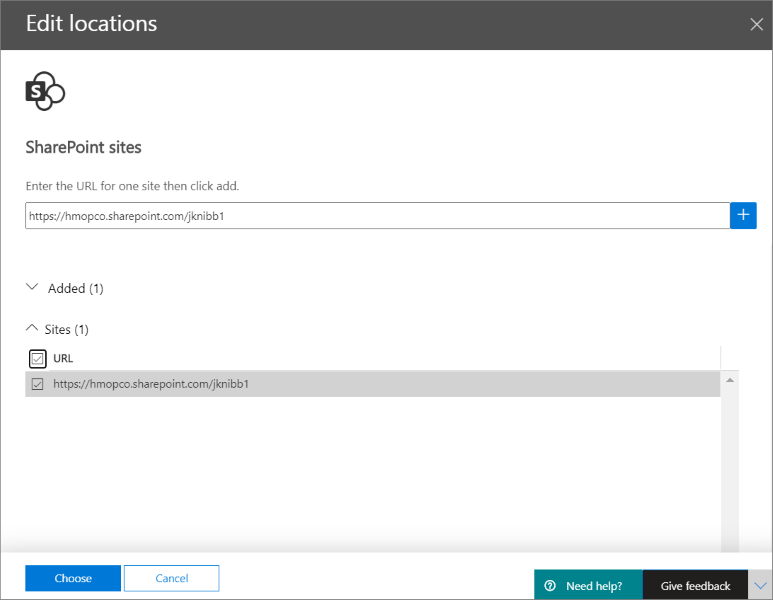
    
20. Click **Choose** and then click **Done**.

21. In the **New search** details pane, click **Next**.

    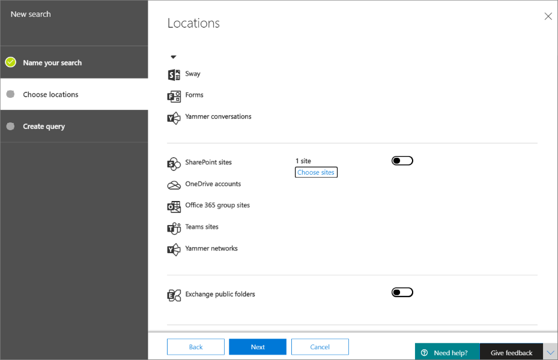
    
22. Click **Finish**.

    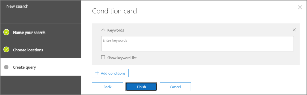

    >[!NOTE]
    > Leave the Condition card blank to ensure the entire mailbox content is searched. The search will take a while based on the amount of content.
    
23. Click **More** once the search is complete and then click **Export results**.

    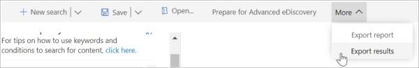

24. Select the appropriate options and click **Export**.

    
      
    >[!NOTE]
    > The export wizard takes a few minutes to launch the Export.

25. In **Export key** section, click **Copy to clipboard**.

    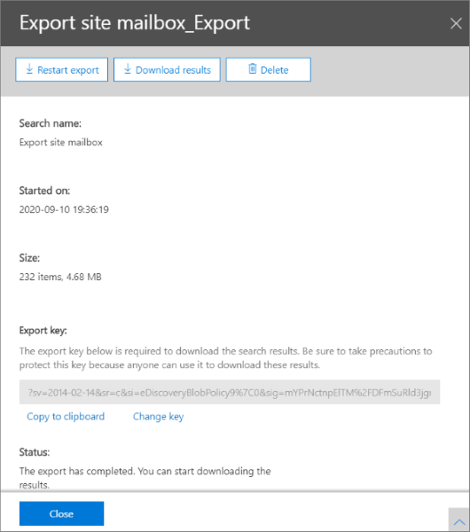

26. Click **Download results**.

27. In the dialog box, click **Open**.

    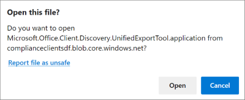
    
    >[!NOTE]
    > This will launch the Microsoft Office 365 eDiscovery Export Tool to export the mailbox to PST.
    
28. Click **Install**.

    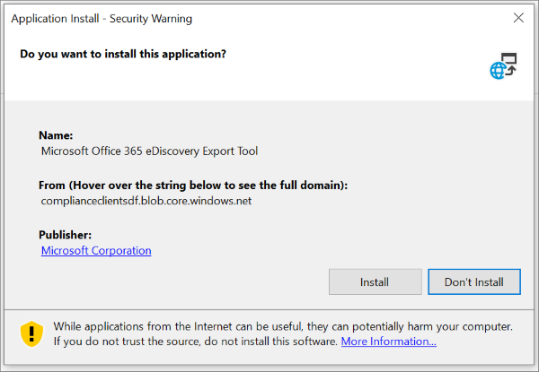

29. Paste the **Export key**, provide the location to save the PST file locally and then click **Start**.

    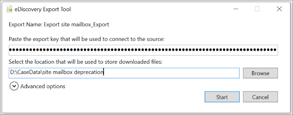
    
    >[!NOTE]
    > The export will take a while based on the size of the PST file.

30. Click **Close**.

    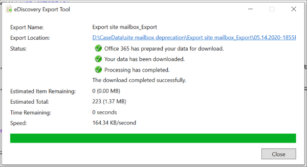
    
    The PST can be now attached in Outlook.
    
    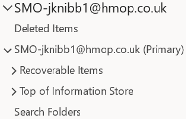
    
    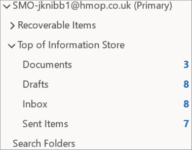
    
  >[!NOTE]
  > - Folder with no email items inside them will not be exported.
  > - The site mailboxes contain special folder named, "Documents", of type IPF.ShortcutFolder. This contains "links" to files that are on SP site. The actual SP files must be       exported using eDiscovery for SP sites.
  > - Outlook shows the items inside the Documents folder as unsafe, this is an expected behaviour.
  > - The document attachments in the emails of Documents folder are just place holder, the actual documents are stored in SharePoint.

    

