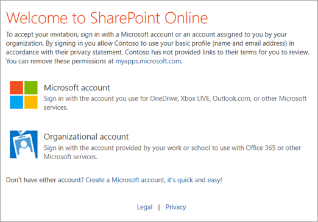
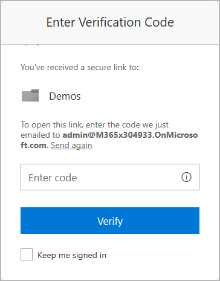
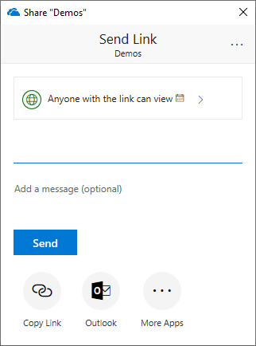

# External sharing overview

The external sharing features of SharePoint Online let users in your organization share content with people outside the organization (such as partners, vendors, clients, or customers). You can also use external sharing to share between licensed users on multiple Office 365 subscriptions if your organization has more than one subscription. Planning for external sharing should be included as part of your overall permissions planning for SharePoint Online. This article describes what happens when users share, depending on what they're sharing and with whom. 
  
(If you want to get straight to setting up sharing, see [Turn external sharing on or off for SharePoint Online](turn-external-sharing-on-or-off.md). If you're trying to share a file or folder, see [Share OneDrive files and folders](https://support.office.com/article/9fcc2f7d-de0c-4cec-93b0-a82024800c07) or [Share SharePoint files or folders in Office 365](https://support.office.com/article/1fe37332-0f9a-4719-970e-d2578da4941c).)
  
> [!NOTE]
> External sharing is turned on by default for your entire SharePoint Online environment and the sites in it. You may want to [turn it off globally](turn-external-sharing-on-or-off.md) before people start using sites or until you know exactly how you want to use the feature. 
  
## How the external sharing settings work

SharePoint Online has external sharing settings at both the organization level and the site level (previously called the "site collection" level). To allow external sharing on any site, you must allow it at the organization level. You can then restrict external sharing for other sites. If a site's external sharing option and the organization-level sharing option don't match, the most restrictive value will always be applied.
  
Whichever option you choose at the organization or site level, the more restrictive functionality is still available. For example, if you choose to allow sharing using "Anyone" links (previously called "shareable" links or "anonymous access" links), users can still share with guests who sign in, and with internal users. 

> [!IMPORTANT]
> Even if your organization-level setting allows external sharing, not all new sites allow it by default. The default sharing setting for Office 365 group-connected team sites is "New and existing guests." The default for communication sites and classic sites is "Only people in your organization." 
  
**Security and privacy**
  
If you have confidential information that should never be shared externally, we recommend storing the information in a site that has external sharing turned off. Create additional sites as needed to use for external sharing. This helps you to manage security risk by preventing external access to sensitive information.

> [!NOTE]
> To limit *internal* sharing of contents on a site, you can prevent site members from sharing, and enable access requests. For info, see [Set up and manage access requests](https://support.office.com/article/94B26E0B-2822-49D4-929A-8455698654B3).  When users share a folder with multiple guests, the guests will be able to see each other's names in the Manage Access panel for the folder (and any items within it).
  
## Sharing Office 365 group-connected team sites

When you or your users create Office 365 groups (for example in Outlook, or by creating a team in Microsoft Teams), a SharePoint team site is created. Admins and users can also create team sites in SharePoint, which creates an Office 365 group. For group-connected team sites, the group owners are added as site owners, and the group members are added as site members. In most cases, you'll want to share these sites by adding people to the Office 365 group. However, you can share only the site. 

> [!IMPORTANT]
> It's important that all group members have permission to access the team site. If you remove the group's permission, many collaboration tasks (such as sharing files in Teams chats) won't work. Only add guests to the group if you want them to be able to access the site. For info about guest access to Office 365 groups, see [Manage guest access in Groups](/office365/admin/create-groups/manage-guest-access-in-groups).  

## What happens when users share

When users share with people outside the organization, an invitation is sent to the person in email, which contains a link to the shared item.

  
 **Recipients who sign in**
  
When users share *sites*, recipients will be prompted to sign in with:
- A Microsoft account
- A work or school account in Azure AD from another organization

When users share *files and folders*, recipients will also be prompted to sign in if they have:
- A Microsoft account

These recipients will typically be added to your directory as guests, and then permissions and groups work the same for these guests as they do for internal users. (To ensure that all guests are added to your directory, use the [SharePoint and OneDrive integration with Azure AD B2B preview](https://docs.microsoft.com/sharepoint/sharepoint-azureb2b-integration-preview).)
  
Because these guests do not have a license in your organization, they are limited to basic collaboration tasks:
  
- They can use Office.com for viewing and editing documents. If your plan includes Office Professional Plus, they can't install the desktop version of Office on their own computers unless you assign them a license. 

- They can perform tasks on a site based on the permission level that they've been given. For example, if you add a guest as a site member, they will have Edit permissions and they will be able to add, edit and delete lists; they will also be able to view, add, update and delete list items and files.
    
- They will be able to see other types of content on sites, depending on the permissions they've been given. For example, they can navigate to different subsites within a shared site. They will also be able to do things like view site feeds.
    
If your authenticated guests need greater capability such as OneDrive storage or creating a Microsoft Flow, you must assign them an appropriate license. To do this, sign in to the [Microsoft 365 admin center](https://admin.microsoft.com) as a global admin, make sure the Preview is off, go to the **Active users** page, select the guest, click **More**, and then click **Edit product licenses**.

 **Recipients who provide a verification code**

When users share files or folders, recipients will be asked to enter a verification code if they have:

- A work or school account in Azure AD from another organization
- An email address that isn't a Microsoft account or a work or school account in Azure AD

If the recipient has a work or school account, they only need to enter the code the first time. Then they will be added as a guest and can sign in with their organization's user name and password.

If the recipient doesn't have a work or school account, they need to use a code each time they access the file or folder, and they are not added to your directory.

> [!NOTE]
> Sites can't be shared with people unless they have a Microsoft account or a work or school account in Azure AD.
  
 **Recipients who don't need to authenticate**
  
Anyone with the link (inside or outside your organization) can access files and folders without having to sign in or provide a code. These links can be freely passed around and are valid until the link is deleted or expires (if you've set an expiration date). You cannot verify the identity of the people using these links, but their IP address is recorded in audit logs when they access or edit shared content.
  

People who access files and folders anonymously through "Anyone" links aren't added to your organization's directory, and you can't assign them licenses. They also can't access sites anonymously. They can only view or edit the specific file or folder for which they have an "Anyone" link. 
  
## Stopping sharing

You can stop sharing with guests by removing their permissions from the shared item, or by removing them as a guest in your directory.
  
You can stop sharing with people who have an "Anyone" link by going to the file or folder that you shared and deleting the link.

 [Learn how to stop sharing an item](https://support.office.com/article/0a36470f-d7fe-40a0-bd74-0ac6c1e13323) 
  
## Collaborating with external business partners

If you have business partners or vendors with whom you need to collaborate or share documents, consider setting up a SharePoint Online extranet site. An extranet site is a dedicated site where you limit external sharing to guests on specific domains only. For details, see [Use Office 365 SharePoint Online as a business-to-business (B2B) extranet solution](create-b2b-extranet.md).

## Need more help?

[!INCLUDE[discussionforums.md](includes/discussionforums.md)]

You can also find help on security and permissions in these [YouTube videos from SharePoint community experts](https://www.youtube.com/playlist?list=PLKurDp05sqD0oE3KnohD69dkP5fHmrfuN).
  
## See also

[How Microsoft manages and enables external sharing and collaboration with SharePoint (Microsoft Ignite)](https://www.youtube.com/watch?v=dK5uky1bJ1Y)

[Coaching your guests through the external sharing experience](https://techcommunity.microsoft.com/t5/SharePoint-Support-Blog/Coaching-your-guest-users-through-the-External-Sharing/ba-p/182739)
  
[Set up and manage access requests](https://support.office.com/article/94b26e0b-2822-49d4-929a-8455698654b3)
  
[Searching for site content shared externally](/office365/securitycompliance/keyword-queries-and-search-conditions)

