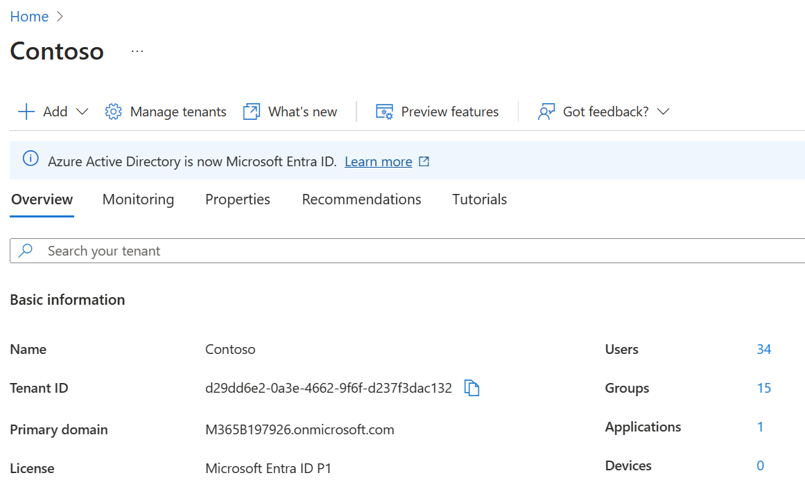

# Find your Microsoft 365 tenant ID

Your Microsoft 365 tenant ID is a globally unique identifier (GUID) that is different than your organization name or domain. You can use this identifier when you configure OneDrive policies.
  
## Find your Microsoft 365 tenant ID in the Microsoft Entra admin center

Your tenant ID can be found in the **Tenant ID** box on the [Overview page](https://entra.microsoft.com/#view/Microsoft_AAD_IAM/TenantOverview.ReactView).

  
> [!NOTE]
> For info about finding your tenant ID by using PowerShell instead, first read [Microsoft Graph PowerShell](/powershell/microsoftgraph/installation?view=graph-powershell-1.0&preserve-view=true) and then use [Get-MgOrganization](/powershell/module/microsoft.graph.identity.directorymanagement/get-mgorganization?view=graph-powershell-1.0&preserve-view=true).
