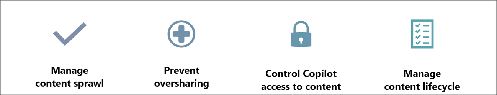

# Get ready for Copilot for Microsoft 365 with SharePoint Advanced Management (SAM)

## Copilot and SharePoint
So, your organization is getting ready to enable Microsoft Copilot for Microsoft 365. Copilot is an AI-powered productivity tool that provides real-time support for your users’ creativity, productivity, and skills. Copilot works by coordinating three components:

-	Large language models (LLMs)
-	The Microsoft 365 productivity apps that you use every day, such as Word, Excel, PowerPoint, Outlook, Teams, and others.
-	Content in Microsoft Graphs

A user tells Copilot what they want, and Copilot only provides response using the content in Microsoft Graph, based on the users’ profile and their permissions. Content in Microsoft Graph includes emails, files, meetings, chats, calendars, and contacts. A significant portion of them are stored as SharePoint files. When you share documents with others, these documents become data stored on SharePoint sites, document libraries and OneDrive. These documents can be: Word document shared by your colleagues, a presentation that you're working with your team, meeting recordings, project notes you created in Loop and OneNote, and more. To ensure assistance provided by Copilot is appropriate, accurate, and compliant, as your organization’s SharePoint admin, it's crucial for you to ensure that your organization’s data in SharePoint is appropriately governed from the following four aspects:

-	Manage content sprawl: reduce content duplication and ensure well-planned content creation. Ensure all sites and content are well managed governed by site owners.
-	Prevent content oversharing: use tools available to SharePoint admins and site owners to prevent users from oversharing content.
-	Control content access: Limit content access by Copilot with user group settings, and other tools. 
-	Manage content lifecycle: remove inactive and outdated content and sites. Make sure the information Copilot access is accurate and up to date. 

## Use SharePoint Advanced Management(SAM) to get your organization ready for Copilot

Microsoft SharePoint Premium – SharePoint Advanced Management (SAM) is an essential Microsoft 365 add-on that helps you, as the SharePoint admin to address these four pillars around content governance. To get ready for your organization’s Microsoft 365 Copilot adoption, there are a few highly recommended steps you can take, primarily using SharePoint Advanced Management tools. These steps reduce accidental oversharing, minimize your content governance footprint, improve Copilot response quality, control content access by Copilot, and ensure data safety specifically for business-critical sites. Let's delve into the specific steps you can take:

### Step 1: Reduce accidental oversharing with SharePoint sharing settings

To minimize accidental content oversharing via Copilot results, it's crucial to implement the best practice sharing settings. Proactive safeguards are key. To effectively prepare your organization for Gen AI, set the appropriate sharing settings for end users at both the organization and site levels:  

At the organization level:

- Update [sharing link ](/sharepoint/turn-external-sharing-on-or-off#file-and-folder-links) for your tenant from organization-wide sharing to specific people links.
- Consider hiding broad-scope permissions from your end users to reduce risks around accidental misuse. [This example](/powershell/module/sharepoint-online/set-spotenant) hides "Everyone Except External Users" in the People Picker control so that no end user can use it.

At the site level:

Consider educating site admins on the site-level controls they can use to [restrict members from sharing](/powershell/module/sharepoint-online/set-spotenant). One key setting here ensures that Site Owners are the recipients of [access requests](https://support.microsoft.com/office/set-up-and-manage-access-requests-94b26e0b-2822-49d4-929a-8455698654b3).

### Step 2: Clean up unused sites

Identify inactive sites, then take action to reduce your governance footprint and improve Copilot response quality. Inactive sites often contain outdated content, cluttering Copilot’s data source and leading to less accurate responses. Removing these sites helps Copilot focus on current information for better results.

- Run an [Inactive Site ](/sharepoint/site-lifecycle-management#create-an-inactive-site-policy) in Simulation mode to identify sites that haven't been accessed for an extended (configurable) period of time.
- Once ready, set the policy to Active mode to notify the Site Owner to attest whether the site is still needed.

### Step 3: Identify sites with potentially overshared content

Without looking at the actual content, how do you quickly identify sites with potentially overshared content? Usually, if you see there's content on a site that is being shared with one of the following options: “**Everyone Except External Users**”, “**People in your organization**” and “**Anyone**.” Currently, SAM lets you quickly identify these sites by running three individual reports on the following usages of the last 28 days:

- Usage of "Everyone Except External Users" 
- Usage of “People in your organization" sharing links 
- Usage of "Anyone" sharing links 

Sites with these three types of usage are at a greater risk of oversharing compared to those without such usages. 
 
### Step 4: Control access to content

When you use either Microsoft Search or Microsoft Copilot, the results come from content in Microsoft Graph, based on each individual user’s profile and permissions. In Step 3, you have identified sites with potentially overshared content. 

Next, you want to ensure Copilot and organization-wide search only have access to content when appropriate. Currently, you can initiate a Site Access Review for site owners to confirm overshared content and take remediation steps. Meanwhile, you as the SharePoint admin can use the Restricted Access Control Policy to immediately restrict access to a site with overshared content. 

#### Site Access Review by site owners

For any site that is identified with potentially overshared content, [Site Access Review](/sharepoint/site-access-review) is needed. As the SharePoint Admin, you should initiate the Site Access Review. 

- Site Owners use a new Site Access Review UI to review the broadly shared content in their site
- The site owners need to determine whether the broad sharing is appropriate, or it's indeed oversharing and requires remediation. 
- If the site owner determines that the content is indeed overshared, they can take easy remediation actions. 

#### Immediately restrict access with the Restricted Access Control Policy

Until the Site Access Review is complete, you as the SharePoint Admin may want to take immediate action to mitigate oversharing risks. To immediately restrict access to a site with overshared content, the SharePoint Admin can set up a Restricted Access Control Policy. 

As a result, all access to the site is restricted to only the group of users specified in the policy. Accordingly, the content from this site is visible in Copilot for Microsoft 365 and Search only for this restricted group of users. This policy can be configured for OneDrive and SharePoint sites, and at the tenant level. 

### Step 5: Take proactive measures on business-critical sites

For business-critical sites, you want to take proactive measures to ensure the content is appropriately shared, and access to content is limited to the minimum level. You can lock down your most important sites with the following measures:

- Use [Restricted Access Control (RAC)](/sharepoint/restricted-access-control) to proactively protect against oversharing. Even better: as part of your custom site provisioning process, configure RAC policy on new sites from the get-go and proactively avoid oversharing forever.
- Consider blocking downloads from selected sites via a block download policy. Or specifically [block the download of Teams meetings recordings](/microsoftteams/block-download-meeting-recording).
- Finally, consider applying encryption action with "extract rights" enforced on business-critical office documents. Learn more [here](/purview/ai-microsoft-purview).

## Coming up

The following policies are currently in preview and will soon be generally available. Sign up to participate in the preview by following instructions [here](https://forms.office.com/pages/responsepage.aspx?id=v4j5cvGGr0GRqy180BHbRw8ueKeaH4JIsskRInqtJE5UNjhYVkg5NDRNWkMxRlI0TFVDR0FYSUNGUi4u&route=shorturl).

### Use the Site Ownership policy to ensure all sites have valid owners

Site owners are the critical role on point for executing governance tasks at scale. Specifically, you need site owners to:

- Help attest if inactive sites are still needed in Step 2- cleaning up unused sites 
- Perform the Site Access Reviews to confirm whether potentially overshared content is indeed being overshared and take remediation to address oversharing risks in Step 4 – control access. 

It's essential to confirm all sites have valid owners before cleaning up unused sites and asking owners to take care of overshared content. SharePoint Advanced Management's Site Ownership policy helps identify ownerless sites and find the appropriate owners when needed.

- Coming up, you can run a Site Ownership policy in Simulation mode to identify any sites that don't have a minimum of two owners.
- Set up the policy to identify owners based on your desired criteria. Then upgrade the policy to Active mode to enable notifications to site owner candidates.

### Use the Inactive Sites – Read only and Inactive Sites – Archive policies to clean up unused sites

In Step 2 of this article, we discussed identifying inactive sites. After identifying inactive sites, you'll ask site owners to attest if the sites are still needed. If the site owners confirm the sties aren't needed, you need to put them either in read-only mode, or move the sites to Microsoft 365 Archive. Coming soon, you'll be able to do these at scale, by using the Inactive Sites – Read only and Inactive Sites – Archive policies to: 

- Make the site read-only
- Move the site to Microsoft 365 Archive 

### Use the Oversharing Baseline Report for Sites, OneDrives, and Files policy to identify oversharing risks

In Step 3, we discussed how to run three usage reports to identify potentially overshared content in the past 28 days. Coming soon, you'll be able to Run a single report to learn where content overexposure risk exists in all sites on your tenant.

- You'll be able to start with running an “Oversharing Baseline Report for Sites, OneDrives and Files” report from the Data Access Governance (DAG) PowerShell commands in SharePoint Online PowerShell module. This report scans all sites in your tenant, and lists sites that share content with more than a certain number of users (you specify the number).

- You can sort, filter or download the report, and identify the sites with potentially overshared content.

### Use the Restricted Content Discoverability policy to further control access to content

In Step 4—control access to content, it's advised to begin with the Site Access Review policy to verify if the potentially overshared content identified in Step 3 is truly overshared. Following this, apply the Restricted Access Control policy to limit access to designated user groups. Soon, a new policy, the Restricted Content Discoverability policy, will be available to further manage access to content.

In addition, in Step 5, to further protect content on your business-critical sites, you can use Restricted Content Discoverability to leave permissions in place, but prevent the content from being available to Copilot. 

The Restricted Content Discoverability policy leaves site access unchanged but prevents the site’s content from being surfaced in Copilot for Microsoft 365 or organization-wide Search. The SharePoint Admin can set Restricted Content Discoverability on that site. 

