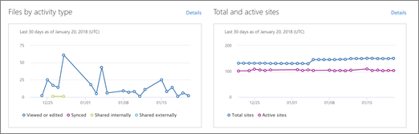
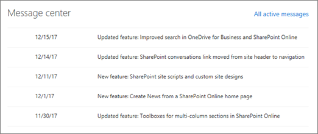
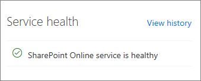

# Get started with the new SharePoint admin center

As a global or SharePoint admin in Office 365, you can try the new SharePoint admin center. To access it, go to the classic SharePoint admin center, select **Open it now** at the top of the page to open the new SharePoint admin center.
  
> [!NOTE]
> Some functionality is introduced gradually to organizations that have opted in to the [Targeted release option in Office 365](/office365/admin/manage/release-options-in-office-365). This means that you may not yet see some features or they may look different than what is described in this article. 
  
## Go to the classic experience

The new SharePoint admin center is now available worldwide to customers who have selected the standard release option. To perform some tasks, you'll still need to use the classic experience.
  
> [!IMPORTANT]
> If a setting exists in both the new and classic SharePoint admin centers, and possibly other admin centers such as the OneDrive and Microsoft 365 admin centers, when you change it in one place, the other admin centers will reflect the change. If you have multiple admins in your organization, make sure you communicate the changes you're making. 
  
Help us improve the new SharePoint admin center! Tell us what you like or don't like, send a suggestion, or file a bug. To send us feedback, click **Feedback** in the lower-right corner. 
  
## View reports

On the Home page, you can see at a glance:
  
- The number of files that have specific types of activity each day for the past 30 days. (If an activity occurs multiple times in one day on the same file, the file is counted only once for that day.)
    
- The number of total and active sites each day for the past 30 days. ("Active" sites are any where users view a page or view, modify, upload, download, share, or sync a file.)
    

  
> [!TIP]
>  To filter a report, click an item in the legend. For example, on the Files by activity type chart, click "Viewed or edited."    To see values for a specific day, point to that day on the report.    To see more details about a report, click **Details** to open the report in the Microsoft 365 admin center. Here, you can see tables of activity by site or users, change the reporting period, pivot the report, export the report data into a .csv file that you can open in Excel, and more. For more info about the SharePoint reports in the Microsoft 365 admin center, see [Office 365 Reports in the Admin Center - SharePoint activity](/office365/admin/activity-reports/sharepoint-activity) and [Office 365 Reports in the Admin Center - SharePoint site usage](/office365/admin/activity-reports/sharepoint-site-usage). 
  
> [!NOTE]
> Reports typically don't include activity from the last 24 to 48 hours. 
  
## View Message center posts

In the Message center section of the home page, you can read official announcements about new and changed SharePoint features to help you manage upcoming changes. Each post gives you an overview of a change and how it may affect your users. Click a post to open it in the Microsoft 365 admin center (where you can dismiss it if you want to hide it from the list), or click **All active messages** to sort and filter the list of messages across all Office 365 services. [Message center in Office 365](/office365/admin/manage/message-center)
  

  
## Service health

In the Service health section of the home page, you can see whether the SharePoint Online service is healthy, or if it's experiencing an active advisory or incident. For more info about an advisory or incident, click it to open the Service health page of the Microsoft 365 admin center.
  

  
## See also

[Manage sites in the new SharePoint admin center](manage-sites-in-new-admin-center.md)

