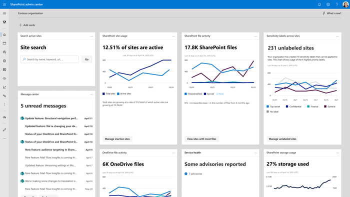

# Get started with the SharePoint admin center

To [go to the SharePoint admin center](https://admin.microsoft.com/sharepoint?page=home&modern=true), you need to sign in with an account that has [admin permissions](./sharepoint-admin-role.md) for your organization.

>[!NOTE]
>[Microsoft Partners](/office365/admin/misc/add-partner) can't access the new SharePoint admin center.  Report data is not available for Office 365 Germany customers and US Government GCC High and DoD customers. If you have Office 365 Germany, [sign in to the Microsoft 365 admin center](https://go.microsoft.com/fwlink/p/?linkid=848041), then browse to the SharePoint admin center.  If you have Office 365 operated by 21Vianet (China), [sign in to the Microsoft 365 admin center](https://go.microsoft.com/fwlink/p/?linkid=850627), then browse to the SharePoint admin center. 

> [!NOTE]
> Some functionality is introduced gradually to organizations that have opted in to the [Targeted release option in Microsoft 365](/office365/admin/manage/release-options-in-office-365). This means that you might not yet see some features described in this article, or they might look different.
  
Help us improve the SharePoint admin center! Tell us what you like or don't like, send a suggestion, or file a bug. To send us feedback, in the lower-right corner, select **Feedback**.

## Home page dashboard

  

> [!TIP]
>  You can choose which lines you want to appear on charts. To hide a line, select the line's label in the legend. For example, on the SharePoint site usage chart, select **Total sites**.    To see values for a specific day, point to that day on the chart. 
  
> [!NOTE]
> Cards typically don't include data from the last 24 to 48 hours. 

### SharePoint site search

This card lets you search active sites from the home page.

### Message center

This card helps you manage upcoming changes to SharePoint and OneDrive. Select a post to open it in the details panel. To view the full list of messages across all Microsoft 365 services, select **Show all**. [More info about the message center](/office365/admin/manage/message-center)

### SharePoint file activity

This card shows how many files you have in SharePoint. It also shows a chart of files by activity type over the past 30 days. (If an activity occurs multiple times in one day on the same file, the file is counted only once for that day.) To view the full report in the Microsoft 365 admin center, select the card title. [More info about SharePoint activity reports in the Microsoft 365 admin center](/microsoft-365/admin/activity-reports/sharepoint-activity-ww)

### Sensitivity labels

If your organization has enabled and set up [sensitivity labels to protect SharePoint sites](/microsoft-365/compliance/sensitivity-labels-teams-groups-sites), this card shows the usage of the labels across all sites. 

### Service health

This card shows whether the SharePoint service is healthy, or if it's experiencing an active advisory or incident. For more info about an advisory or incident, select it to open the **Service health** page of the Microsoft 365 admin center.

### OneDrive usage

This card shows the percentage of active OneDrive accounts in your organization and a chart of total and active accounts over the past 30 days. To view the full report in the Microsoft 365 admin center, select the card title. [More info about the OneDrive usage report in the Microsoft 365 admin center](/microsoft-365/admin/activity-reports/onedrive-for-business-usage-ww) 

### OneDrive file activity

This card shows how many files you have in OneDrive. It also shows a chart of files by activity type over the past 30 days. (If an activity occurs multiple times in one day on the same file, the file is counted only once for that day.) To view the full report in the Microsoft 365 admin center, select the card title. [More info about OneDrive activity reports in the Microsoft 365 admin center](/microsoft-365/admin/activity-reports/onedrive-for-business-activity-ww)

### SharePoint storage usage

This card shows how much of your SharePoint storage you've used and a chart of your storage usage over the past 180 days. To view all SharePoint site usage reports in the Microsoft 365 admin center, select the card title. [More info about SharePoint site usage reports in the Microsoft 365 admin center](/microsoft-365/admin/activity-reports/sharepoint-site-usage-ww)

### SharePoint site usage 

This card shows the percentage of active sites in your organization and a chart of total and active sites over the past 30 days. To view the full report in the Microsoft 365 admin center, select the card title. [More info about SharePoint site usage reports in the Microsoft 365 admin center](/microsoft-365/admin/activity-reports/sharepoint-site-usage-ww) 

### Term store operations

This card shows how many term store operations are being performed and a chart of operations by type over the past 15 days. 

### Microsoft 365 active users report

This card shows the usage of each Microsoft 365 service. To view the full report, select **View full report**. [More info about the Active users report in the Microsoft 365 admin center](/microsoft-365/admin/activity-reports/active-users-ww)

## Customize your dashboard

- To add available cards that aren't already on the dashboard, select **Add cards**. Tap or click a card to add it to the page, or drag it to a specific location on the page. 

    

- To remove a card, select More actions (...), and then select **Remove**.

- To move a card to a different location on the page, drag the card title.

  
## Customize the navigation pane

> [!NOTE]
> This feature isn't available if you're signed in as a global reader.

1. At the bottom of the left pane, select **Customize navigation**.

2. Select the items you want to appear in the pane, and then select **Save**.

    > [!TIP]
    > To minimize the left pane, select the icon with the three horizontal bars (**Collapse navigation menu**).

## Where to find things in the new SharePoint admin center

If you're used to working in the classic SharePoint admin center, to learn where you can find features and tasks in the new admin center, use the following table.

|Classic page |New page |Notes  |
|---------|---------|---------|
|site collections      |    [Sites > Active sites](https://admin.microsoft.com/sharepoint?page=siteManagement&modern=true)     |      The new SharePoint admin center refers to site collections as "sites." [Learn where to find tasks from the classic site collections page](site-collections-page.md)  |
|term store      |   [Content services > Term store](https://admin.microsoft.com/sharepoint?page=termStoreAdminCenter&modern=true)   |        |
|   sharing  |       [Policies > Sharing](https://admin.microsoft.com/sharepoint?page=sharing&modern=true)  |        The new page includes the most common settings, and others will be added. |
|settings      |    [Settings](https://admin.microsoft.com/sharepoint?page=settings&modern=true)     |      The new page includes the most common settings, and others are coming soon. At the bottom of the new Settings page, to access all the classic settings, select **classic settings page**.    |
|geo locations      |     [Advanced > Geo locations](https://admin.microsoft.com/sharepoint?page=geoLocations&modern=true)  |         |
|access control      |    [Policies > Access control](https://admin.microsoft.com/sharepoint?page=accessControl&modern=true)     |     The new SharePoint admin center contains all the classic settings and more.    |
|data migration      |    [Migration](https://admin.microsoft.com/sharepoint?page=migration&modern=true)     |     The new Migration Manager lets you migrate from on-premises file shares and SharePoint Server sites as well as popular cloud providers. This feature isn't available if you're signed in as a global reader. [Learn more about Migrating content to Microsoft 365](/sharepointmigration/migrate-to-sharepoint-online)    |
|User profiles, Search, Apps, BCS, Secure store, Records management, InfoPath, Configure hybrid (hybrid picker). |   [More features](https://admin.microsoft.com/sharepoint?page=classicFeatures&modern=true)      |         |

## See also

[Manage sites in the new SharePoint admin center](manage-sites-in-new-admin-center.md)