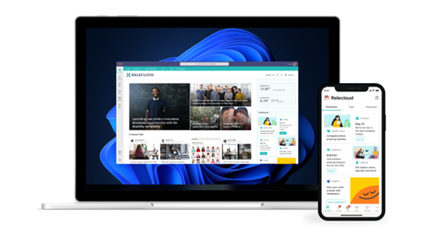
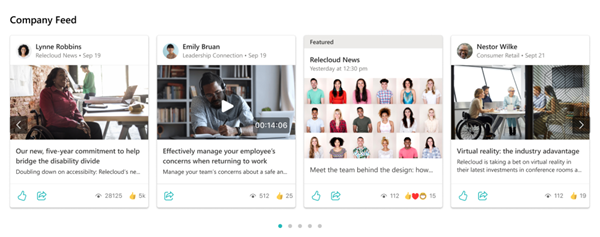
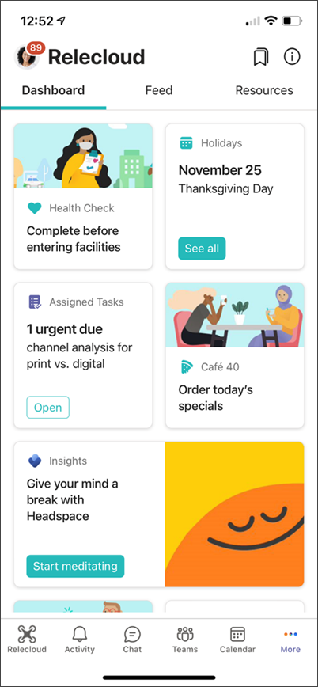

# Set up and launch Viva Connections (Preview)

Microsoft [Viva Connections](/viva-connections-overview.md) is a desktop and mobile experience that brings together relevant news, conversations, and resources in one place for your organization. It's built on your current Microsoft 365 ecosystem and powered by SharePoint to help you engage, inform, and empower your hybrid workforce. The Viva Connections experience is deployed and accessed in Microsoft Teams.

Use these step-by-step instructions to help you set up and launch [Viva Connections](https://techcommunity.microsoft.com/t5/microsoft-viva-blog/viva-connections-public-preview/ba-p/2730869) on desktop and mobile devices using currently available features to create an engaging user experience.

> [!IMPORTANT]
> - Some Viva Connections features will become available sooner than others. This document reflects the most up to date guidance and will be updated over the next several weeks to include updates to features as they become available. 
> - Information in this article relates to the upgraded Viva Connections app that is in Public preview. Viva Connections includes *both the desktop and mobile experiences*. It may be modified before it's generally available for all customers.
> - In March 2021, a *desktop-only* version of Viva Connections called [Viva Connections desktop](/viva-connections.md) was released as a custom line of business app and it can be provisioned via PowerShell.
> - To complete these step-by-step instructions, ensure that you have the permissions (or privileges) to the SharePoint and Microsoft Teams admin centers. Get more information about [permissions in SharePoint](customize-sharepoint-site-permissions.md) and [permissions in Microsoft Teams](/microsoftteams/teams-channels-overview#membership-roles-and-settings).

## Step 1: Prepare intranet navigation design and content

Prepare your intranet by ensuring intranet content and the flow of information is in order. A well-planned and well-executed intranet, hub, or site are important elements in ensuring you get the best from Viva Connections. When you set up Viva Connections, global navigation in the SharePoint app bar and navigation on the SharePoint home site will impact the overall Viva Connections experience. 
 

While working to prepare your intranet, align with stakeholders to define top scenarios that can be supported through Viva Connections. Focus on tasks and scenarios that can be easily completed on a mobile device. Organize the Viva Connections dashboard around these key scenarios. After you launch your first iteration of Viva Connections, you can always add new scenarios and content as you gather insights from user feedback and usage analytics. Audit, modernize, and prioritize content related to your Viva Connection scenarios.

### Get started
1.  **Prepare home site and global navigation design -** To ensure that your navigational design is a success, review best practices on how to design and set up your [SharePoint information architecture](information-architecture-modern-experience.md).
2.  **Modernize sites and pages -** Only modern SharePoint sites and pages can be viewed in Microsoft Teams, otherwise they will open in a separate browser window. Learn more about how to [modernize SharePoint sites](/sharepoint/dev/transform/modernize-classic-sites) and [pages](/sharepoint/dev/transform/modernize-userinterface-site-pages). If you are not using modern SharePoint yet, review the [Guide to the modern experience in SharePoint](guide-to-sharepoint-modern-experience.md).
3.  **Consider whether you will need a multilingual experience -** You'll need to start by enabling your home site with a default language. 

### Permissions
- SharePoint administrators (or higher) can [create home sites](/SharePoint/home-site-admin-center) and [hub sites](/sharepoint/create-hub-site).
- Site owners of the home site (or higher) can [enable and customize global navigation](/SharePoint/sharepoint-app-bar).
- Site owner and site member permissions are required to [customize site-level navigation](https://support.microsoft.com/office/customize-the-navigation-on-your-sharepoint-site-3cd61ae7-a9ed-4e1e-bf6d-4655f0bf25ca).

## Step 2: Designate a home site in SharePoint

A home site is a SharePoint communication site that acts as the front door to your organization’s intranet and has special capabilities such as the ability to prioritize news posted from the home site across the rest of the intranet. When you deploy Viva Connections, your SharePoint home site becomes the intranet-landing experience inside of Microsoft Teams. Consider using [The Landing template](https://lookbook.microsoft.com/details/c9300e94-6e83-471a-b767-b7878689e97e) in the SharePoint look book to get a head start.

> [!IMPORTANT]
> - A SharePoint home site is required to set up Viva Connections.
> - Home sites are generally high-traffic sites that should be [optimized for performance](/portal-health)

### Get started
1. If your organization does not already have a home site, learn more about [how to plan a home site](/home-site-plan). 
2. Then, [set the home site](/home-site-admin-center) in the SharePoint admin center or using [SharePoint PowerShell](/home-site).
3. Make sure you [share the home site](https://support.microsoft.com/office/share-a-site-958771a8-d041-4eb8-b51c-afea2eae3658) with everybody in your organization.

### Permissions
- SharePoint administrator (or higher) can create a home site.

## Step 3: Enable the SharePoint app bar and customize global navigation

The SharePoint app bar allows users to find important content and resources, and dynamically displays personalized sites, news, and files. Viva Connections uses elements from the SharePoint app bar and global navigation for the desktop and mobile experiences. 
SharePoint app bar elements will display in Microsoft Teams (the access point is highlighted in the red box in the image above) and includes global navigation, followed sites, and recommended news. On mobile devices, Viva Connections uses global navigation for the **Resources** tab. 

> [!IMPORTANT]
> - If your app bar is not set up, you won’t see a navigation panel in the desktop experience, and global navigation resources in the **Resources** tab of the Viva Connections app will not display.
> - A home site is required before you can enable and customize the SharePoint app bar.

### Get started
1. Learn more about [how to think about home site navigation and global navigation](https://techcommunity.microsoft.com/t5/video-hub/build-and-launch-a-sharepoint-home-site-tips-and-tricks-from-the/m-p/1696758). 
2. Learn how to set up the [SharePoint app bar and global navigation](sharepoint-app-bar.md).

### Permissions
- Site owner (or higher) permissions to the home site are required to enable and customize global navigation in the SharePoint app bar.

## Step 4: Create your Dashboard, add cards, and apply audience targeting in SharePoint

The Dashboard brings it all together – it provides a personalized landing experience and is designed to be the central destination where everyone can discover your organization's resources and complete daily tasks. Apply audience targeting to dashboard cards to give your users an experience tailored to their role and interests. Once you set up the Dashboard, you will be able to use the [Dashboard web part on the home site](/SharePoint/use-dashboard-web-part-on-home-site). 

> [!NOTE]
> The ability to create a Dashboard is only available from the home site.

**Popular scenarios that can be supported by Viva Connections include:** 
 
 

| General tasks    | Tasks for information workers   | Tasks for front line workers  |
| :------------------- | :------------------- |:----------------|
| - View pay and benefits   - Submit a ticket to the help desk   - Access lunch and café options   - Catch up on news and announcements | - Find people and team information   - Complete required training   - View company holidays | - View and manage shifts   - Access time sheets and popular forms   - View workplace policies and resources|

### Get started
1.  Learn how to [author your Dashboard, add cards, and apply audience targeting](/SharePoint/create-dashboard).
2.  *Optional* - Develop your own custom cards using [Adaptive Cards](/adaptive-cards/).

### Permissions
- Site editor (or higher) permissions to the Dashboard site are required to create and edit Dashboard resources.

## Step 5: Get content ready for your Feed with SharePoint news and Yammer

> [!div class="mx-imgBorder"]
> 

In the Viva Connections app, users will see a Feed that is personalized with relevant content personalized to them. The Feed automatically balances fresh and engaging content with corporate communications to keep users engaged, while also ensuring that the users see the most important messages. 

The Feed requires usage of modern SharePoint and either SharePoint news or a Yammer community. For the best and most engaging experience, use both. We recommend creating or using an existing organization news site so that users get the most important news.

If you are not already using SharePoint news or Yammer, learn how to use them by referring to the following articles:

**SharePoint news:**

- [Create an organizational news site](organization-news-site.md)
- [Use SharePoint news](https://support.microsoft.com/office/create-and-share-news-on-your-sharepoint-sites-495f8f1a-3bef-4045-b33a-55e5abe7aed7)

**Yammer**

- [Welcome to new Yammer](https://support.microsoft.com/office/welcome-to-new-yammer-8c749c30-2d17-4153-a3cc-37a70f254681)
- [Join and create Yammer community](https://support.microsoft.com/office/join-and-create-a-community-in-yammer-56aaf591-1fbc-4160-ba26-0c4723c23fd6#:~:text=Create%20a%20community%20in%20Yammer%20Click%20the%20Yammer,Community%20Name,%20enter%20the%20name%20of%20your%20community.)

### Get started
1. In Yammer, target the conversations you want to display in the Feed by using Yammer’s **Boost** and [**Featured**](https://support.microsoft.com/office/feature-a-conversation-in-new-yammer-92469ece-8a63-424f-9ad6-802ad90fc5c4) options on Yammer community pages.
2. Use [News boost](https://support.microsoft.com/office/boost-news-from-organization-news-sites-46ad8dc5-8f3b-4d81-853d-8bbbdd0f9c83) to elevate SharePoint news and announcements into a priority position in the Feed.
3. Use [Video news links](/video-news-links) in SharePoint to create an engaging viewing experience in the Feed.
4. Use the [Feed web part](https://prod.support.services.microsoft.com/office/use-the-feed-web-part-for-viva-connections-001fbe90-3778-4801-9ea9-71308711d330?preview=true) to display personalized news and announcements to viewers on the home site.

### Permissions
- Permissions required to create a Yammer community vary depending on your organization.
- Permissions required for SharePoint news:
    - To create an organization news site, you need SharePoint administrator permissions.
    - To create news stories, you need page-edit permissions or higher.

## Step 6: Enable the Viva Connections app in the Microsoft Teams admin center

After you have prepared your intranet for Viva Connections in SharePoint, you are ready to add the Viva Connections app in the Microsoft Teams Admin Center. Add the Viva Connections app, and then customize app settings to add your organization's logo, pre-install, and pre-pin the app for end users.

### Get started
1. [Add the Viva Connections app](/SharePoint/add-viva-connections-app) in the Teams admin center.
2. Then customize app settings like the app name and logo and decide user policies.
3. Finally, make the app available to end users.

### Permissions
- Teams administrator (or higher) permissions are required to add the Viva Connections app to the Teams Admin Center (TAC).

## Step 7: Choose settings for your mobile Viva Connections app

| Viva Connections Dashboard on a mobile device                  |Mobile settings guidance              | 
| :------------------- | :------------------- |
|   | The Viva Connections app creates a custom app in Microsoft Teams that fits the needs of your organization. Your organization’s custom app will appear as a branded company app in the Microsoft Teams app center. Once the app is added, your organization’s icon will appear in the Teams app bar in the desktop and mobile Microsoft Teams experience. Users won’t see the app by default if you don’t pre-install and pre-pin.

> [!NOTE]
> A Dashboard is required to customize settings for the mobile app.

### Get started
1.	If you have pre-pinned the app for your users with Teams app set up policies in step #6, then the app will automatically appear in users’ Teams mobile client apps on iOS and Android.
2.	If you have not pinned the app via policy, then users will first need to search for and install Viva Connections from the Teams desktop application. [Learn more about Viva Connections mobile settings.](https://support.microsoft.com/office/choose-settings-for-the-viva-connections-mobile-app-61bc93fe-5d58-4b4c-a0b1-abdd484ccf46)

### Permissions
- Site editor (or higher) permissions to the Dashboard site are required to choose settings for the mobile experience.

## Step 8: Let your users know how to access and use Viva Connections

| Viva Connections Dashboard interaction                 |End user guidance                 | 
| :------------------- | :------------------- |
|   | Help make end users aware of this new resource and provide guidance on what icon in the Teams app bar is your organization's instance of Viva Connections. Then, help end users understand how to use [the desktop experience](https://support.microsoft.com/office/your-intranet-is-now-in-microsoft-teams-8b4e7f76-f305-49a9-b6d2-09378476f95b). | 

## Resources

[Overview of Viva Connections](/viva-connections-overview)
 

[Public preview announcement on the TechCommunity blog](https://techcommunity.microsoft.com/t5/microsoft-viva-blog/viva-connections-public-preview/ba-p/2730869#:~:text=Viva%20Connections%20is%20the%20gateway%20to%20your%20organization%27s,from%20information%20workers%20to%20frontline%20and%20deskless%20employees.)

