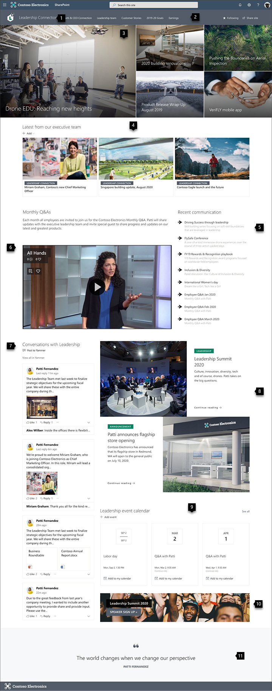

# Guided walkthrough - creating a leadership site for your organization

In this article, we show you elements of an example leadership site to inspire you, and help you learn how to create similar sites for your own organization. In this example, the leadership site provides your organization insight into the goals and priorities of the leadership team. Watch this video to see how it is built, or read the article below.

<!-- daisy put the video here-->

## Let's get started

First, if you haven't already created a Communication site, check out the <!-- daisy bookmark [Create your site] --> section in this article.  If you need to learn how to add sections and web parts, check out the section <!-- daisy bookmark [Add sections and web parts] --> in this article.

Once you have your created your site and know how to edit pages, you can use the steps below to add the elements shown.

## Example leadership site

**1. Showcase your company branding** Make it yours with a logo and theme. <!-- daisy bkmk -->Learn how

**2. Make your site easy to get around** Customize navigation to make it easy for people to discover important content on your site. <!-- daisy bkmk> Learn how

**3. Focus on priorities** Feature curated content that's a priority for the organization. <!-- daisy -->Learn how

**4. Share timely news** Share the most recent news, like vision statements and blog postings.<!--daisy--> Learn how

**5. Connect to important resources** Link to pages and sites that cover key topics.  <!--daisy-->Learn how

**6. Engage with video**  Add video to keep people updated on the latest talks, updates, and more.<!--daisy--> Learn how

**7. Keep communication fresh** Share recent conversations and comments from your organization.<!--daisy--> Learn how

**8. Engage users with beautiful images** Add more images with text and links to make your page look great and engage users.<!--daisy--> Learn how

**9. Keep everyone up-to-date** Show a calendar of the latest events.<!--daisy--> Learn how

**10. Sign them up** Create a call to action for sign-ups, surveys, or other important actions.<!--daisy--> Learn how

**11. Inspire** Add impact with inspirational or vision-oriented quotes.<!--daisy--> Learn how

## Create your site

To make a site like the one shown here, you'll create a [Communication site](https://support.microsoft.com/office/use-the-sharepoint-topic-showcase-and-blank-communication-site-templates-94a33429-e580-45c3-a090-5512a8070732). To do this, select **Create site** from the SharePoint start page (or, if you're going to associate this site with a Hub site, navigate to the hub site and click Create site there so that the communication site is automatically be associated with that hub site).

Next, choose **Communication site**, and then the **Blank** layout. Fill out your site name, description, and other information, and select **Finish**.

For more details, see [Create a communication site in SharePoint Online](https://support.microsoft.com/office/create-a-communication-site-in-sharepoint-7fb44b20-a72f-4d2c-9173-fc8f59ba50eb).
<!-- daisy bookmark -->Back to top

## Showcase your company branding

You can quickly and easily customize the look of your SharePoint site to reflect your professional style and brand.

<!--daisy image 4-->

**Change the look** settings are located under **Settings** <!--daisy settings icon--> in the top right corner of your SharePoint site.

<!--daisy image 5-->

You can select the site theme you want, and even customize it.

<!-- daisy image 6-->

You can change your header layout and logo when you click **Header** under **Change the look**.

<!-- daisy image 7-->

Under Change the look, you can also find options for navigation (cascade or mega menu) and footer options. For more details on changing the look of your site, see [Change the look of your SharePoint site](https://support.microsoft.com/office/change-the-look-of-your-sharepoint-site-06bbadc3-6b04-4a60-9d14-894f6a170818).

<!--daisy bookmark--> Back to top

## Make your site easy to get around

Easily edit the left and top menus to link the page to other SharePoint pages or on the Internet.

<!-- daisy image 8-->

Select **Edit** on the bottom of the left navigation to manage links there, or on the top menu to manage links there. Hover over the location in the menu where you want to add a link, and select +. Then add the type of link you want to add, your website address, and name to display in the navigation bar in the **Add a link** dialog box. Want to reorder your navigation links? Just drag them into the position you want.

For more detailed information on navigation, see [Customize the navigation on your SharePoint site](https://support.microsoft.com/office/customize-the-navigation-on-your-sharepoint-site-3cd61ae7-a9ed-4e1e-bf6d-4655f0bf25ca).

<!-- daisy bookmark -->Back to top

## Add sections and web parts

Sections make up your page, and are you place one or more web parts. While editing the page, each section will show controls to edit the layout, move, or delete the sections.

Start editing by clicking **Edit** on the top right of the page.

<!-- daisy image 9-->

The + symbol before or after a section will add a section using one of several layouts.

<!-- daisy image 10-->

For information on working with sections, see [Add or remove sections and columns on a page](https://support.microsoft.com/en-us/office/add-sections-and-columns-on-a-sharepoint-modern-page-fc491eb4-f733-4825-8fe2-e1ed80bd0899).

To add web parts to sections, select the plus symbol <!--daisy plus symbol--> in a section, which may appear before or after a web part in a section. Then select a web part to use. For more information on all web parts, see [Using web parts on SharePoint pages](https://support.microsoft.com/office/using-web-parts-on-sharepoint-pages-336e8e92-3e2d-4298-ae01-d404bbe751e0).

<!-- daisy image 11-->

Web parts may be edited, moved or deleted within sections. The **Edit web part** icon opens detailed controls unique to each web part type.

<!-- daisy image 12-->

<!-- daisy bookmark -->Back to top

## Focus on priorities with the Hero web part

Let your team know what’s most important with high-impact hero images, company branding, and important news. The initial impact of the Leadership site home page is created by large and eye-catching images of the Hero web part. The layout used in this example is **Three tiles**.

### Hero layout

Editing the web part presents layout options. The **Tiles** option, such as the one shown below, presents layouts for between one and five tiles. The **Layers** option sets each image as a layer with the image next to the title. Up to five layers are possible, so that you can use the web part to fill the entire page.

In this example, the Hero web part is in a full-width section.

Use the **Move item** <!--daisy move item icon--> button on the left to rearrange the tiles within the Hero web part.

<!-- daisy image 13-->

### Customize each tile

When you click a tile, you'll see a toolbar at the bottom of the tile where you can click **Edit details** where you can change the link and image used. With the larger tile, you can also set call to action text and link. On the same toolbar, you can set focal point for the hover animation, plus zoom in and zoom out of the image.

<!-- daisy image 14-->

For more details on using the Hero web part, see [Use the Hero web part](https://support.microsoft.com/en-us/office/use-the-hero-web-part-d57f449b-19a0-4b0d-8ce3-be5866430645).

<!-- daisy bookmark -->Back to top

## Share timely news with the News web part

The News web part provides controls to choose the **News Source** and **Layout**, and to **Organize** and **Filter** the content. Under **Layout**, there are five options to adjust now news items are presented. In this example, news stories are coming the site as the source, and the **Top story** layout. The stories are presented side-by-side with large images because only two news stories on the site are published.

In this example, the web part is in a one-column section.

For more details on using the News web part, see [Use the News web part on a SharePoint page](https://support.microsoft.com/office/use-the-news-web-part-on-a-sharepoint-page-c2dcee50-f5d7-434b-8cb9-a7feefd9f165).

<!-- daisy bookmark -->Back to top

## Connect to important resources with the Quick Links web part

With the Quick links web part, you have the ability to easily create professional, on-page menus for listing links to other pages or sites. In this example, the web part is using the **Compact** layout, but other layouts, like Button and Filmstrip, are available.

In this Leadership site example shown above, this web part is in the second column of a two-column section.

<!-- daisy image 15-->

For more details on using the Quick links web part, see [Use the Quick Links web part](https://support.microsoft.com/office/use-the-quick-links-web-part-e1df7561-209d-4362-96d4-469f85ab2a82).

<!-- daisy bookmark -->Back to top

## Make it visual by adding video with the Stream web part

Using the [Microsoft Stream service](https://docs.microsoft.com/stream/overview), you can add Stream videos to your page for enhanced visuals and higher user engagement.

In this Leadership site example shown above, this web part is in the first column of a two-column section.

<!-- daisy image 16-->

For more details on using the Stream web part, see [Use the Stream web part](https://support.microsoft.com/office/use-the-stream-classic-web-part-b97fa87c-1337-4271-a059-17f0d2b26e8b).

<!-- daisy bookmark -->Back to top

## Keep communication fresh with the Yammer web part

With Yammer, you can have organization-wide conversations. Now you can have those conversations right on your page with the Yammer **Conversations** web part. In this example, the conversation is being pulled from a Yammer group called Leadership.

In this Leadership site example shown above, this web part is in the first column of a two-column section.

<!-- daisy image 17-->

For more details on using the Yammer web part, see [Use a Yammer web part in SharePoint Online](https://support.microsoft.com/office/use-a-yammer-web-part-in-sharepoint-online-a53cfa0c-3d09-42c8-a286-1038a81c59da).

<!-- daisy bookmark -->Back to top

## Engage users with beautiful images with a second Hero web part

The Hero web part doesn't have to be for the top of the page only. In this example, a second hero web part further down the page uses the **Layers** layout with two rows to display larger images.

<!-- daisy image 18-->

Learn more about the [Hero web part](https://support.microsoft.com/office/use-the-hero-web-part-d57f449b-19a0-4b0d-8ce3-be5866430645).

## Keep everyone up to date with the Events web part

The Events web part allows you to easily display upcoming events on your page. In this example, leadership events are highlighted.

In this Leadership site example, the web part is in the second column of a two-column section.

<!-- daisy image 19-->

Learn more about the Events web part in [Use the Events web part](https://support.microsoft.com/office/use-the-events-web-part-5fe4da93-5fa9-4695-b1ee-b0ae4c981909).

## Sign them up with the Call to action web part

The Call to action web part allows you to create a button with a call to action for users. In this example, it's used to encourage and direct employees to sign up for a speaker session.

In this Leadership site example, the web part is in the second column of a two-column section.

<!-- daisy image 20-->

For more details on how to use this web part, see [Use the Call to action web part](https://support.microsoft.com/office/use-the-call-to-action-web-part-e9917310-7543-4fc4-8f3f-d78e46074c00).

## Inspire with a quote using the Text web part

### Enhance the message

The leadership quote uses the Text web part. This web part allows basic text formatting, including styles and tables, for creating fixed sections of formatted text. In this example, the Text web part is using the **Pull quote** style. Clicking the **…** control at the right end of the formatting toolbar offers additional options to the right of the web part.

In this Leadership site example shown above, the web part is in a one-column section.

<!-- daisy image 21-->

For more details on using the Text web part, see [Add text and tables to your page with the Text web part](https://support.microsoft.com/office/add-text-and-tables-to-your-page-with-the-text-web-part-729c0aa1-bc0d-41e3-9cde-c60533f2c801).

<!-- daisy bookmark -->Back to top

## Want more?

Get inspired with more examples in the [SharePoint Look Book](https://sharepointlookbook.azurewebsites.net/).

<!-->

**Phases of change management:**

   

**Video -** Edit the [Embed web part](https://support.microsoft.com/office/add-content-to-your-page-using-the-embed-web-part-721f3b2f-437f-45ef-ac4e-df29dba74de8) on the **Message from our CEO** page to point to a YouTube video or an intranet video link. Use the [Stream web part](https://support.microsoft.com/office/use-the-stream-web-part-b97fa87c-1337-4271-a059-17f0d2b26e8b#:~:text=The%20Stream%20web%20part%20will%20display%20a%20Stream,and%20DoD%20or%20Office%20365%20operated%20by%2021Vianet.) to display an existing Stream video.