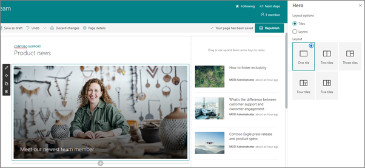
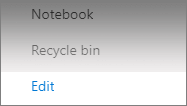

# Guided walkthrough: Creating a Team site

In this article, we show you elements of an example Team site to inspire you, and help you learn how to create similar sites for your own organization.

Use a team site when you want to collaborate with other members of your team or with others on a specific project. With a team site, typically all or most members can contribute content to the site and the information is limited to only the members of the team or project and specific stakeholders. Additionally, team sites are connected to [groups](https://support.microsoft.com/office/learn-about-microsoft-365-groups-b565caa1-5c40-40ef-9915-60fdb2d97fa2) and a [Teams channel](https://support.microsoft.com/office/video-what-is-microsoft-teams-422bf3aa-9ae8-46f1-83a2-e65720e1a34d). This makes it easy for your team to have group permissions, as well as a Teams space to chat, meet, and share files.

First, if you haven't already created a Team site, check out [Create a team site in SharePoint](https://support.microsoft.com/office/create-a-team-site-in-sharepoint-ef10c1e7-15f3-42a3-98aa-b5972711777d).

If you need to learn how to edit and publish the page on your site, check out the section [Manage sections and web parts] <!-- daisy bookmark--> in this article.

Once you have created your site and know how to edit pages, you can use the guidance below to add the elements shown.

## Example Team site

1. **Team highlights and news** Get visual while sharing information. <!--learn how-->
2. **Quick launch** Add links to more content around the site.
3. **Inform the team** Offer links, events and content related to team work.

4. **Share news about the team** Offer news items of interest to the team.

5. **Highlight important information** Increase visibility of key information with the Hero web part.

6. **Display project status** Use the Planner web part to show team progress on projects.

7. **Display recent activity** Automatically show the most recent updates to team site content.

## Manage sections and web parts

<!-- daisy check with team about what to do with this section-->

Sections make up your page, and are where you place one or more web parts. While editing the page, each section will show controls to edit the layout, move, or delete the sections.

Start editing by clicking **Edit** on the top right of the page.

The + symbol before or after a section will add a section using one of several layouts.

For information on working with sections, see [Add or remove sections and columns on a page](https://support.microsoft.com/office/add-sections-and-columns-on-a-sharepoint-modern-page-fc491eb4-f733-4825-8fe2-e1ed80bd0899).

To add web parts to sections, select the plus symbol  in a section, which may appear before or after a web part in a section. Then select a web part to use. For more information on all web parts, see [Using web parts on SharePoint pages](https://support.microsoft.com/office/using-web-parts-on-sharepoint-pages-336e8e92-3e2d-4298-ae01-d404bbe751e0).

Web parts may be edited, moved, or deleted within sections. The **Edit web part** icon opens detailed controls unique to each web part type.

<!-- daisy back to top-->

## Team highlights and news

The first section of this example page uses a two-column layout. In the first column is a Hero web part that uses a one-tile layout to link to information introducing a new team member. Above that is a Text web part with a title. In the second column is a News web part that uses a list layout. Above that is a Spacer web part to help align the two web parts.

Learn how to use the [Hero web part](https://support.microsoft.com/office/use-the-hero-web-part-d57f449b-19a0-4b0d-8ce3-be5866430645) and the [News web part](https://support.microsoft.com/office/use-the-hero-web-part-d57f449b-19a0-4b0d-8ce3-be5866430645).

## Quick launch

You can quickly and easily customize the organization and navigation of your SharePoint site. Edit the Quick launch menu by selecting **Edit** at the bottom of the menu.

<!-- daisy you stopped here-->

## Want more?

Get inspired with more examples in the [SharePoint look book](https://sharepointlookbook.azurewebsites.net/).

See other [guided walkthroughs](https://support.microsoft.com/office/guided-walkthroughs-creating-sites-for-your-organization-7cc52ac9-394e-417e-85fe-33070e0cd13c?ui=en-us&rs=en-us&ad=us) for creating sties for your organization.
