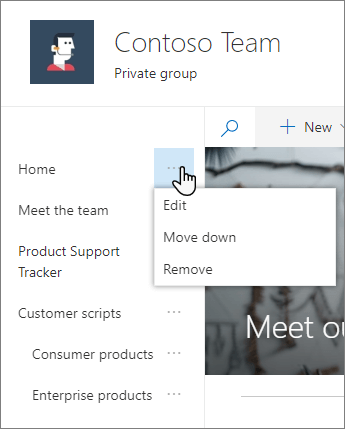
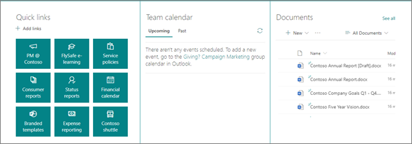
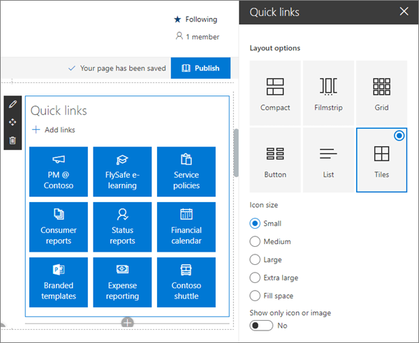
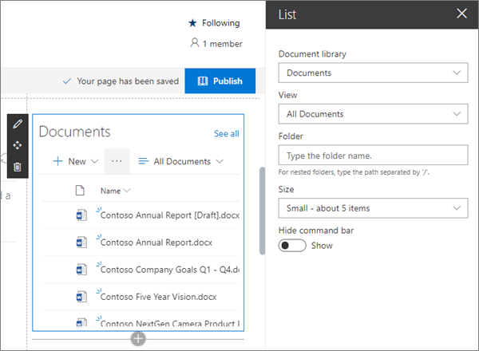
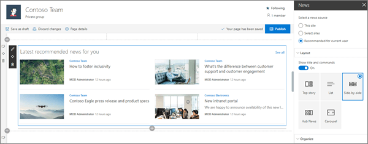
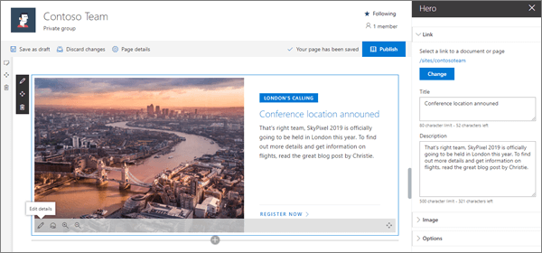
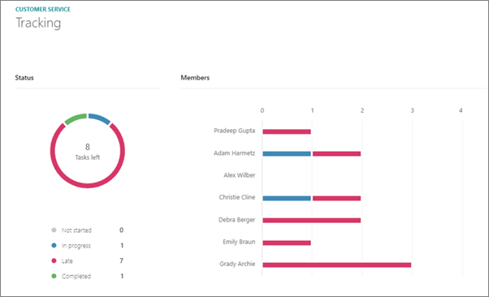
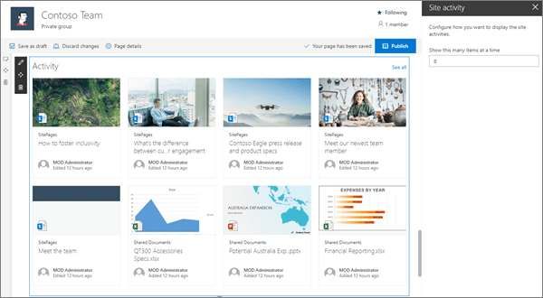

# Guided walkthrough: Creating a Team site

In this article, we show you elements of an example Team site to inspire you, and help you learn how to create similar sites for your own organization.

Use a team site when you want to collaborate with other members of your team or with others on a specific project. With a team site, typically all or most members can contribute content to the site and the information is limited to only the members of the team or project and specific stakeholders. Additionally, team sites are connected to [groups](https://support.microsoft.com/office/learn-about-microsoft-365-groups-b565caa1-5c40-40ef-9915-60fdb2d97fa2) and a [Teams channel](https://support.microsoft.com/office/video-what-is-microsoft-teams-422bf3aa-9ae8-46f1-83a2-e65720e1a34d). This makes it easy for your team to have group permissions, as well as a Teams space to chat, meet, and share files.

First, if you haven't already created a Team site, check out [Create a team site in SharePoint](https://support.microsoft.com/office/create-a-team-site-in-sharepoint-ef10c1e7-15f3-42a3-98aa-b5972711777d).

If you need to learn how to edit and publish the page on your site, check out the section [Manage sections and web parts](#manage-sections-and-web-parts) in this article.

Once you've created your site and know how to edit pages, you can use the guidance below to add the elements shown.

## Example Team site

1. **Team highlights and news** Get visual while sharing information. [Learn how](#team-highlights-and-news)
2. **Quick launch** Add links to more content around the site. [Learn how](#quick-launch)
3. **Inform the team** Offer links, events, and content related to team work. [Learn how](#inform-the-team)

4. **Share news about the team** Offer news items of interest to the team. [Learn how](#add-important-news-with-the-news-web-part)

5. **Highlight important information** Increase visibility of key information with the Hero web part. [Learn how](#highlight-important-information)

6. **Display project status** Use the Planner web part to show team progress on projects. [Learn how](#show-project-status)

7. **Display recent activity** Automatically show the most recent updates to team site content. [Learn how](#show-team-activity-with-the-site-activity-web-part)

## Manage sections and web parts

Sections make up your page, and are where you place one or more web parts. While editing the page, each section will show controls to edit the layout, move, or delete the sections.

Start editing by clicking **Edit** on the top right of the page.

The + symbol before or after a section will add a section using one of several layouts.

For information on working with sections, see [Add or remove sections and columns on a page](https://support.microsoft.com/office/add-sections-and-columns-on-a-sharepoint-modern-page-fc491eb4-f733-4825-8fe2-e1ed80bd0899).

To add web parts to sections, select the plus symbol  in a section, which may appear before or after a web part in a section. Then select a web part to use. For more information on all web parts, see [Using web parts on SharePoint pages](https://support.microsoft.com/office/using-web-parts-on-sharepoint-pages-336e8e92-3e2d-4298-ae01-d404bbe751e0).

Web parts may be edited, moved, or deleted within sections. The **Edit web part** icon opens detailed controls unique to each web part type.

[Back to top](#example-team-site)

## Team highlights and news

The first section of this example page uses a two-column layout. In the first column is a Hero web part that uses a one-tile layout to link to information introducing a new team member. Above that is a Text web part with a title. In the second column is a News web part that uses a list layout. Above that is a Spacer web part to help align the two web parts.

Learn how to use the [Hero web part](https://support.microsoft.com/office/use-the-hero-web-part-d57f449b-19a0-4b0d-8ce3-be5866430645) and the [News web part](https://support.microsoft.com/office/use-the-hero-web-part-d57f449b-19a0-4b0d-8ce3-be5866430645).

## Quick launch

You can quickly and easily customize the organization and navigation of your SharePoint site. Edit the Quick launch menu by selecting **Edit** at the bottom of the menu.

Select the **...** on the right side of each menu item to **Edit**, **Move**, or **Remove** an item.

While editing, your drafts can either be saved for later or discarded. When your page updates are ready, select **Publish** to make them visible to site viewers.

[Back to top](#example-team-site)

## Inform the team

The second section in this example is in a three-column layout and includes the Quick links web part,  the Group calendar web part, and the Document library web part.

### Quick links

The Quick links web part offers several easy-to-use menu formats for listing links to other pages or sites. In this Team site example, this web part uses the **Tiles** layout with small icons for quick and easy reference.

For more details on using the Quick links web part, see [Use the Quick links web part](https://support.microsoft.com/office/use-the-quick-links-web-part-e1df7561-209d-4362-96d4-469f85ab2a82).

### Group calendar

The Group calendar web part automatically shows meetings and appointments that are on your Office 365 group calendar. [Office 365 groups](https://support.microsoft.com/office/learn-about-microsoft-365-groups-b565caa1-5c40-40ef-9915-60fdb2d97fa2) and their associated calendars are created automatically when you create a team site.

For more information on the Group calendar web part, see [Use the Group calendar web part](https://support.microsoft.com/office/use-the-group-calendar-web-part-eaf3c04d-5699-48cb-8b5e-3caa887d51ce).

### List web part

Display site content including documents where the team can easily find it. You can use lists either as a document library or to track information.

For more details on using the List web part, see [Using the List web part](https://support.microsoft.com/office/use-the-list-web-part-ef0a1b80-f8b3-443d-b04a-1e76c70b5537).

[Back to top](#example-team-site)

## Add important news with the News web part

Team sites allow you to show news for the entire team or filter news tailored to the interests of specific users. In this example, the News web part uses **Recommended for current user** as the source and a **Side-by-side** layout in a one-column section with a background.

For more details on using the News web part, see [Use the News web part on a SharePoint page](https://support.microsoft.com/office/use-the-news-web-part-on-a-sharepoint-page-c2dcee50-f5d7-434b-8cb9-a7feefd9f165)

[Back to top](#example-team-site)

## Highlight important information

Let your team know what's most important with high-impact hero images, company branding, and important news. The Hero web part allows you to use large and eye-catching images to draw immediate attention to the most important information on your site. The layout used in this example is **Two tiles**.

### The power of tiles

Tiles can include images, topic headings, titles, descriptions, and a call to action link. Other adjustments include image scaling and setting the focus for the image zoom animation.

### Each tile can be edited

Use the **Move item** control on the left to rearrange the tiles within the Hero web part. Controls on the right allow you to **Edit details** to adjust the text and image, **Set focal point** for the hover animation, and **Zoom in** and **Zoom out** of the image.

In this example, the Hero web part is in a full-width section.

For more details on using the Hero web part, see [Use the Hero web part](https://support.microsoft.com/office/use-the-hero-web-part-d57f449b-19a0-4b0d-8ce3-be5866430645)

[Back to top](#example-team-site)

## Show project status

If you use [Microsoft Planner](https://support.office.com/planner) to manage your projects, and have a plan created, you can use the Planner web part to show status for that plan on your SharePoint site.

For more details on using the Planner web part, see [Use the planner web part](https://support.microsoft.com/office/use-the-planner-web-part-a1e4ada8-8817-4e57-8e65-1bf546808843)

[Back to top](#example-team-site)

## Show team activity with the Site activity web part

The activity web part has only one setting - how many items to show. Activity shown by the web part includes page updates and all documents stored on the team site.

In this example, the web part is in a one-column section.

For more details on using the Site activity web part, see [Use the site activity web part](https://support.microsoft.com/office/use-the-site-activity-web-part-1fa91401-ac36-42b6-beba-bb8469d6cbfa)

[Back to top](#example-team-site)

## Want more?

Get inspired with more examples in the [SharePoint look book](https://sharepointlookbook.azurewebsites.net/).

See other [guided walkthroughs](https://support.microsoft.com/office/guided-walkthroughs-creating-sites-for-your-organization-7cc52ac9-394e-417e-85fe-33070e0cd13c?ui=en-us&rs=en-us&ad=us) for creating sties for your organization.
