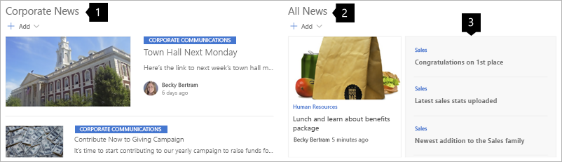
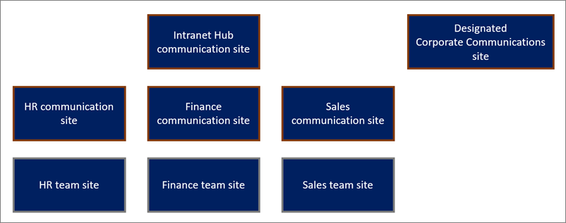
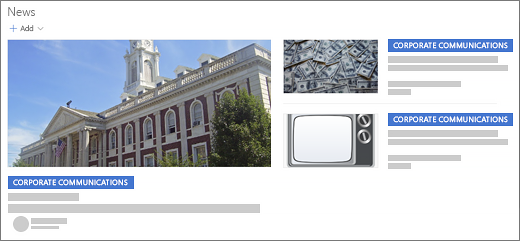
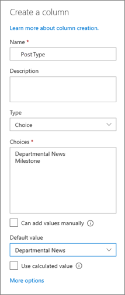
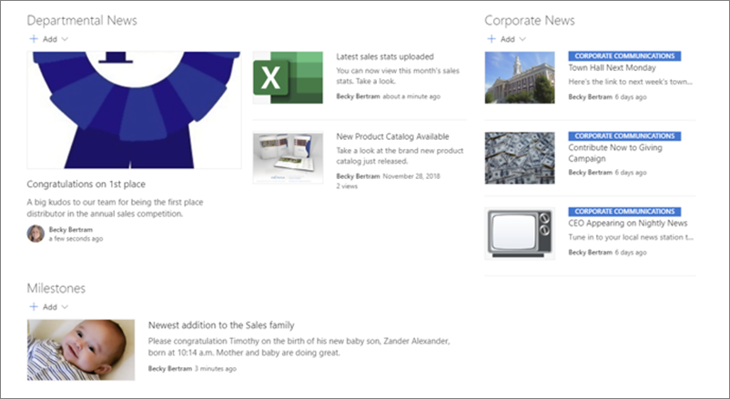
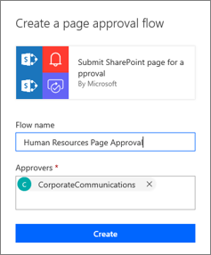
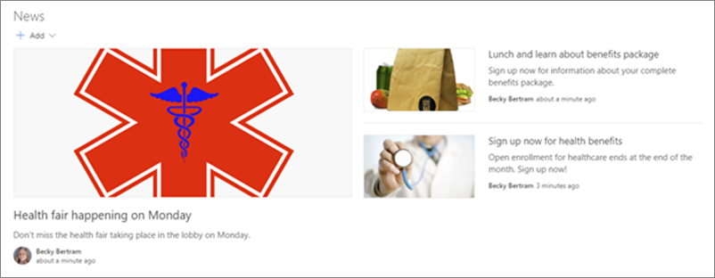
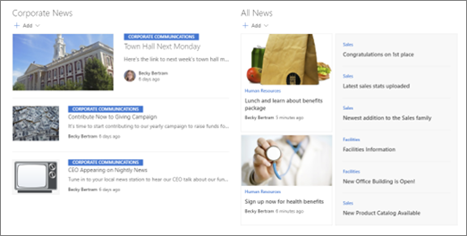

# Guided walkthrough: Setting up news for your organization using a hub site

With SharePoint, you can share news content across your organization in a meaningful and discoverable way. By default, SharePoint news is shown on the SharePoint start page, on team sites, communication sites, hub sites, and on the mobile app according to how relevant the news is for the user. For example, if an important news story is posted by someone in your close sphere of work or posted to a site where you're active, it will be shown to the user.

Organizations have many options as to the kind of news shown, where it's shown, who can author posts, and more.

In this article, we'll show you how to implement a comprehensive strategy for setting up news at all levels of your organization.

## The strategy

In this walkthrough, we'll do more than just set up News web parts on various sites. We'll show you a comprehensive strategy that includes setting up an "official" news site for news that is visually distinguished as organization news; setting up categories for different types of news; and even setting up an approval process for news posts. We'll display news on an intranet [hub site](https://support.microsoft.com/office/what-is-a-sharepoint-hub-site-fe26ae84-14b7-45b6-a6d1-948b3966427f) that comes from a corporate [communication site](https://support.microsoft.com/office/use-the-sharepoint-topic-showcase-and-blank-communication-site-templates-94a33429-e580-45c3-a090-5512a8070732), a department communication site, and a department [team site](https://support.microsoft.com/office/use-the-sharepoint-team-collaboration-site-template-75545757-36c3-46a7-beed-0aaa74f0401e).

The hub site homepage displays all approved news stories for any site associated with the hub. That means users see all news posts created in the Corporate News site, all news posts created in departmental communication sites, and news stories for just their department’s team site.

1. News from an official corporate communication site that's part of the hub site
2. News from a department communication site that's part of the hub site
3. News from a department team site that's part of the hub site

Content is displayed in the following way on the sites in the hub:

- Each departmental communication site displays news posts for just that department.
- Each departmental team site displays news posts created in that team site and posts created in the Corporate News site.

Here's how the news flow works:

- All employees have permission to [create news](https://support.microsoft.com/office/create-and-share-news-on-your-sharepoint-sites-495f8f1a-3bef-4045-b33a-55e5abe7aed7) on their team sites. Posts can be tagged as being a “milestone” or simply “departmental.”
- Each department has one or more employees assigned the task of creating news posts in their department’s communication site.
- All news stories created in departmental communication sites go through a [page approval flow](https://support.microsoft.com/office/approval-flow-for-modern-pages-a8b2e689-d4a1-4639-8028-333c0ece30d9) in which a designated person from the Corporate Communications department approves posts.
- Official news posts from the Corporate Communications department are created in a special site called Corporate News, which is not associated with the hub site. [This site is designated as “official” news](https://support.microsoft.com/office/create-and-share-news-on-your-sharepoint-sites-495f8f1a-3bef-4045-b33a-55e5abe7aed7#bmk_wherenewsisshown).
- On a monthly basis, a newsletter containing selected news stories from Corporate Communications is [emailed to all employees](https://support.microsoft.com/office/create-and-send-a-news-digest-42efc3c6-605f-4a9a-85d5-1f9ff46019bf).

## The hub site structure

All team and communication sites, except for the Corporate communication site, are associated with a single hub site.

Each department has a communication site to share information with the rest of the organization, and a [team site](https://support.microsoft.com/office/use-the-sharepoint-team-collaboration-site-template-75545757-36c3-46a7-beed-0aaa74f0401e) for internal communication among department employees.

## Implementing the strategy

In this section, you'll walk through the process of setting up your SharePoint environment to meet the requirements of this news strategy. This process involves setting up the News web part and creating a Page approval process in a Pages library, creating categories for news, and designating one site as "official news."

In this example, the assumption is that each of the communication and team sites is already associated with a hub site (except for Corporate Communications) and there are already several news posts in the Corporate Communications site. If you need to know how to set up these types of sites, see [Set up your SharePoint hub site](https://support.microsoft.com/office/set-up-your-sharepoint-hub-site-e2daed64-658c-4462-aeaf-7d1a92eba098), [Create a communication site in SharePoint Online](https://support.microsoft.com/office/create-a-communication-site-in-sharepoint-7fb44b20-a72f-4d2c-9173-fc8f59ba50eb), and [Create a team site in SharePoint](https://support.microsoft.com/office/create-a-team-site-in-sharepoint-ef10c1e7-15f3-42a3-98aa-b5972711777d).

### Set up your corporate communications site for official organization news

Setting up your corporate communication site for "official" organization news allows news stories from Corporate Communications to appear with emphasis so your users know immediately that this is official company news, like in this example:

To enable this feature and specify the site for organization news, a SharePoint Administrator must use the [SharePoint Online PowerShell commands](/powershell/module/sharepoint-online):

[Get-SPOOrgNewsSite](/powershell/module/sharepoint-online/get-spoorgnewssite)

[Set-SPOOrgNewsSite](/powershell/module/sharepoint-online/set-spoorgnewssite)

### Set up news on a department team site

In your department team site, you'll add the News web part to the page three times. Each web part will display different news information based on news source and categories. To create the categories, add a column to the Pages library to [allow authors to tag their pages with the appropriate category](https://support.microsoft.com/office/view-edit-and-add-page-details-778018d3-8269-4fd2-a55d-8c0e5b72b938).

### Create columns for categories

1. On your department team site, select the **Pages** link in the site navigation to go to the pages library.
2. Select **+ Add column** or the **+** to the right ot the last column name at the top of the pages.

    

3. In the **Name** field, enter the name **Post Type**.
4. In the dropdown menu, choose **Choice** as the type of column.
5. Provide two choices: "Department News" and "Milestone."
6. Select **Save**.

Next, we'll add News web parts to the department team site home page to show department news, milestone news, and news from your organization's website.

### Add Department news

1. [Add a one-third right section](https://support.microsoft.com/office/add-sections-and-columns-on-a-sharepoint-modern-page-fc491eb4-f733-4825-8fe2-e1ed80bd0899) to the home page.
2. In the first column, add the **News** web part, and title it “Department News.”
3. Select **Edit**  in the web part toolbar.
4. Set the following options in the web part property pane:
    - **News source**: This site
    - **Show title and commands**: On
    - **Layout**: Top story
    - **Filter**: Page properties
    - **Property name**: Post type **Equals** Department News
5. Select **Apply** to save your changes.

### Add Milestone news

1. In the same column, beneath the web part you just added, add the **News** web part again, and title it “Milestones.”
2. Select **Edit**  in the web part toolbar.
3. Set the following options in the web part property pane:
    - **News source**: This site
    - **Show title and commands**: On
    - **Layout**: Side-by-side
    - **Filter**: Page properties
    - **Property name**: Post type **Equals** Milestones
4. Select **Apply** to save your changes.

### Add Corporate news

1. In the second (right) column, add the **News** web part again, and title it “Corporate news.”
2. Select **Edit**  in the web part toolbar.
3. Set the following options in the web part property pane:
    - **News source**: Choose **Select sites**, and then select your corporate news site.
    - **Show title and commands**: On
    - **Layout**: Side-by-side
    - **Filter**: Page properties
    - **Property name**: Post type **Equals** Milestones
4. Select **Apply** to save your changes.

To test what you've done so far, create several news posts in the department site. Set the page properties on your news story pages so that in some the Post Type is set to Department News, and in others, set the Post Type to Milestone. For a refresher on setting properties for pages, see [View, edit, and add page details](https://support.microsoft.com/office/view-edit-and-add-page-details-778018d3-8269-4fd2-a55d-8c0e5b72b938).

This is what the department homepage looks like after it's complete:

## Set up your department communication site

In this example, news posts created in the communication site must be approved. You can set up [page approval using Power Automate](https://support.microsoft.com/office/approval-flow-for-modern-pages-a8b2e689-d4a1-4639-8028-333c0ece30d9). Give the Flow a name that includes the site name such as “Human Resources Page Approval” and set the approver to an employee in the Corporate Communications department.

Next, set up the site home page to display news stories from this site.

1. On the home page of your department communication site, add a **News** web part.
2. Select **Edit**  in the web part toolbar.
3. Set the following options in the web part property pane:
    - **News source**: This site
    - **Layout** Top story
4. Create a news post you'd like to display on your home page. When you're done, submit the page for approval by selecting **Submit for approval** at the top right of the page.

The employee designated as an approver when you set up the Flow will receive an email that the page is waiting for approval. Once they approve the page, it will appear in the News web part on your department communication site.

Go ahead and create several news posts in this site. Ensure that each page is submitted for approval and then approved.

In this example, you can see the kind of news displayed on departmental communication site for the Human Resources department:

## Set up the Intranet hub site homepage

1. Add a [two-column section](https://support.microsoft.com/office/add-sections-and-columns-on-a-sharepoint-modern-page-fc491eb4-f733-4825-8fe2-e1ed80bd0899) to your hub site home page.
2. In the left column, add the **News** web part.
3. Select **Edit**  in the web part toolbar.
4. Set the following options in the web part property pane:
    - **News source**: Choose **Select sites**, and then choose **Corporate Communications site**.
    - **Layout**: Top story
5. In the right column, add the **News** web part again.
6. Set the following options in the web part property pane:
    - **News source**: All sites in the hub
    - **Layout**: Hub news

When you're done, you should see just the news posts from Corporate Communications on the left side of the page, and news posts from every site associated with the hub in the web part on the right.

## Developing your own news strategy

Now that you've seen how to put one specific strategy to work, you can think about your own strategy. Here are some questions to ask yourself, and your organization, to help you prepare:

- How is news currently communicated? How can you use the same people or processes that you already have in place when utilizing the new approach?
- What kind of news content do you want to share?
- Who will be authoring content?
- Does news need to be approved? If so, what should the approval process be?
- How is news currently communicated?

## Organization- and department-wide communications

In many organizations, there's already a formal means of communicating information to employees organization-wide. Additionally, in many cases, employees within a department communicate with one another in a less formal way. It’s important to think through these processes because, in some cases, you can continue to utilize the same people or processes within SharePoint.

When thinking about communication organization-wide, ask yourself the following kinds of questions:

- Does someone at your organization create and send newsletters?
- Are they emailed? If so, what's the current process for letting that person know which news needs to be included? How often are the newsletters sent out?
- What's the process for determining which news gets included and which doesn’t? Who makes that decision?
- What's the process for editing the content?
- What's the process for deciding which images get included in stories?

At the departmental level, ask yourself these kinds of questions:

- Is there someone whose job responsibility includes sharing information with the rest of the department?
- Do employees share information informally with each other using tools such as email or messaging one another?
- What content is being shared?

## Types of content and its relevance

The next step in building your news strategy is to evaluate the kind of news content being produced by your organization. Types of news stories might include:

- “In the news” stories that notify employees that your company or organization got public press, such as appearing in a trade publication or on a news program
- Company announcements or milestones, such as releasing a new product or starting a new initiative
- Employee milestones, such as when an employee gets married, has a child, or retires
- Information that requires employees to take action, such as signing up for benefits or attending training

As you think about this content, it’s important to think about relevance and importance for various groups within your organization. For example:

- Everyone in your organization needs to know when they can sign up for benefits. This is important and relevant for everyone.
- People in the Finance department need to know about new laws that relate to their accounting practices. This is relevant and important to them. However, it's not relevant or important for anyone else in the organization.
- The Sales department is having a cooking competition in the break room on Friday. This might be relevant to those in the Sales department, but it doesn’t qualify as important, and no one else in the organization would consider it relevant or important.

The purpose of thinking through your content is to make a note of which content needs to be surfaced in a more predominant way, a secondary way, or not at all. How you answer this question may depend on factors such as the size of your company. If you're a small company, you may decide that employee milestones should be displayed company-wide, while a larger company may only show this to employees in a particular department.

### Who's doing what

#### Who's authoring news content?

In some organizations, news content is created and managed by a central person or group of people, such as the Corporate Communications department. This centralized approach creates a simple approach to authoring and managing news content, ensuring that only important and relevant content is published for employees company-wide. However, this approach reduces the amount of news content typically generated because it requires the intensive time of one individual or one group of people. By opening up the publication process to others in your organization, you're empowering others to author news content. News content created by users in their own departments will be newer and more focused on their department activities, increasing the content’s relevance.

#### Who's approving news content?

Once you allow others to create news content, it’s possible that content will be created that doesn't fit your criteria for quality content. That may include content that has spelling and grammatical errors, uses inappropriate language, or is irrelevant. You may decide to implement an approval process to ensure that content meets the criteria necessary for publication.

#### How will users consume news using SharePoint?

Traditionally, intranet sites were built with the assumption that users would navigate to the intranet homepage and consume news there. In this scenario, important company news would be presented on the homepage, with an additional news feed of stories that were aggregated from departmental sites. This is a “pull” scenario, where “official” content (often important and relevant to all employees) is displayed and aggregated content is “pulled” from other departmental sites. In many cases, however, users don’t navigate to the intranet homepage anymore. Users may simply navigate directly to their departmental site homepage, since that site contains most of the information they find relevant. In some cases, organizations may choose to implement a “push” scenario, where official information is “pushed” down to their departmental site and is displayed alongside news stories that were created just in their department.

If your organization is using hub sites, you can aggregate news content at the hub level. If your organization has implemented multiple hubs, it’s important to think about how these hubs play into your overall news strategy. It’s common practice to create both an internal and external department site. The internal departmental site is typically a group-connected SharePoint team site. That site is only intended for members of that department. However, there's also a public SharePoint communication site, which is used to communicate information from that department outward to the whole organization.

Using this model, all users will see all news posts created in departmental communication sites, but users will only see news posts created in team sites to which they belong.

It’s also important to think about the other places where users might consume news content. Users can read news stories using the SharePoint app on their mobile device and on the SharePoint page in Office 365. Additionally, a site owner can create a newsletter of recent news stories, which can be sent to users. Also, users can post news stories from a group-connected SharePoint site to a Microsoft Teams channel.

## Want more?

Get inspired with more examples in the [SharePoint Look Book](https://adoption.microsoft.com/sharepoint-look-book).

See other [guided walkthroughs](https://support.microsoft.com/office/guided-walkthroughs-creating-sites-for-your-organization-7cc52ac9-394e-417e-85fe-33070e0cd13c?ui=en-us&rs=en-us&ad=us) for creating sites for your organization.

