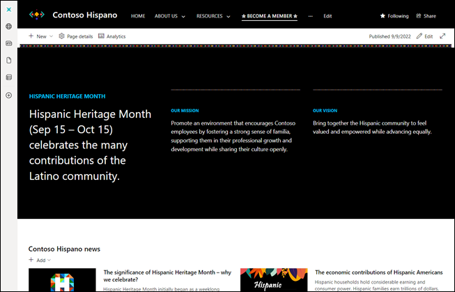
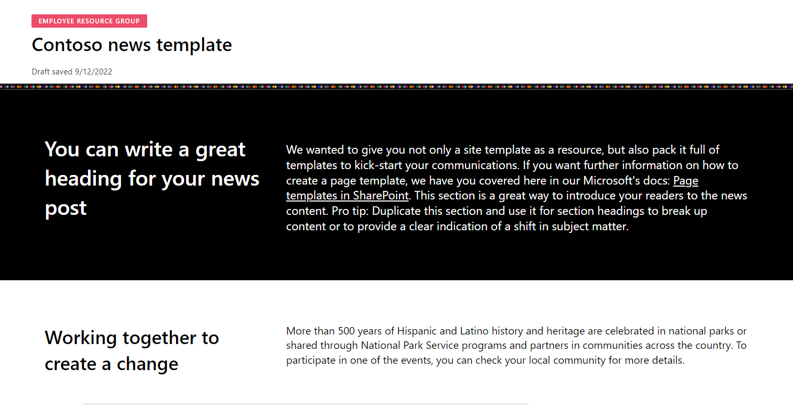
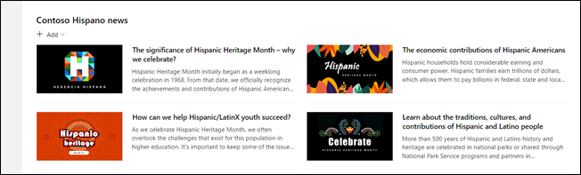

# Overview of the Hispanic Heritage Employee Resource Group site template

   

Use the Hispanic Heritage Employee Resource Group site template to quickly create a communication site from the [SharePoint Look Book](https://adoption.microsoft.com/sharepoint-look-book) to uplift employee resource groups, support the career growth of people in your organization, and to help advance equality and allyship for all. 

This template features content focused on a Hispanic and Latinx employee resource group but can be adapted to fit various other employee groups at your organization.  

**The Hispanic Heritage Employee Resource Group site features:** 

- **Home page with a unique theme:** The site’s landing page features Hispanic heritage branding, inclusive content, and example news posts and events. 
- **Page template:** Use the page template to create news posts and more pages for the site. 
- **Pre-populated content and web parts:** Includes inspirational and inclusive content to make customizing the site easier. 
- **Easy provisioning:** Provision the Hispanic Heritage Employee Resource Group site from the [SharePoint Look Book](https://adoption.microsoft.com/sharepoint-look-book) with just a few steps. 
- **Mobile ready:** The Employee Resource Group site can be easily accessed [on a mobile device when you get the SharePoint mobile app](https://www.microsoft.com/microsoft-365/sharepoint/mobile-app?wt.mc_id=AID686708_QSG_228389&ocid=AID686708_QSG_228389&rtc=1).

## How to get the Hispanic Heritage Employee Resource Group site: 

| Step 1: Provision | Step 2: Customize | Step 3: Share | 
| :------------------: | :------------------: |:---------------:| 
| Navigate to the [custom PnP site templates](/sharepoint/dev/solution-guidance/applying-pnp-templates) and select the template you need | Follow guidance on this page to customize the site | Share the site with the rest of your organization | 

## Step 1: Provision the site  

1. Go to the Hispanic Heritage Employee Resource Group template page. 
2. Select **Add to your tenant**. If you aren't signed into to your tenant, the SharePoint Look Book asks for your site collection admin credentials. 
3. From the permissions requested dialog box, select **Consent on behalf of your organization** and then select **Accept.** 

   >[!NOTE] 
   > The provisioning service requires these permissions to provision the site template. There is no overall impact on your tenant, and these permissions are used for the solution installation. You must accept these permissions to proceed with the installation. 

4. Complete the fields on the provisioning information page as appropriate for your installation. At a minimum, enter the email address where you wish to get notifications about the provisioning process and the URL prefix for your site to be provisioned to. 
5. Select **Provision** when ready to install the site into your tenant environment.  
   - The provisioning process takes up to 20 minutes. 
   - You'll be notified via email (to the notification email address you entered on the Provisioning page) when the site is ready for access. 

### Next, add owners to the site 

As the site collection admin, you may not be the person customizing the site, so you need to assign a few site owners. Owners have administrative privileges on the site so they can modify site pages, content, and branding. 

1. Select **Share** in the right-hand corner of the site. 
2. Add users, Microsoft 365 Groups, or security groups to give them access to the site. 
3. Assign users as a Site owner to allow permission to customize the site. 
4. Include the site URL in the Share message, and then select **Share.** 

## Step 2: Customize the site 

After the site has been provisioned and site owners have been added, it's time to customize the site to make it your own. Customize the site’s look, navigation, and content like news posts and events. 

#### Start by signing into Microsoft 365 and navigating to the site

1. Open your web browser and navigate to [office.com](https://www.office.com/) or your organization’s sign-in location. 
2. Sign in with your username and password. 
3. Navigate to the site's location using the URL supplied by your site collection admin, or select SharePoint from the Microsoft 365 home page, and then select the site. 

#### Next, explore prepopulated content: 

   

- **Home page –** The landing page features a unique theme, colorful images, and more inspirational content that is relevant and engaging. Content here's inspired by Hispanic and Latinx employee resource groups but can be adapted to other types of groups. Customize the Text, News, Events, and Quick Links web parts to make this site your own. 
- **Page template –** A page template with a unique theme can be found in the site’s contents to help create news posts and pages for the site more quickly.  
- **News web part –** Prepopulated news posts were created using the page template. 
- **Events web part –** Prepopulated events from different employee resource groups highlight more opportunities to learn and practice allyship. 

#### Then, customize the site

1. **Add your organization’s logo and review more site design details:** Edit the look of your SharePoint sites to align with your organization's brand. Customize the site display name, logo, header layout, navigation style, and more in the [Change the look panel](https://support.microsoft.com/office/customize-your-sharepoint-site-320b43e5-b047-4fda-8381-f61e8ac7f59b).

2. **Customize the site’s navigation:** Edit site navigation to include links to other relevant resources. [Learn how to edit site navigation](https://support.microsoft.com/office/customize-the-navigation-on-your-sharepoint-site-3cd61ae7-a9ed-4e1e-bf6d-4655f0bf25ca). Start by selecting **Edit** next to the navigation panel to start editing labels and links.  

3. **Edit web part content:** Select **Edit** in the right-hand corner to begin customizing web parts and content. Select the **Edit** (pencil icon) next to each web part to customize the layout and to edit content. 

   

   - [Text web part](https://support.microsoft.com/office/add-text-tables-and-images-to-your-page-with-the-text-web-part-729c0aa1-bc0d-41e3-9cde-c60533f2c801) – Replace prepopulated content with your own. 

   - [News web part](https://support.microsoft.com/office/use-the-news-web-part-on-a-sharepoint-page-c2dcee50-f5d7-434b-8cb9-a7feefd9f165) - Use the Page template that can be found in **Settings > Site content > Pages > Templates** to create branded news posts that populate the News web part. Delete the prepopulated news posts before sharing the site with others. 

   - [Events web part](https://support.microsoft.com/office/use-the-events-web-part-5fe4da93-5fa9-4695-b1ee-b0ae4c981909) - Edit events in the Events web part to include events from your organization's employee resource groups. Delete the prepopulated events before sharing with others. 

   - [Quick Links web part](https://support.microsoft.com/office/use-the-quick-links-web-part-e1df7561-209d-4362-96d4-469f85ab2a82) – Edit links to connect to more resources and employee resource groups sites. 

## Step 3: Share the site 

Once you are done customizing and proof-reading the site, you're ready to share it with others. [Run a health check](https://support.microsoft.com/office/use-the-sharepoint-site-performance-page-38a1f782-2e73-4ec8-b55e-827611bc3632) before sharing and consider using the [Portal launch scheduler tool](/microsoft-365/enterprise/portallaunchscheduler) if you expect a high amount of site traffic (10k individual visits per day or higher) to ensure a high-quality viewing experience.  

1. Select **Share** from the right-hand corner. 
2. In the Share site pane, enter the names of people to add to the site. The permission level is read only. 
3. Enter an optional message to send to the person or clear the Send email box if you don't want to send an email. 
4. Select **Share.**

### More resources 

[Add a page to a communication site](https://support.microsoft.com/office/create-and-use-modern-pages-on-a-sharepoint-site-b3d46deb-27a6-4b1e-87b8-df851e503dec#bkmk_addpage)

[Using web parts on SharePoint pages](https://support.microsoft.com/office/using-web-parts-on-sharepoint-pages-336e8e92-3e2d-4298-ae01-d404bbe751e0) 

[Customize your SharePoint site](https://support.microsoft.com/office/customize-your-sharepoint-site-320b43e5-b047-4fda-8381-f61e8ac7f59b) 

