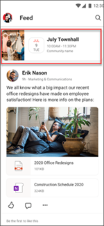

# Hold a town hall in Yammer and keep the conversation going

Bring your organization together to communicate the overall state of the business, status of large-scale projects, success stories, and growth opportunities. Create an end-to-end live event experience in Yammer that engages audiences before, during, and after the event.

Organizations often call their large-scale events for employees a town hall. Sometimes organizations refer to a town hall as an all-hands meeting or all-company meeting. In this example, we'll be referring to this type of meeting as an organization town hall, but the steps and guidance can be used the same way for similar meetings and live events in Yammer.

Get started preparing and implementing a town hall that is on demand, secure, accessible to all audiences, and allows you to keep the conversation going after the live event.

**Town halls can help bring your organization together by:**

- Sharing information in a meaningful and engaging format
- Building trust and connections across an organization
- Broadcasting to large groups of people at one time
- Keeping the conversation going in channels related to the town hall
- Using live event analytics to understand event reach and engagement
- Connecting teams in hybrid work environments

|Phase                  | Tasks          |
| :-------------------: |:----------------|
| **Plan**  | - Define audience profile and scope audience size    - Align with stakeholders and define messaging   - Consider multi-geo and multi-lingual options   - Review Microsoft 365 tools to help produce and host the live event   - Plan and organize pre and post-event communication and promotion strategies |
| **Promote**   | - Identify channels where the town hall can be promoted   - Use multiple channels to reach different audiences   - Consider where the event recording will be stored and so it can be accessed by everyone  |
| **Produce** | - Identify and assign roles and tasks   - Review the set-up checklist   - Prepare to moderate live questions and answers  |
| **Host**  | - Host the live event and manage engagement in the Yammer feed   - Make the recording sharable for employees |
| **Share**  | - Share the recording to communication channels (Yammer, Outlook, Teams, and SharePoint news)   - View Attendee insights to measure engagement   |

## Plan a town hall

Since town halls reach broad and diverse audiences, you'll want to consider the needs and preferences of your audience and make sure content can be accessed before, during, and after the event.

**Planning considerations:**

- The town hall is a virtual live event and can be accessed by different people across different regions and time zones.
- Many people will attend using a mobile device.
- Some people won't attend the live event, but will want to watch the event recording later.
- Some people won't watch the full recording, but will want to see highlights of the most important information therefore after the town hall, a recording and highlights can be shared in the form of a SharePoint news post.
- Event Q&A can take place in a Yammer community, so people who couldn't attend can still benefit from the information shared.
- Promoting the town hall event will be most successful by diversifying the different channels that are currently being used by your audience.

### 1. Learn about your audience

Invest in learning what's most important to your audience. Knowing your audience will help you determine how to effectively deliver your message, what speakers will resonate with your audience, how to moderate the town hall, and how to  structure the town hall. [Learn more about how to scope and define your audience.](audience-profile.md)

### 2. Ensure content is accessible to everyone

Town halls are designed to reach the entire organization or large groups within it. Make sure the event's target audience has access to the tools they need to consume the content.

- Plan to record town hall events. When a live event is recorded, it will automatically be added to Microsoft Stream. Learn how to enable [autogenerate captions](/stream/portal-autogenerate-captions). The live event can also be saved to the Yammer home page.
- If your organization operates across multiple geographic regions, make sure the time zone the event takes place in allows for most people to attend live.
- Yammer supports live events and town halls in many languages across multiple platforms.
- Consider posting the event recording as a [Video news link in SharePoint](/viva/connections/video-news-links) so it automatically displays in the [Viva Connections Feed](/viva/connections/viva-connections-overview#viva-connections-feed) in Microsoft Teams. 

### 3. Define the town hall message

Craft a message that's well organized, detailed, and to the point. To engage your audience and make sure the messages in the town hall are understood by everyone:

- Make the presentation visual to create the most engagement. Use PowerPoint to create a visual display of your message to keep your audience connected. Organizations have the option of [broadcasting a live event in Yammer using Teams](https://support.microsoft.com/office/broadcast-a-live-event-in-classic-yammer-using-teams-333a5ea6-c73e-4717-8c53-7ea8f8de2724). Learn to [configure desktop sharing in Microsoft Teams](/microsoftteams/configure-desktop-sharing) to display your PowerPoint deck during your town hall. 
- Provide town hall objectives to attendees beforehand. Share these objectives via email or the event SharePoint site.
- Only share the most relevant information. Ensure the most important information is highlighted to reserve time and to keep your audience engaged.

### 4. Decide the live event speakers and structure

Invite speakers who align with the message of the town hall. If the intent of your event is to report on  quarterly earnings,  recruit people from the finance department who can speak to insights and answer questions.

- Develop the schedule and time limits for the town hall.
- Assign roles to moderators and brief them on key tasks. If you plan to use live Q&A during the event, prepare speakers with a list of known concerns or questions.
- Test equipment beforehand. Make sure each speaker and moderator knows how to use the tools used to conduct the town hall. This can range from how to share their screen, [managing live questions and answers](https://support.microsoft.com/office/new-yammer-live-event-faq-ec9deff2-3181-4300-a204-c809729e4dff),and [more engagement opportunities](https://support.microsoft.com/office/drive-engagement-in-a-classic-yammer-live-event-c0244ad8-6dcb-419c-add9-2e4a00543412?ui=en-us&rs=en-us&ad=us).

### 5. Use Yammer to host your town hall event

Yammer enables people to connect with each other across an entire organization. It helps unite people who don't often interact and gives them the ability to discover content and meet and engage with organization leaders. Get started with [organizing live events in Yammer](https://teamworktools.azurewebsites.net/yammer/How%20to%20host%20a%20live%20event%20in%20Yammer%20Playbook.pdf)

> [!NOTE]
> To host a live event in Yammer, your organization must have **Enforce Office 365 identity** selected, and you must be using Microsoft 365 connected Yammer groups. For more information, see [Enforce Office 365 identity for Yammer users](/yammer/configure-your-yammer-network/enforce-office-365-identity) and [Yammer and Microsoft 365 groups](/yammer/manage-yammer-groups/yammer-and-office-365-groups).

## Promote the town hall and manage engagement

Promote the town hall before the event date where your target audience usually gets announcements and updates. Then [manage engagement during the during the town hall](#host-a-town-hall-in-yammer) and [after the town hall.](#post-event-engagement)

#### Promote in Yammer

Drive pre-event awareness in Yammer. When holding a town hall in Yammer, audience engagement begins as soon as the event has been created. Attendees can promote and discover the upcoming event through the event banner (when in the live feed), event notifications, and by accessing the Event tab on mobile.

In the Yammer Home Feed, attendees can set up notifications that let them know when the event is live. An Event banner appears when the event is live, allowing them to attend the town hall immediately from anywhere.

#### Promote in SharePoint

Inform and prepare your audience for your event by creating a [SharePoint communications site](https://support.microsoft.com/office/plan-your-sharepoint-communication-site-35d9adfe-d5cc-462f-a63a-bae7f2529182)  using the [Events template](https://support.microsoft.com/office/use-the-sharepoint-event-planning-site-template-9464fe53-c85c-4e3b-94d9-0e70a45b08c6). Include instructions for attending and any other resources like pre-reads or news links.

#### Promote in Outlook

Invite all attendees to the event with a calendar invite via email in Outlook. Provide detailed information such as a link to the SharePoint event site, the Yammer meeting link, and the Yammer event page.

Include objectives or talking points in the invite. This will help attendees prepare questions to ask during the event. Yammer live events are also integrated with Outlook so that event organizers can add other event stakeholders who will help with the event's production.

#### Promote in Viva Connections

Viva Connections is an app in Microsoft Teams and is built on the existing capabilities of Microsoft 365. It allows organizations to customize employee experiences that centralize important information, tools, and resources on both desktop and mobile devices.

The Viva Connections home page features the Feed and Dashboard web parts that can be used to promote your event. Learn more about [Viva Connections](/microsoft-viva/connections). Use SharePoint news posts and [video news links](/viva/connections/video-news-links) to promote the event and to share the event recording after the event. Then, event content will display prominently in the [Viva Connections Feed](/viva/connections/viva-connections-overview#viva-connections-feed).

## Produce and host a town hall

Depending on the kind of event, live events can be run by one person, or as a team. Some of these roles may be played by the same person. A practice run with everyone for the live event will help make everyone feel confident and prepared during the event. Testing equipment, screensharing, and practicing the flow of multiple presenters or hand-offs is important to walk through prior to the event to 
ensure smooth transitions. A run through with the latest content, notes or demo environments is key to make sure everyone is on the same page.

|Role|Description|Role details
|---|---|---|---|
|**Producer**|To run a town hall successfully, you will need one or more producers. A producer can schedule, organize, and manipulate the screen while in the live event. This person is responsible for choosing the speakers and granting all attendees the proper permissions and licenses. In many cases, the producer is also a presenter or speaker.|- Schedule, Edit, or Cancel the event   -Organize the event   -Send out invitations to attendees   -Prepare Moderators and Speakers   -Grant all attendees the proper permissions and licenses   -Manipulate the screen while in the live event|
|**Moderator**|The producer will also need to include one or more moderators who are responsible for driving engagement in the Yammer event by  keeping track of questions and comments from audience members and by offering technical support when needed.|- Keep track of questions and comments from Audience members   -Offer Technical Support to Audience members in need   -Ensure all attendees are following rules of Conduct   -Add comments, questions, polls   -Respond to Posts as needed   - Organize Posts   -Highlight the best answers to questions in the chat   -Help speakers manage time|
|**Speaker**|Consider each speaker the main attraction. This is the person delivering the message. Your town hall can feature more than one speaker. This can include the leader of an organization, a department, or even a subject matter expert. Your town hall can have more than one speaker.|- Prepare presentations   - Prepare by testing audio and video quality before the presentation   - Configure the event streaming as needed   - Keep track of time|
|**Event attendee**|Each audience member attends town halls to gain insight or understanding of the talking point(s) of each speaker. Encourage audience engagement by taking advantage of the built-in Q&A and the open form conversation feature on Yammer.|- Attend the town hall   - Ask the moderator questions   - Engage in related conversation with other audience members|

### Host a town hall in Yammer

#### Step 1: Get set up in Yammer

Creating and producing live events in Yammer requires Microsoft Stream and/ or Teams licenses and specific permissions. Yammer administrators can schedule live meetings in Yammer.
For events using an external app or device, you will need to have your Microsoft Stream license enabled.

Learn more about [Permissions for scheduling, creating, and producing live events in Yammer](/yammer/manage-yammer-groups/yammer-live-events).

#### Step 2: Test Equipment

Determine whether your speakers will be broadcasting from a web cam or a studio-produced broadcast.  Make sure all equipment needed to connect video and audio is secured and in place.

Learn more about [producing a live event in Yammer using an external device](https://support.microsoft.com/office/schedule-and-produce-a-live-event-in-new-yammer-using-an-external-app-or-device-975f596a-8fc5-4400-8bf5-7ec77ec18415).

#### Step 3: Manage Engagement

Audience members and moderators can engage during the event using the conversation bar. Be sure to record the event so people who weren't able to attend live can watch later.

   

Yammer allows for a live Q&A during the event, as well as freeform conversation that promotes candid, organization-wide conversation. Learn more about [using Q&A in a Yammer community](https://support.microsoft.com/office/use-questions-and-answers-in-a-yammer-community-a4f1b722-d1bf-42be-a592-7288c7c0b895).

## Post-event engagement

After the event, plan to share the event recording in a shared location. Use SharePoint news posts and [video news links](/viva/connections/video-news-links) to share the event recording and display it prominently in the [Viva Connections Feed](/viva/connections/viva-connections-overview#viva-connections-feed). Then, review event analytics to learn more about the event reach and user behavior. 

### Share a recording of the live event

Members of your organization can watch the recording of the event stream after the event. Communities created in Yammer during the event can continue the conversation and watch the recording of the town hall on the Yammer platform. Moderators can also provide automatic recaps for those who may have missed the town hall.

Make your town hall and post-event engagement scalable by sharing your town hall recording across multiple platforms. Add it to your SharePoint site using the [Yammer web part](https://support.microsoft.com/office/use-a-yammer-web-part-in-sharepoint-online-a53cfa0c-3d09-42c8-a286-1038a81c59da) or the [News feed web part](/yammer/integrate-yammer-with-other-apps/yammer-and-newsfeed), add it to your news feed in [Viva Connections](/viva/connections/viva-connections-overview), or share it to a team channel in [Teams](/microsoftteams/best-practices-large-groups).

[Stream](/stream/portal-get-started) (on SharePoint) provides [Multi-Geo support](/microsoft-365/enterprise/administering-a-multi-geo-environment) for video storage and advanced sharing options. Increase your event recording's discoverability and shareability by adding it to your organization's Stream portal. Access additional video analytics including views over time and viewer engagement by saving your town hall recording to Stream.

### Measure attendee insights

Yammer features insights that show attendee location, department insights, sentiment analysis, and API sensibility. View insights to see how many people attended, average watch time, and more. Recognize trends by seeing how many conversations, comments, questions, answers, and reactions were generated through the event. Use this information to amplify the content people engaged with  most and to plan for your next town hall.

### Measure Community Engagement

Yammer's insights that allow creators of town halls to identify trends such as conversations, questions, top contributors, topics, hashtags, location, and department.

These insights provide information that allows you to measure community growth by tracking member creation, active members, member location, department and more. You can also see how community members engage by seeing how many comments, reactions, questions, answers, live events and more. Learn more about [viewing community insights in Yammer](https://support.microsoft.com/office/view-community-insights-in-yammer-48bc648e-b567-49d7-b2b5-5fea23777c46#:~:text=How%20to%20see%20community%20insights%20in%20Yammer.%20In,highlights%20two%20metrics%3A%20Active%20People%20and%20Posted%20Messages.).

## More Resources

[Use PowerShell to set up live events and policies](/microsoftteams/teams-live-events/set-teams-live-events-policies-using-powershell).

[Produce and organize a live event in Yammer](https://support.microsoft.com/office/organize-a-live-event-in-new-yammer-7338782a-4f0b-4fd0-a6c3-33625906ead1).

[Corporate communications overview](corporate-communications-overview.md)

[Yammer live event guide](https://aka.ms/LiveEventsinYammerplaybook)

