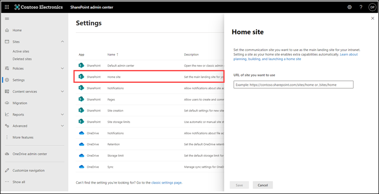
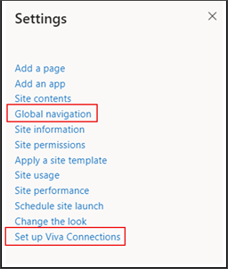

# Set up a home site from the SharePoint admin center (Preview)
  
Learn how to set up and manage a home site for your organization in the SharePoint admin center. If you have already set a home site for your organization, you can skip this step.

Learn more about [planning and building a home site](/sharepoint/SharePointOnline/home-site-plan.md) before assigning home site status to a site in the SharePoint admin center. 

### Step 1: Log into the SharePoint admin center 
Login with admin credentials into your SharePoint admin center. Typically, you can sign in using this URL https://(<)InsertYourTenantDomainName)-admin.sharepoint.com/ 

### Step 2: Go to the settings page in the admin center
Navigate to the Settings section in the SharePoint admin center.

### Step 3: Assign a home site for your organization
Next, select the **Home site** option from the list of apps. Then, paste the SharePoint URL of the communication site that you’d like to become the home site. Select **Save** when you are done.

### Step 4: Confirm the home site value is set 
In the Current value column, you’ll see the new home site URL you entered in the previous step.

> [!NOTE] 
> It may take up to 10 minutes for new home site URLs to take effect.

### Step 5: Enable the SharePoint app bar and set up global navigation
It may take up to 10 minutes for the newly assigned home site to reflect home site capabilities, like Global navigation creation and Viva Connections setup options from the Settings option on the home site.

Next, learn more about how to [enable and set up global navigation](/SharePoint/sharepoint-app-bar) in the SharePoint app bar.

### Resources

**Watch:** [Build and launch a SharePoint Home Site: Tips and Tricks From The Product Team](https://techcommunity.microsoft.com/t5/video-hub/build-and-launch-a-sharepoint-home-site-tips-and-tricks-from-the/m-p/1696758)
 

[Plan, build, and launch your home site](/sharepoint/home-site-plan)

[Creating and launching a healthy SharePoint portal](/sharepoint/portal-health)

Use and customize the [The Landing template](https://lookbook.microsoft.com/details/c9300e94-6e83-471a-b767-b7878689e97e) from the SharePoint look book 
