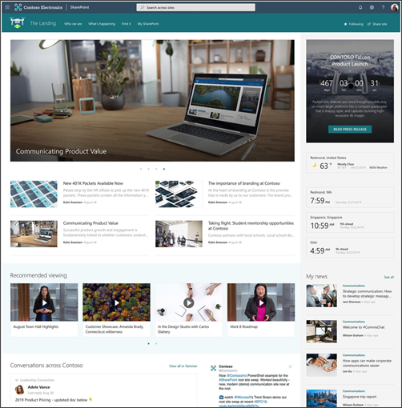

# Plan, build, and maintain a home site for your organization
  
A SharePoint home site provide a personalized landing experience that reflects the organization’s brand, voice, and priorities. A home site also serves as the gateway to other portals in your organization’s intranet. Your organization needs a home site not only to provide the best intranet experience for viewers but to also take advantage of features like SharePoint global navigation and the many ways to integrate your intranet with Microsoft Teams by using [Viva Connections](https://www.microsoft.com/microsoft-viva/?ef_id=5acddca3e3be1730e131bc646cab7344:G:s&OCID=AID2101053_SEM_5acddca3e3be1730e131bc646cab7344:G:s&msclkid=5acddca3e3be1730e131bc646cab7344).
 
 
If you’ve already created your home site and are ready to set it now, learn how to [transform your communication site into a home site](/sharepoint/home-site#:~:text=Set%20a%20site%20as%20your%20home%20site%201,365.%20...%203%20Run%20Set-SPOHomeSite%20-HomeSiteUrl%20%3CsiteUrl%3E.%20).

> [!NOTE]
> Today, home sites can only be created using [SharePoint PowerShell](/powershell/sharepoint/sharepoint-online/introduction-sharepoint-online-management-shell?view=sharepoint-ps). Admin credentials are required to use SharePoint PowerShell.

**Use a SharePoint home site to:**

- Provide a gateway to other high-traffic portals
- Connect people with an intranet-wide search experience
- Showcase targeted news and content
- Take advantage of the new people engagement tool, Viva Connections 

**Example of a home site:**
    

**Home site in the SharePoint mobile app:**
    

> [!NOTE]
> Integration between the home site and [SharePoint start page](https://support.office.com/article/6b85097a-87e0-4611-a29a-dfd49b1a1220) (where the branding, theming, header, navigation, and footer elements from the home site are applied to the start page and users can easily navigate between the pages) is not available at this time. Please watch for updates in the [Microsoft 365 roadmap](https://www.microsoft.com/microsoft-365/roadmap?filters=SharePoint).

## What is a SharePoint home site?

Home sites are SharePoint communication sites that have special capabilities such as the ability to prioritize news posted from the home site across the rest of the intranet. Review key differences between standard SharePoint communication sites and home sites:

| Feature                  | Communication site                 | Home site          |
| :------------------- | :------------------: |:---------------:|
| Engage and inform broad audiences  | X | X |
| Customizable branding opportunities                 | X                | X            |
| Can be turned into a hub site                | X                  | X             |
| Automatically marked as the official source of organizational news                 |                   | X              |
| Priority access in the mobile app home button                |                   | X              |
| Option to enable and customize global navogation in the SharePoint app bar                 |                   | X              |
| Option to set up Viva Connections              |                    | X              |

### Home site super powers explained

Home sites are unlike any other site in SharePoint. When you transform a SharePoint communication site into a home site, you’ll automatically apply special capabilities that make the home site an ideal landing destination for your intelligent intranet.

#### Search for content across the entire intranet
Home sites allow users to search for content (such as sites, news, and files) across the entire intranet rather than searching just the site like typical SharePoint sites.

#### Official source of organizational news  
By default, a home site is set as the organizational news source. News post that are created from the home site automatically become official organizational news and will take priority on the [SharePoint start page](https://support.microsoft.com/office/discover-content-with-the-sharepoint-start-page-6b85097a-87e0-4611-a29a-dfd49b1a1220) and in the home section of the SharePoint mobile app. Administrators can [set sites as official organizations news sources in the admin center](/sharepoint/organization-news-site).

#### Enable and customize global navigation in the SharePoint app bar
The SharePoint app bar features a global navigation option that displays intranet navigational nodes and resources no matter where users are in SharePoint. To take full advantage of this feature, you must have a home site. Learn more about how to [enable and customize global navigation in the SharePoint app bar](/SharePoint/sharepoint-app-bar). 

#### Use Viva Connections to integrate your intranet into Microsoft teams
Viva connections was designed to drive engagement, build community, and enable your organization to stay connected. To take advantage if this solution, you’ll need a home site. Then, you can integrate the home site into Microsoft Teams. [Learn more about Viva connections](/SharePoint/viva-connections).

### Before getting started

Before you get started planning and building your home site, review best practices and considerations. 

#### Best practices for creating home sites:
-	Since home sites will be used by the entire organization, the site needs to be [inclusive and easily accessible on all devices](https://support.microsoft.com/topic/get-ready-build-an-accessible-sharepoint-site-3a1df3ad-f093-450c-85a6-b3bf70fd6abb)
-	For the same reason above, [consider other languages that might be needed](https://support.microsoft.com/office/create-multilingual-communication-sites-pages-and-news-2bb7d610-5453-41c6-a0e8-6f40b3ed750c)
- Since the home site will be viewed by high volumn of users, ensure you are [managing site performance](/sharepoint/portal-health) through the planning and building phases
-	Links in the home site navigation can direct users to content on the home site and global navigation can be used to lead users to universally used resources and portals
-	After creating your home site, [replace the site with the current root site](/sharepoint/modern-root-site#replace-your-root-site)
-	Make sure the home site is discoverable by [adding an entry point to the Microsoft 365 app launcher](/microsoft-365/admin/manage/customize-the-app-launcher?view=o365-worldwide) and a [featured link on the SharePoint start page](/sharepoint/change-links-list-on-sharepoint-home-page)
-	[News published from the home site](https://support.microsoft.com/office/create-and-share-news-on-your-sharepoint-sites-495f8f1a-3bef-4045-b33a-55e5abe7aed7) should be relevant to the entire organization

#### Considerations:
-	Align the branding on the home site to the overall intranet brand 
-	For organizations with many portals and resources, consider [making your home site a hub site](/sharepoint/planning-hub-sites) to expand navigational options and easily sync permissions and branding across many sites
-	Use a home site template from the SharePoint look book called [The Landing](https://lookbook.microsoft.com/details/c9300e94-6e83-471a-b767-b7878689e97e) to jump start the design process

## Summary of how to get a home site for your organization

Since home sites are the gateway to your intranet, you’ll want to prioritize content and resources that are relevant to most employees. Work with business owners and stakeholders to organize and align the flow of information and the navigational design. Then, use [SharePoint PowerShell](/powershell/sharepoint/sharepoint-online/introduction-sharepoint-online-management-shell?view=sharepoint-ps) to create a home site and use the [Page diagnostics for SharePoint tool](/microsoft-365/Enterprise/page-diagnostics-for-spo?view=o365-worldwide) to ensure to best viewing experience. Finally, use the [Portal launch scheduler](/microsoft-365/enterprise/portallaunchscheduler?view=o365-worldwide) to plan the launch of your new site and make the site discoverable by adding links to key entry-points in the Microsoft 365 experience.
 
 
Before you get started planning your home site, [hear from the Microsoft product team on how to think](https://techcommunity.microsoft.com/t5/video-hub/build-and-launch-a-sharepoint-home-site-tips-and-tricks-from-the/m-p/1696758) about and approach the design of your organization’s home site. 

| Plan                  | Build                | Manage          |
| :------------------- | :------------------- |:----------------|
| -	Align objectives with partners and business owners   - Organize priority content and resources   - Design wayfinding for the home site and global navigation   - Think about branding   - Use audience targeting on navigational links, news, and web parts| -	Upload and organize site assets and content like logos and files   - Customize the site to align with the rest of the intranet   - Apply audience targeting   - Turn on a content approval flow   - Use PowerShell to turn the communication site into a home site   - Replace the home site with the root site   - Measure site health and performance   - Test on all devices| -	Share the site with your organization   - Use the Portal launch scheduler to manage the launch   - Make the home site discoverable   - Announce the launch of the home site in an all-hands meeting and in communication channels   - Monitor usage and page analytics |

## Plan your home site
A great home site starts with a plan. Since the home site is essentially the gateway to the intranet, you will want to collaborate with other business owners such as human resources, leadership teams, and even your legal team to ensure the most important and universal resources are accessible for everyone in the organization. 

|  Icon                 | Action        | Get started          |
| :------------------: | :------------------: |:----------------|
|     | **Get organized** | Start by aligning objectives with stakeholders and organizing priority content and resources. Consider details specific to your organization like if the home page will need to be available in more than one language. Use modern SharePoint sites for the home site. Learn more about how [modern SharePoint sites](https://support.microsoft.com/office/sharepoint-classic-and-modern-experiences-5725c103-505d-4a6e-9350-300d3ec7d73f) and how to [create a multi-lingual site and pages](https://support.microsoft.com/office/create-multilingual-communication-sites-pages-and-news-2bb7d610-5453-41c6-a0e8-6f40b3ed750c). |
|                  | **Plan navigation**                 | Then, organize the navigational structure for the home site itself and global navigation. Consider making the home site a hub site if you need to add an extra layer of navigation and make it easier to sync associated site permissions and branding. Learn more about [planning site navigation](/sharepoint/plan-implement-navigation-design) and how to [make your home site a hub site](/sharepoint/planning-hub-sites). Then, review guidance on how to [set up global navigation on the home site](/SharePoint/sharepoint-app-bar).|
|                 | **Personalize content**                 | Next, think about the difference audiences that your organization serves. Consider how elements on your home site like navigational links and certain web parts could benefit from audience targeting to specific audiences.Learn more about [audience targeting](https://support.microsoft.com/office/change-the-look-of-your-sharepoint-site-06bbadc3-6b04-4a60-9d14-894f6a170818?ui=en-us&rs=en-us&ad=us). |
|                    | **Gather branding assets**                   | Finally, start gathering assets needed to apply custom branding and other details to your home site, like logo files, color themes, and any custom solutions. Learn more about how to [change the look of your site](https://support.microsoft.com/office/change-the-look-of-your-sharepoint-site-06bbadc3-6b04-4a60-9d14-894f6a170818?ui=en-us&rs=en-us&ad=us). |
|                    | **Consider site performance**                   | Even before you build your site, understand the main elements that will make sure your home site is healthy. A healthy home site is one that optimizes performance to ensure the best possible viewing experience. Use the Page diagnostics for SharePoint tool to make sure the home page is healthy before sharing with end-users.Learn more about [healthy portals](/sharepoint/portal-health) and using the [Page diagnostics tool for SharePoint](/microsoft-365/enterprise/page-diagnostics-for-spo?view=o365-worldwide). |

## Build your home site
Once you’ve got a plan, you are ready to start creating the home site in SharePoint. Start with a communication site, and after you’ve got the general layout finalized, use SharePoint PowerShell to transform it into a home site. 

|  Icon                 | Action        | Get started          |
| :------------------: | :------------------: |:----------------|
|     | **Create a modern communication site** | Start by creating a SharePoint communication site and build out the site by using sections, web parts, and pages. Consider using a mega menu and footer to enhance wayfinding. Web parts that are particularly useful for a home site include: News web part, My feed web part, Yammer web parts, Quick link web part, and the Highlighted content web part.Learn how to [create a communication site](https://support.microsoft.com/office/create-a-communication-site-in-sharepoint-7fb44b20-a72f-4d2c-9173-fc8f59ba50eb#:~:text=Steps%20to%20create%20a%20communication%20site%201%20Sign,news%2C%20events%2C%20and%20other%20content.%20...%20See%20More.), use [modern web parts](https://support.microsoft.com/office/using-web-parts-on-sharepoint-pages-336e8e92-3e2d-4298-ae01-d404bbe751e0), and [customize your site](https://support.microsoft.com/office/customize-your-sharepoint-site-320b43e5-b047-4fda-8381-f61e8ac7f59b#:~:text=Customize%20your%20SharePoint%20site.%201%20Change%20the%20logo.,navigation.%205%20Add%20a%20site%20footer.%20See%20More.). |
|    | **Apply audience targeting**| Next, turn on audience targeting on for the home site. By enabling audience targeting, specific content will be prioritized to specific audiences in navigational links, news, and certain web parts. Learn more about [how audience targeting works](https://support.microsoft.com/office/target-content-to-a-specific-audience-on-a-sharepoint-site-68113d1b-be99-4d4c-a61c-73b087f48a81) and [how to apply it](https://support.microsoft.com/office/target-navigation-news-and-files-to-specific-audiences-33d84cb6-14ed-4e53-a426-74c38ea32293) to navigational links, news, and web parts.|
|    | **Set up a page approval flow** | Then, make sure the home site is set up for regular content updates. Turn on content approval to ensure only high-quality content is published on the home site. Learn how to [turn on a page approval flow](https://support.microsoft.com/office/approval-flow-for-modern-pages-a8b2e689-d4a1-4639-8028-333c0ece30d9?ui=en-us&rs=en-us&ad=us).|
|    | **Create the home site** | Next, transform a SharePoint communication site into a home site, you must use SharePoint PowerShell and your communication site needs to be modern.Make sure you are using the [latest version of PowerShell](https://www.microsoft.com/download/details.aspx?id=35588) and then [use PowerShell to create the home site](/sharepoint/home-site#set-a-site-as-your-home-site).|
|    | **Set up global navigation** | Then, enable global navigation to allow users to easily navigate to important intranet resources anywhere in SharePoint. Global navigation can only be customized from the home site’s home page.Learn how to [enable and customize global navigation](/SharePoint/sharepoint-app-bar).|
|    | **Replace the home site with the root site**  | Next, swap the root site with the new home site. The root site for your organization is one of the sites that's provisioned automatically when you purchase and set up a Microsoft 365 plan. Swap the home site with the root site to ensure home site superpowers are fully active. Learn how to [make the root site the home site](/sharepoint/modern-root-site#replace-your-root-site).|
|    | **Test site health and the viewing experience**  | Finally, review portal launch guidance and understand the main elements that will make sure your home site is healthy. A healthy home site is one that optimizes performance to ensure the best possible viewing experience. Use the Page diagnostics for SharePoint tool to make sure the home page is healthy before sharing with end-users. Learn more about [healthy portals](/sharepoint/portal-health) and using the [Page diagnostics tool for SharePoint](/microsoft-365/enterprise/page-diagnostics-for-spo?view=o365-worldwide).|

## Launch your home site
Once you’ve got your home site created it’s time to plan the launch and make sure the rest of the organization can find and use the home site.

|  Icon                 | Action        | Get started          |
| :------------------: | :------------------: |:----------------|
|     | **Share the site and schedule the portal launch** | Start by ensuring your home site is healthy, and then its time to share the site with the rest of the organization and schedule the launch. Use the Portal launch scheduler tool to gradually roll out the home site to batches of end-users. Using a phased approach is ideal to manage any performance issues that may arise and to ensure a positive viewing experience. Learn mow about how to use the [Portal launch scheduler tool](/microsoft-365/enterprise/portallaunchscheduler?view=o365-21vianet&branch=hokavian-portal-launche-update). |
|    | **Improve discoverability**| Next, make sure people in your organization can easily find the home site through a few different entry points in the Microsoft 365 experience. Add a link to the home site in the Microsoft app launcher (sometimes called the waffle) and on the SharePoint start page. Learn more about how to [add a custom tile to the app launcher](/microsoft-365/admin/manage/customize-the-app-launcher?view=o365-worldwide) and how to [add a featured link to the SharePoint start page](/sharepoint/change-links-list-on-sharepoint-home-page).|
|    | **Engage your audience** | Then, let your organization know about the new home site resource, and other new elements like global navigation. Consider multiple communication options like a SharePoint news post that can also be shared in email and in Microsoft teams. Learn more about how to [create and post SharePoint news](https://support.microsoft.com/office/create-and-share-news-on-your-sharepoint-sites-495f8f1a-3bef-4045-b33a-55e5abe7aed7) and [share it in an email](https://support.microsoft.com/office/use-the-news-web-part-on-a-sharepoint-page-c2dcee50-f5d7-434b-8cb9-a7feefd9f165#bkmk_send).|
|    | **Manage and maintain your home site** | Finally, once the site is healthy, launched, and being used by the organization, monitor site usage and maintain the site. Site maintenance should include making sure site content is relevant, there aren’t any broken links, and that the site stays healthy and performant. Learn how to [view usage data and analytics](https://support.microsoft.com/office/view-usage-data-for-your-sharepoint-site-2fa8ddc2-c4b3-4268-8d26-a772dc55779e) for your site and how to [maintain your site over time](https://support.microsoft.com/office/manage-your-sharepoint-communication-site-21761aac-f7f7-4499-b0ca-cf283477c32f).|
|    | **Integrate the home site into Microsoft Teams using Viva Connections** | Expand the reach of the home site and help meet users where they are already working by making it easy to access sand share content all in one place. After you have a home site and the global navigation enabled and customized in the SharePoint app bar, you’ve met the requirements to [integrate the home site into Microsoft Teams](/SharePoint/viva-connections) using Viva Connections.Learn more about the [Viva Connections end-user experience](https://support.microsoft.com/office/your-intranet-is-now-in-microsoft-teams-8b4e7f76-f305-49a9-b6d2-09378476f95b?ui=en-US&rs=en-US&ad=US).|

## Home site FAQs

## Resources

Watch: [Build and launch a SharePoint Home Site: Tips and Tricks From The Product Team](https://techcommunity.microsoft.com/t5/video-hub/build-and-launch-a-sharepoint-home-site-tips-and-tricks-from-the/m-p/1696758)
[Use PowerShell to create a home site for your organization](/sharepoint/home-site)
[Planning your SharePoint hub sites](/sharepoint/planning-hub-sites)
[Creating and launching a healthy SharePoint portal](/sharepoint/portal-health)
