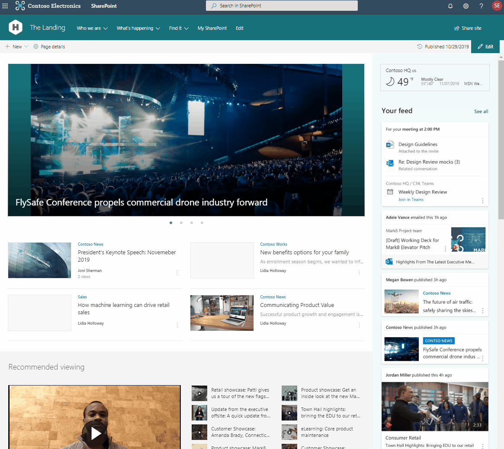

# Create a home site
  
A home site is a [communication site](https://support.office.com/article/94A33429-E580-45C3-A090-5512A8070732
) that's designed to be the landing page for your intranet portal. It brings together news, events, embedded video and conversations, and other resources to deliver an engaging experience that reflects your voice, priorities, and brand. 

> [!NOTE]
> Some functionality is introduced gradually to organizations that have opted in to the [Targeted release option in Office 365](/office365/admin/manage/release-options-in-office-365). This means that you may not yet see this feature or it may look different than what is described in this article. 

When you set a site as your home site:

- A link to the SharePoint start page will appear at the top of it.

    

- Users can easily navigate to the site from the SharePoint mobile app

    

- Search for the site is scoped to all sites within the organization.
- The site is automatically set up as an [organization news site](organization-news-site.md).

## Limitations

- Only one site in an organization can be set as a home site. 
- The site you select must be a communication site that is not associated with a hub. It can't be a subsite. 
- This feature doesn't work if your organization has configured [Office 365 Multi-Geo](/office365/enterprise/multi-geo-capabilities-in-onedrive-and-sharepoint-online-in-office-365)
- SharePoint framework extensions will work on the home site, but not the SharePoint start page.
 
## Set up your home site

1. Take time to consider the goals of your landing page from the perspective of your IT department, your organization's communication team, and as end users of the experience.
2. Create a communication site to use for the home site, using built-in SharePoint customization features as much as possible:
    - Use the megamenu style for navigation and add a site footer. For info, see [Change the look of your SharePoint site](https://support.office.com/article/06bbadc3-6b04-4a60-9d14-894f6a170818).
    - Try out various page layouts, including the vertical section. For info, see [Add sections and columns](https://support.office.com/article/fc491eb4-f733-4825-8fe2-e1ed80bd0899).
    - Use [audience targeting](https://support.office.com/article/68113d1b-be99-4d4c-a61c-73b087f48a81) with SharePoint news and navigation links to tailor the experience for your audiences.
    - Use personalized web parts, preferably in a unique visual location like the vertical section with background color, which allows users to quickly consume organization content and get back to their work. 
    - Extend the site as needed by using the SharePoint Framework. To get started building custom web parts, see [SharePoint Framework Tutorial 1](https://www.youtube.com/watch?v=S3tG2DE8tR8). For info about app extensions, see [Getting started with SharePoint Framework Application customizers](https://www.youtube.com/watch?v=gp056PEZoRQ&list=PLR9nK3mnD-OV6WhWHOMAvW-T_EBGKIs3u&index=18&t=0s).
    - Make sure the site is set up for regular content updates. 
3. Create a launch plan for redirecting from your current solution to the new home site and notifying users of the change.
4. Make sure the site adheres to the [guidelines for healthy portals](https://Aka.ms/portalhealth).
5. When you're ready to launch, [replace your root site with the new site](modern-root-site.md#swap-your-root-site).
6. Make the site a home site by following the steps in the next section.
7. Make sure to [customize the Office 365 theme for your organization](/office365/admin/setup/customize-your-organization-theme), adding your logo and linking it to the home site. 

## Run the PowerShell cmdlet

To run this cmdlet, you must be a site admin of the site you want to set as the home site.

1. [Download the latest SharePoint Online Management Shell](https://go.microsoft.com/fwlink/p/?LinkId=255251).

    > [!NOTE]
    > If you installed a previous version of the SharePoint Online Management Shell, go to Add or remove programs and uninstall “SharePoint Online Management Shell.”  On the Download Center page, select your language and then click the Download button. You’ll be asked to choose between downloading a x64 and x86 .msi file. Download the x64 file if you’re running the 64-bit version of Windows or the x86 file if you’re running the 32-bit version. If you don’t know, see https://support.microsoft.com/help/13443/windows-which-operating-system. After the file downloads, run it and follow the steps in the Setup Wizard. 
    
2. Connect to SharePoint Online as a global admin or SharePoint admin in Office 365. To learn how, see [Getting started with SharePoint Online Management Shell](/powershell/sharepoint/sharepoint-online/connect-sharepoint-online).
    
3. Run `Set-SPOHomeSite - HomeSiteUrl <siteUrl>`.

    (Where siteUrl is the site you want to use)

> [!NOTE]
> The first time you set up a home site, it might take several minutes. If you [change the site address](change-site-address.md) of a home site, it might take up to 8 hours.

## Frequently asked questions

**Can a home site be a hub site?**

Yes. For info on registering the site as a hub site, see [Create a hub site](create-hub-site).

**What's the difference between the home site and the SharePoint start page?**

The [SharePoint start page](https://support.office.com/article/5ffd35a6-9fd8-47a4-900d-c548208d092e) is tailored for each user, powered by intelligence from the Microsoft Graph. It's a personalized way to find resources. The SharePoint home site is a carefully crafted collection of content that the organization wants to deliver to users. 
